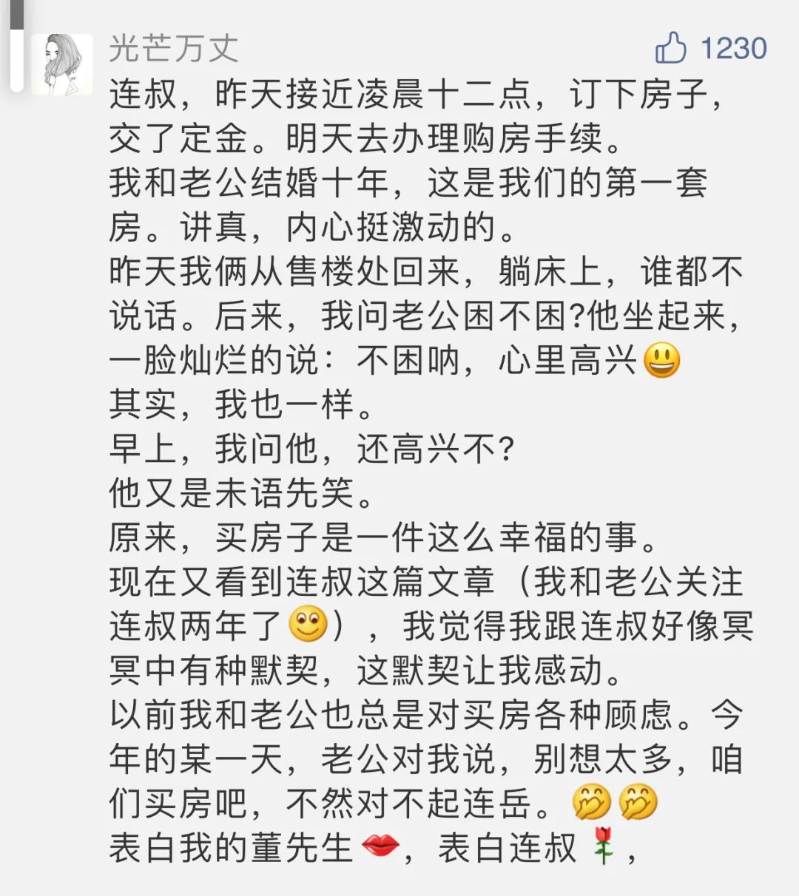

Augustus John，David and Dorelia

  

现在很多稀松平常的东西，比如吃饱穿暖、家用电器齐备、抽水马桶、轻松得到教育机会、有病能及时赶到医院、从一地迁徙到另一地、女性普遍有工作机会，它们中的任何一项，都是以前中国人终身追求才可能触摸到的稀缺之物。

  

现在的孩子很难相信，仅仅40年前，为了拥有一台电视机，要耗费夫妻俩几年的工资，难度好像现在存房子的首付。我们现在可能很庆幸，自己的人生不必耗费在追求这些“简陋”的事物上。但这种幸运处理不好，却可能变成不幸。太容易得到满足，人就会失去韧性，稍微碰到有一点点难度的挑战，就会放弃、逃避。

  

匮乏时代，放弃与逃避的结局可能就是死亡，很难放弃与逃避。没有电视机虽然不会死，但你到别人家蹭电视，蹭多了，面子上过不去，不蹭嘛，又很难熬，所以你会为电视机而努力。现在不努力的人，所有基本的享受都不缺，近乎免费的娱乐资源无穷无尽，舒服地混下去，一点都不难。一不小心，就沦落成意志软弱，事事逃避，祸及家人的寄生虫。这是一种另类的“资源诅咒”，生在富足时代，你的人生却更苍白了。

  

还好，人的欲望是无限的，所以人的追求是无限的。无论是物质还是知识，人永远渴望更多，新一代人的必需品，是上一代人的奢侈品。每一代人，都有“积攒数年努力获得某物”的时刻，为这时刻，人的忍耐、规划、意志及责任，都得到锻炼。它让你觉得艰难，无法轻轻松松得到，但得到后的快乐记忆，深刻而持久，将长久滋养感情。换言之，若没有这种“艰难而快乐”的经历，即使有暂时的幸福的关系，也无法维持。

  

这一代年轻人“艰难而快乐”的时刻，体现是买房子上，就像下面这对夫妻：

  

  

无论你们辛苦三五年，还是十来年，甚至更长一点，你们的必须有这种时刻，这是一个人成熟的时刻，也是感情稳固的标志。

  

很多年轻人抱怨房子给他们太大压力，妨碍他们享受生活。这是不理解命运的好意，房子的压力是来拯救你的，不经过它的挑战，你理解不了幸福关系，维持不了幸福关系。一个人连真正的生活都不理解，谈何享受？

  

推荐：[学习的开始，是先解决心理魔障](http://mp.weixin.qq.com/s?__biz=MjM5NDU0Mjk2MQ==&mid=2651634971&idx=1&sn=aefecfcb58946f8d583d11b13315b431&chksm=bd7e39058a09b013d25be25db682c6d4737245e5f81e4d42d8ec90f95f4ecf00035c5780521a&scene=21#wechat_redirect)  

上文：[刚需买房忌想太多](http://mp.weixin.qq.com/s?__biz=MjM5NDU0Mjk2MQ==&mid=2651648524&idx=1&sn=7c54fb5dcf0b6a24e7fd66bb865b6d3c&chksm=bd7e76128a09ff041354d53b1058eaa41accb8156f39b4e8091297eb6a73b0aa2a7a7137d882&scene=21#wechat_redirect)
