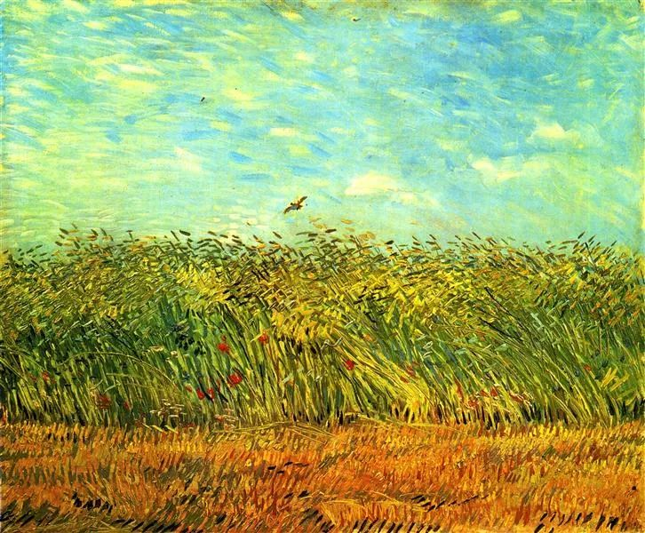

Vincent van Gogh，Wheat Field with a Lark

  

昨天讲到生育话题，留言数是平时的两倍。

  

我的工作节奏，一般是5点起床开始写，8点左右文章推送后，喝泡茶，休息一个小时，然后看文章的留言，作若干回复，直至中午，工作才能大致收尾。而昨天的留言看了一整天。

  

看下来，再次验证了中国人的生育观与生育状态的多元，这是好事。多元的存在，证明社会宽容。一个好社会，是“和而不同”的，不同观念与生活方式的人和谐相处。一个坏社会，却“同而不和”，多元必须杀剩至一元，与我不同的，就是冒犯我，否定我，除之方能后快。中国人从来都追求“和而不同”，这是中国文明的基因，也是其文明能抗冲击，有同化力的原因。当个人或社会违背这点，追求“同而不和”时，结局都比较不愉快。

  

生活方式（其包含生育）不存在对错，只是在多元中选择合适你的一元。但生活方式永远有主流支流之分，大众小众之别。在做选择时，别只盯着自己选择的好处，这样容易犯错误，变成“同而不和”。

  

知己知彼，百战不殆。只把这8个字当成兵法，就太可惜了。它是好的选择法，告诉我们在选择之前要做些什么。己不仅是我方，彼也不只是敌方。己可以是我的选择，彼是那些我放弃的选择。我的选择，要多看它的不利之处，就像知道自己的弱点；我放弃的选择，要多看它的有利之处，就像知道敌人的强点。这样选择才是理性的、坚定的、真正符合你内心的。

  

我年轻时选择丁克，有几个原因，对其坏处也有充分的考虑。

  

一是我对传承自己生物意义上的基因，并没有太大兴趣。 

  

二是我预感到自己的成长之路艰难而漫长，资质有限，必须全情投入，不学到50岁，可能一事无成。而我不太能够接受一事无成的人生。

  

三是我有信心成为比较有钱的人，能把自己和自己爱的人一生尽可能照顾好。

  

这个选择，风险更大，要做更多事，要更勤奋，是一条更窄的路，知道这点，就行了。但这个理由不仅不能普适，甚至不适合第二个人，只适合我和连太。

  

做选择是很难的事，尤其是年轻时。如果你选择的是支流与小众，那不是一味夸大它的好处麻醉自己，你反而要多想想主流与大众的好处，没有这些好处，你是否能够接受？这才是“和而不同”“知己知彼”的做法。当然，你选择的是主流与大众，也可以看看支流与小众有什么好处，以为仗着人多势众就可喊打喊杀，那就是“同而不和”，不知己也不知彼的小人。

  

在生活方式上，如果你不会选，有摇摆，那么随主流与大众，错误的可能性小一些。该恋爱恋爱，该结婚结婚，该生孩子生孩子，生两个比较符合进化选择你就生两个（一对夫妻平均生两个多一点孩子，物种才可保持健康的延续，所以进化自然而然会促使多数人选择生两个孩子，生得极多或不生，永远都不是主流）。

  

无论主流支流，适合你的就是对的。无论你的选择是大众还是小众，有一点不能变，你要爱你自己，爱你的家人，爱这个世界，往这个方向努力，总归不会有大错。

  

推荐：[你太快了！](http://mp.weixin.qq.com/s?__biz=MjM5NDU0Mjk2MQ==&mid=2651638717&idx=1&sn=d8768ef95153c504ad94bfb268b84ee3&chksm=bd7e4fa38a09c6b5d22876141236ae3f363437cd35b41cdfd9dadc2ff6a1d1da00ade9dc0100&scene=21#wechat_redirect)  

上文：[如果你选择生，就生两个](http://mp.weixin.qq.com/s?__biz=MjM5NDU0Mjk2MQ==&mid=2651649094&idx=1&sn=c19ec6bb189863951915dbbe83448827&chksm=bd7e70588a09f94eb613ba190b90cec467d7cd4a2c2392e9af807999e9309033708aa5d1c9e2&scene=21#wechat_redirect)
