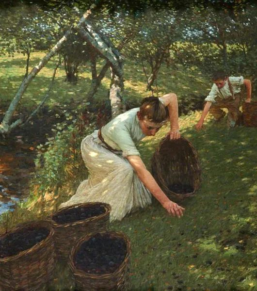
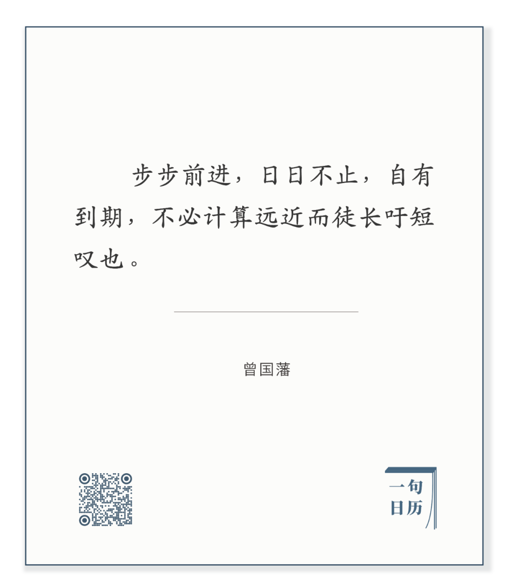

Henry Herbert La Thangue，Gathering Plums

  

长按二维码可关注  

  

活得简单一点，每天那些固定的事情做完，一天就结束了。不觉得太累，只是今天计划完成，有一丝丝快乐。  

  

生活不宜起伏太大，太随兴。今天太勤奋，明天又太偷懒，把自己的生存系统搞得太复杂。这也是人才有的毛病。植物没有，低等动物也没有，它们的简单写在基因里，机器一般地运行任务。它们没有所谓的计划，它们的未来与现在在一体的，永远在完成现在，就是它们的未来。人也有这技能，只不过，人特有的长处，扰乱自己，容易失去简单的能力。人老在想未来，所有美妙的事情都发生在未来，现实对比得难以忍受。一天做不成多少事，勤奋没有马上的利益，于是不必勤奋。放弃一天似乎不影响未来，没有马上的危害，于是享受懒惰。  

  

人的简单，是沉思后的结果，复杂演算得到的答案。步步前进，日日不止，可做的事小而明确，却是宏大理想的一部分，它避免了空想，增加了耐心，世上无难事，一天天捉住时光就是了，像植物一样。  

  

今天是第142期“下周很重要”，制订你下周的时光捕捉计划。

  

推荐：[幸福而丰富的一生，就是六个字](http://mp.weixin.qq.com/s?__biz=MjM5NDU0Mjk2MQ==&mid=2651645764&idx=1&sn=a0de5f4558466e57d7bec4f5aa75a80b&chksm=bd7e635a8a09ea4c7b5a962ee4140ca0d978202d9276f859cfa5a9dffea8bb792d9f2e128cc3&scene=21#wechat_redirect)  

上文：[学历的重要性不容小觑，那又怎样？](http://mp.weixin.qq.com/s?__biz=MjM5NDU0Mjk2MQ==&mid=2651648390&idx=1&sn=b92bcbf227a0e0f5e79ffcbaf4731652&chksm=bd7e75988a09fc8ed14ad73911d0a3302017040d2ca93ec815e7f81e1f95f35093f9a3914194&scene=21#wechat_redirect)
