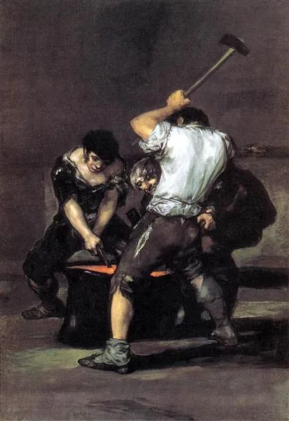
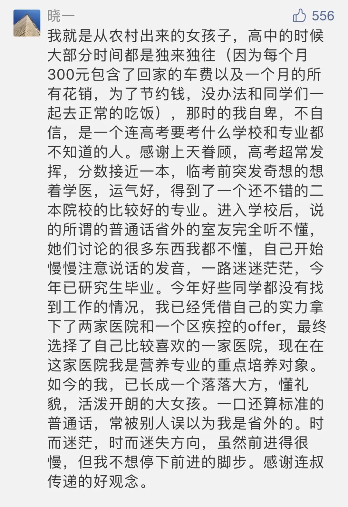

  

Francisco Goya，The Forge

  

起点低的苦孩子，下面是一个成长模板：

  

  

苦孩子都得像她一样，走出苦地后，还得过一个自卑关。

  

世上好人多，人本质是善良的，天生具有同情心与正义感，这已由实验证明，不必怀疑。但世界同时有冷酷的成分，人也是复杂的。很多人为获得优越感与存在感，往往通过欺凌与嘲弄弱者。刚走出农村或非发达地区的苦孩子难免成为目标。这是件令人难过的事，但是过了，人生就没什么事难得住你。

  

自卑有两种体现方式。

  

一是彻底的自我否定。自己的成长史，自己的生活方式、方法论与价值观，甚至包括自己所属的族群、所说的语言，一律以为不美、不对，通通否定。希望以这种方式迎合所谓的强者，从而加入强者阵营。自我阉割的人，从而失去自己的根，也放弃他的核心竞争力，最大的成就不过是强者附庸，为别人而活。再进一步的人，甚至对自己的同类更狠，就像蓬佩奥的军师余茂春。

  

二是自卑以反向方式呈现，特别自大，唯我独尊，目空一切。喜欢打击他人，否定他人，控制他人。这样的人，好像很强大，其实一生理解不了平等与包容，永远觉得受伤害，永远充满攻击性，人人避之不及，家人也要深受其害。

  

走不出自卑，只不过是一个人的身体走出了贫穷，心还留给了贫穷。世界显得太凶险，太复杂，不是别人要害我，就是我得害别人。这样的人生，再怎么奋斗，也渡不过苦海。

  

走出自卑，保有自信，世界就呈现出其善良而单纯的一面。正经人，不会轻视你起点低，甚至根本不关心你的起点。你嘴不甜、不时髦、不风趣，似乎是边缘人，这些都是枝节，用出你应对高考的方法：勤奋、吃苦、诚实、耐心，那么，你适应一切环境，你获得尊重，你有幸福生活，你成就自己，改变世界，都是自然而然，水到渠成的事。人生就这么走下去，能提升自己处境的方法，又没伤害别人，别人怎么小瞧，怎么攻击，自信地坚持住就是了。

  

苦出身，起点低，这不是什么可自卑的事，一步步升级，它反而让你对人性、对世界有更真实丰富的认知（这当然是你独有的认知资源）。从更低处起跳，只要跳得像高处起跳的人一样高，已经是弹跳力更强，这不是让人更自信吗？不要停，继续往高处跳。

  

推荐：[储蓄永远是富人思维](http://mp.weixin.qq.com/s?__biz=MjM5NDU0Mjk2MQ==&mid=2651635450&idx=1&sn=b7204aeb7e2353ec557a2163c6c96423&chksm=bd7e3ae48a09b3f22dd4bdd263161cf0683cc45cb03fc8f92c8cb4b9742b7e5f423591d9d7f8&scene=21#wechat_redirect)  

上文：[说说张桂梅，什么是真正的素质？](http://mp.weixin.qq.com/s?__biz=MjM5NDU0Mjk2MQ==&mid=2651648637&idx=1&sn=3a2c64d76d2934a6cb2466617dfda28c&chksm=bd7e76638a09ff75c6f59157dbdfbbec15f148eb7b4adf46ba7fe9eeeaa3da4205d2e4cb6c16&scene=21#wechat_redirect)
