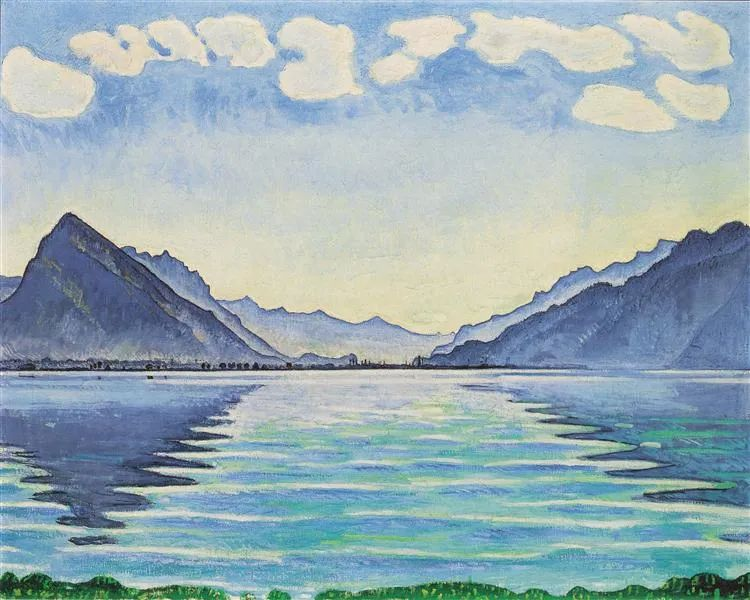

  

Ferdinand Hodler，Reflection

  

请一定要记住你经历的2020年，这可能是我们人生中最重要的一年，世界从此不同了，庆幸的是，中国走在正确的道路上。

  

最适合评价2020年的，其实是李光耀，他可能是中国人最熟悉的外国政治家之一。他有别于别的政治家，有种奇特的魅力，尖锐，真诚，似乎每一句话都要得罪人，但他的朋友很多，连中美的元首都会向他请教。我想，这建立在两点之上：一是新加坡在他手上，短短一代人，就由风雨飘摇的微小的第三世界国家变成发达国家；二是他不为理论所拘，善于发现事物的规律，有看见未来的能力。

  

邓小平1978年决定改革开放之前，曾访问新加坡，其繁华美丽程度令他震撼，他向李光耀表示祝贺“你们有一座美丽的城市，一座花园城市。”李光耀答道，“你们完全可以做得更好，我们只是中国南方没有土地的农民的后代，你们有学者，有科学家，有专家。你们将比我们做得更好。”邓小平没有接话，以锐利的眼神回应。

  

邓小平可能以为李光耀只是客气的恭维。尤其是对大国领袖。

  

李光耀对不思进取、意志薄弱的大国领袖，一点面子也不会给。他曾建议英迪拉·甘地拿出魄力，改变印度一盘散沙的官僚主义体制，因为她是印度最合适实行改革的人。她的回应却是：“我做不了。事情就是这样。印度就是这样。”李光耀从此看淡印度。对戈尔巴乔夫，他更是视之为糊涂虫，跳进游泳池之前却没有学会游泳。

  

李光耀本身并不害怕争议与批评，因为政治家有时就是要做“令多数人讨厌的事”，他甚至宣称自己会毫不犹豫将一些人“未经审判”就关起来，只要这样有利于新加坡利益。因为治理是以结果论的，而不是追求理念的逻辑自洽。与此同时，他对新加坡的法治又很自豪，认为这是新加坡繁荣的基础之一。结合起来，就可以知道他的法治观：你来新加坡投资做生意，新加坡一定是可信的可靠的，未来是确定的，但要在政治上捣乱，危害新加坡，没什么可以限制我把你抓起来。

  

他认为美国将一直是个强国，但对美国强推自己的价值观与民主体制嗤之以鼻，其发达，运气的成分更重，没资格像教师爷一样给各国写评语。他断定中国未来必是与美国共享世界的强国，而且中国有其传统，老百姓并不会接受美国的体制，但也认为中国政府必须解决腐败问题，并建立法治。

  

他有段话，用来评价2020年，非常恰当：“我相信，一个国家如果要发展自己，更需要纪律，而不是民主。民主过于兴旺，就会催生无纪律、无秩序的环境，这是不利于发展的。要检验一套政治体制的价值，最终还是要看它能否建立稳定的社会环境，是否有助于改善大多数民众的生活标准，能否在确保人民和平共处的前提下享有最大限度的自由。”中国的防疫与经济，一枝独秀，靠的就是纪律。100年前一盘散沙、处处挨打的中国人，可能绝想不到他们的后代可以如此团结，如此优秀。这可能就是百年未有之大变局吧。经历了2020年，我们不是应该更自信、更乐观吗？

  

李光耀崇拜的政治家，只有三个，戴高乐、丘吉尔和邓小平。他们极富自尊，意志坚定，敢想敢做，凭个人智慧与勇气，在关键时刻不教条、不畏惧，做出最好的决定，带领国家走向胜利。

  

邓小平1992年视察中国南方，敦促改革，在讲话中提到，“向世界学习，特别要向新加坡学习，要做得比他们更好。”他应该已经知道，李光耀当年并非恭维。李光耀听了也很开心，对自己说：“噢，他没有忘记我对他说的话。”

  

建议你看看这本8年前《李光耀论中国与世界》。当时看，他的许多观点，可能显得突兀，难以接受。现在看，你就会知道他是一个多么有见识的人，确实领先了世界，能在自己死后指点这个世界。
