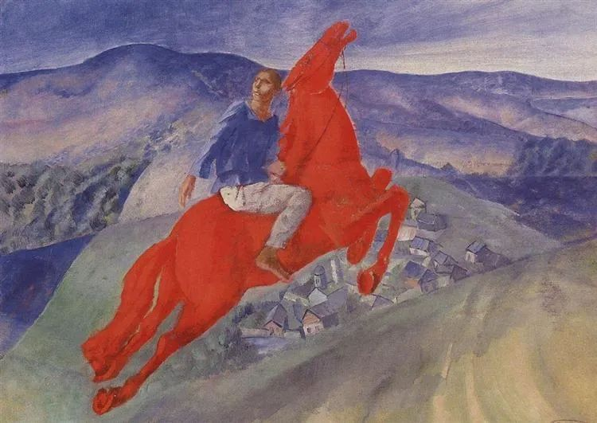
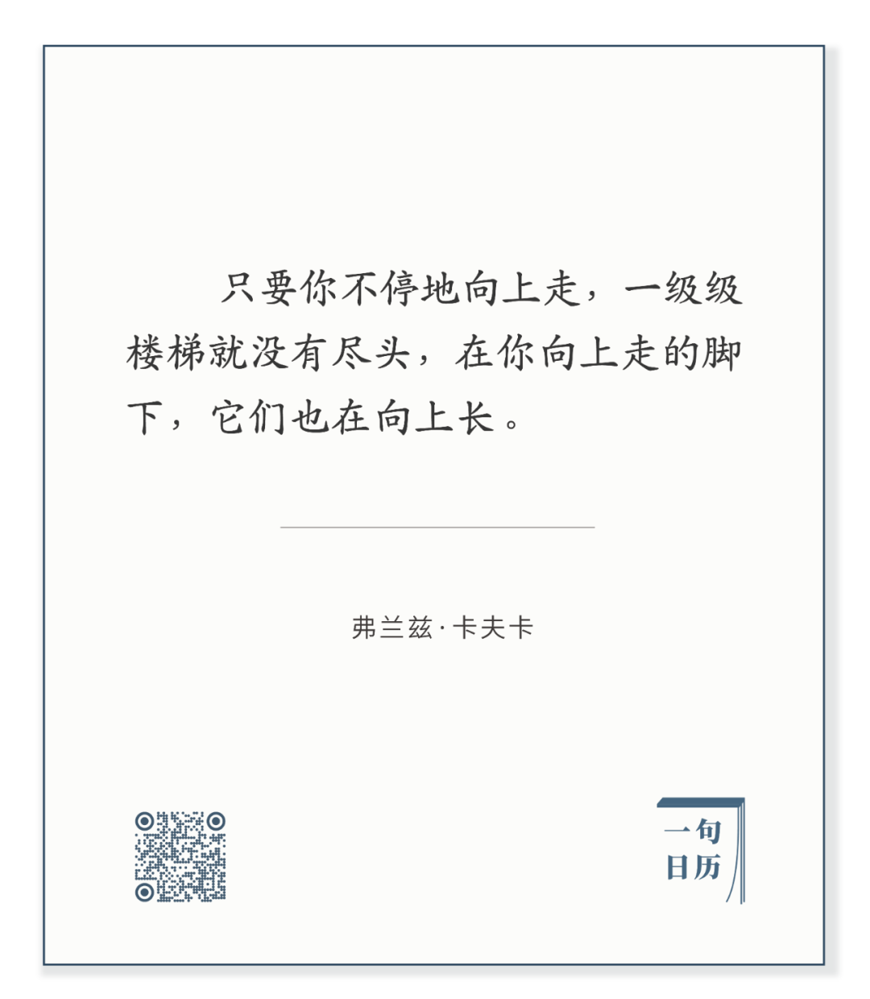

Kuzma Petrov-Vodkin，Fantasy

  

长按二维码可关注

  

卡夫卡这句话，说出[无穷的本质](http://mp.weixin.qq.com/s?__biz=MjM5NDU0Mjk2MQ==&mid=2651645255&idx=1&sn=b174aaad482b07e636ac08e4a7bd00ec&chksm=bd7e61598a09e84ff9e66017e910a0a43364140643de5a5c9407a0467fe97b2d0f076c181e33&scene=21#wechat_redirect)。无穷就是永远向上，没有尽头。无穷就是永远只是开始，没有结束。

  

人要建立无穷的思维方式。这很难，因为人生有尽，由生而死，由弱到强，再由强到弱，像一个圆环，一个0。困在这个模式里的人，难免认为，上了就得下，开始了就会结束。

  

多想想无穷的事。  

  

有些无穷你观测得到，比如我们身处的宇宙无穷无尽。  

  

人类的知识永远在增长，它没有最高峰，不存在折返点。每秒都在增加新的知识。  

  

仅从这两个无穷推演，我们就知道，现在困扰着的一切难事，在永远的向上面前，都是无事。  

  

资源是无穷的（因为宇宙是无穷的），别说核聚变与未来科技，只要太阳能技术足够高效廉价，小小一粒太阳就能暂时满足我们。这暂时，是几十亿年。  

  

贫穷将会消失，因为财富将无穷增长。财富是什么，就是将自然物转化为服务人类的人造物。石头与铁变成了房子，沙子和光变成了芯片。

  

疾病也会消失，至少目前的一切疾病都会消失。有病之所以治不好，不过是还没掌握足够的知识。  

  

一个宇宙都提供了无穷的可能，更别说可能存在着无穷多的宇宙。  

  

无穷思维是什么？

  

你今天有困扰？没事，明天，后天，只要你知识不停增长，困扰就会消失。  

  

你今天在低地，那就上，上，上，不停向上，总会走到高地。  

  

今天是第147期“下周很重要”，写下并完成你的计划，不要嫌小，那是你无穷上升的一环，将达到你的极大，无穷大。  

  

推荐：[难，更难](http://mp.weixin.qq.com/s?__biz=MjM5NDU0Mjk2MQ==&mid=2651645255&idx=1&sn=b174aaad482b07e636ac08e4a7bd00ec&chksm=bd7e61598a09e84ff9e66017e910a0a43364140643de5a5c9407a0467fe97b2d0f076c181e33&scene=21#wechat_redirect)  

上文：[偏见，意思是偏偏不见机会](http://mp.weixin.qq.com/s?__biz=MjM5NDU0Mjk2MQ==&mid=2651655513&idx=1&sn=760f8bba7cbae1afb42e28e6a07a288c&chksm=bd7f89478a08005150760ef478290c7fd6e3dd75691345dac4c6c095e7f076d357a434b956cf&scene=21#wechat_redirect)
