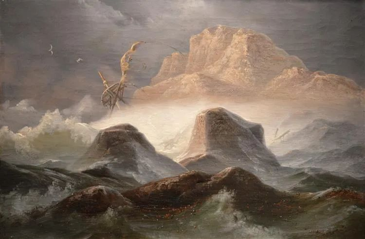

  

Knud Baade，Storm Ved Den Norske Kyst

  

连岳老师，

  

您好，多年前我还没谈恋爱的时候就看过您的《我爱问连岳》系列，没想到今天自己也有了很想不通需要求助的事情。

  

给您发这封邮件，是实在想不明白了，很希望您能指点迷津。

  

我的难题是和男友交往两年，他父母坚决反对，我现在进退两难。

  

我俩的情况是，我31岁，来自上海周边二线城市，美国硕士毕业后来沪工作，从事互联网工作，家境小康。男友34岁，上海本地人，欧洲英德硕士，从事金融行业，家境非常殷实。我们是同学介绍相识恋爱的，交往两年感情非常好，认定彼此都会是非常好的人生伙伴。初期只大概了解他应该家境还算不错，后面遭到他父母反对后才逐渐了解可能比我以为的要好很多，也是这样的家境差距，造成了他父母在还没有见过我的情况下就强烈反对，拒绝见面，拒接接受。

  

我现在很为难，一方面舍不得我男友，他在父母反对阻挠的情况下一直很坚定，从家里搬出来自己在外租住，在我面前从未流露过任何的优越感、嫌麻烦或者动摇，一直对我很好很支持，打算明年和我结婚。但另一方面，他父母也非常坚决，对我的工作学历家境都不满意，表示要结婚的话就和我男友断绝亲子关系，不会有任何精神或经济的支持。并且这样的情况我也还不敢告诉我父母，不想他们为我担心，也怕伤了他们的自尊心。我觉得感情难能可贵，能遇到彼此坚定选择并且相处和谐快乐的关系实属不易，我不忍放弃。但也觉得父母关系无法割舍，并不希望我男友因此失去父母，留下遗憾。

  

连岳老师怎么看呢？此刻的我内心非常迷茫，不知道要怎么做才是正确的选择。

  

应该遵从内心，克服万难，走一条哪怕艰难但属于自己的人生道路？

  

还是应该接受孩子生命由父母给予的原罪，顺从父母以表孝道？

  

很希望得到您的回复，感谢！

  

忠实读者W

  

* * *

  

W：

  

你的工作学历家境，配得上任何人，这点要自信。

  

你们未被祝福，是男友的父母没有用好自己的财富，错在他们，不在你们。

  

拥有很多财富，这自然是件好事，但用不好，就变成了坏事。拥有财富的家庭，在孩子选择配偶上面，本来面可以更宽，可能性更多。因为不缺钱，可以更专注于人品。婚姻这种长达一生的关系，没有人品为基础，走不完，勉强走完，也太痛苦。

  

自己有钱，则更有条件不在乎对方有没钱。财富这样用，让人更慷慨，更从容，更有同情心，财富起了提升与丰富人格的作用。自己有钱，却瞧不起更穷困的人，以为谁都在盯着自己的钱，变成守财奴，人格猥琐，更吝啬，更焦虑，更苛刻，那财富就化为诅咒。

  

财富的流动性很强，富不过三代是常有之事。有钱的家庭担心财富传承出问题，这可以理解。财富某种程度上，也是中国传统里的天命，人品格局配得上，它才保得住。培养挑选继承人，更应看重人品格局，没有的话，再有钱也会败光，只余悲剧或笑柄。你男友的父母，因为觉得你家不够阔，拒绝见你，了解你，也不尊重儿子的选择，就是还没有理解财富是天命，做不好传承。

  

教育他们的工作，落在你和男友的身上。切断一切联系，更能证明自己，你们受过好教育，又有好工作与好感情，开始创造自己的财富，多年以后，你们的生活应有尽有，事实证明，你并不贪图他们的钱财，你的人格一点不低于他们。他们接纳儿子与你，也就水到渠成。

  

在这段比较辛苦的时间里，有几点要注意：

  

一是你不要逃避，尽快和父母沟通，他们当然会伤自尊，有情绪。但你和男友感情好，有志气，对自己的生活展现出勇气，这才能安慰他们，并得到祝福。

  

二是不要记他父母的仇。若起了“将来我发达了定得出气”或者“你们老了还是要来求我们”之类的心思，那格局就和他们一样窄，爱情与人生降格为小鸡肚肠。从现在开始就要定位自己为原谅者与教育者，用自己的高姿态与好生活转变他们的想法，最终迎来和解。男友不会失去父母，父母也不会失去儿子。

  

三是要加倍珍惜彼此，在日常生活的挑战中经营好爱情，忍得了低潮，耐得住繁琐。你们成为对方的福气，外部的祝福终究会来，不要来得太多。你们若忘了爱的初心，爱情破产，浪费人生，那就坐实了所有的恶意。不管现在有无祝福，真正的幸福，最终是由你们两人决定的。

  

幸福是最高级的天命，要配得上它。

  

祝开心。

  

连岳

  

推荐：[这合理吗？他打我，说是考验我的真爱](http://mp.weixin.qq.com/s?__biz=MjM5NDU0Mjk2MQ==&mid=2651649533&idx=1&sn=01d808a41905841bce858d2c38fdbb8d&chksm=bd7e71e38a09f8f56cdc0eb00d1ca09535011ac8d910e93b96be3008db2b77074938523ee786&scene=21#wechat_redirect)  

上文：[虽然双标对中国不公正，不过也有价值](http://mp.weixin.qq.com/s?__biz=MjM5NDU0Mjk2MQ==&mid=2651649677&idx=1&sn=82b5718043641dfa384625d50e526b9b&chksm=bd7e72938a09fb85c88b62d97eb86102b058e6cb49971dd2b72d4e53ac3cde677396652486bc&scene=21#wechat_redirect)
