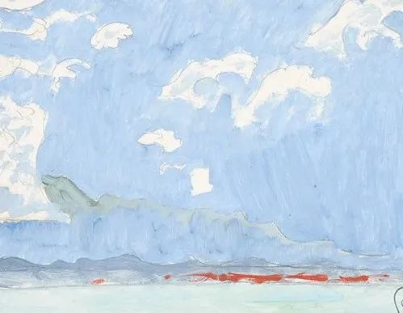
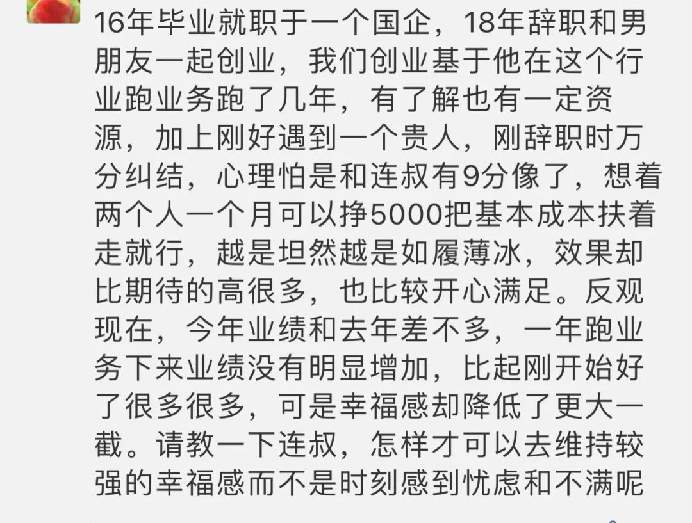

  

Cuno Amiet，Thunersee

  

早年看到德鲁克一句话，非常喜欢。或者说，这句话契合自己的气质与追求，所以印象深刻。

  

这句话是“管理上了轨道的组织，常常索然无味。”知道一件事正确，天天重复，自然平淡无奇。只有找不到方向，识别不出真正的价值，才一天一个想法，天天追风口。

  

每个人都是管理者。大小企业主是。即使被雇佣，你下了班的时间，也得管理自己，或还有家庭。人终究得当管理者，要知道一些管理的真理。上面那句德鲁克的话，就是删繁就简的真理。

  

昨天有位朋友的留言，其体现出来的焦虑，是很多管理者的通病：

  

  

很多人办企业，开公司，不赚钱，焦虑；赚了钱，怕明年不赚钱；焦虑，连续赚钱，又嫌增长速度慢，焦虑。结果就永远都在焦虑。就像上面这位朋友，今年业绩和去年差不多，在这特殊的一年，其实已是大成绩，值得庆祝，他还是焦虑。不顾事实，永远只追求增长，怎么可能幸福呢？年初疫情发生后，我给自己公司定的目标就是保证员工收入，然后不亏本，就行了。要什么增长，要得太多就会焦虑。结果今年没亏，心情很好。当然也没增长。

  

其实正常年份我也不设增长目标。因为我觉得增长并不是目标。公司像人一样，健康地活着，活得久一点，才是第一目标。公司有合理的利润，员工有合理的收入，就这么“索然无味”地走下去。我是一个几乎没有焦虑的人，与我喜欢“索然无味”有关。脱离单打独斗，要对员工负责以后，我其实是克制自己的勤奋的，长假强制性不写，必须休息。我写了有员工就得加班，就不那么“索然无味”了，钱少赚一点有什么关系。  

  

我对员工的要求也很简单，善良，靠谱，技能60分起步就行了，会给你时间练习，练到80分，甚至90分。我一年也不开一个会，会议室基本是摆设。每天都是固定的事情，照做就是了，开什么会呢？聚餐时，爱喝酒的人喝，不想喝的人就别喝，我会敬大家一杯酒，之后各自随意，你也不要拍我马屁，我也不爱听。我的意思是，世界再怎么复杂，我们自己是可以简单的。其实世界并不复杂，只是混乱了，迷惑了，它才看起来复杂。世界是单纯的，单纯到索然无味地趣味万千。

  

推荐：[穷查理，富人生](http://mp.weixin.qq.com/s?__biz=MjM5NDU0Mjk2MQ==&mid=2651643298&idx=2&sn=21cb1652a6999d789f0a8ee63ea2a0c3&chksm=bd7e59bc8a09d0aa91d168a813d0fb5701f65340732f00a9d89df9bce724100ee44af2c6ff1a&scene=21#wechat_redirect)  

上文：[人生前紧才可后松](http://mp.weixin.qq.com/s?__biz=MjM5NDU0Mjk2MQ==&mid=2651650263&idx=1&sn=d91319703007882abe4780444bedcee8&chksm=bd7e7cc98a09f5dfda64da6b1e9183f69a82e52d5f73b0ac03c0a0a22085c3baaa7d29e39792&scene=21#wechat_redirect)
