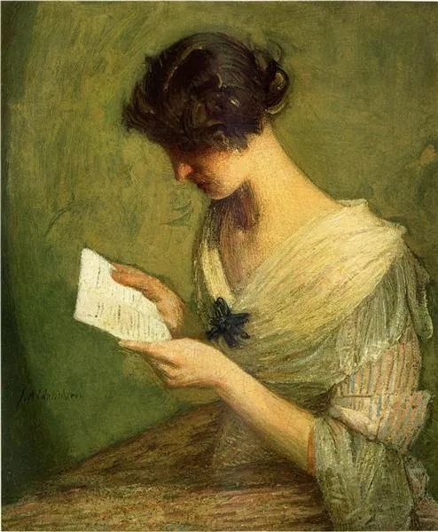

Julian Alden Weir，The Letter

  

著名的张桂梅老师，言辞剧烈地反对自己学校毕业的女生当全职太太。当得知一位来捐款的毕业生是全职太太后，她甚至怒斥：“你给我滚，我不要你的的钱！”

  

全职太太在张老师心中地位之低，由此可见。她反对的理由，是“你看男的在外面找小三有多少啊，把你甩在家里。因为你长时间在家里跟丈夫没有共同语言了，完全没有了，你被社会淘汰了，整个把你控制在原来的那个水准上。”“女人一定要靠能力，不要相信那些男人”。

  

全职太太，也称全职主妇，是一个大筐，在筐中，此太太与彼太太的区别，可能比人与猪的区别还大。一棍子打死，似乎全职太太见不得人，对不起自己所受的教育，太不公平，我想为之一辩。

  

一、全职太太有被动与主动之分。当女性没有教育权与工作权之时，她们只能当全职太太。这当然是极大的不平等，也埋没了无数女性人才。当女性有选择权时，全职太太只是360行中，她选的一种工作，像其他工作一样正当。很多贫困女生，靠张桂梅老师的华坪女子高级中学的帮助，完成了从被动走向主动的转变，同样是一个全职太太，性质已经不同，不能说回到原点。

  

二、全职太太有称职与不称职之分。有些女性工作能力太弱，学习能力太差，找不到工作后不得不去当全职太太。并非当全职太太耽误了她，让她被社会淘汰。而是她被社会淘汰后当了全职太太。因果不能倒置。这类女性，一般来说，也当不好全职太太。她们的配偶，如果做好了自己份内的工作，却要背上耽误太太的骂名，那也不公平。要避免走到一个极端，以为自己只要是全职太太，多不称职，从老板到老公，全世界都欠她。其实是她欠全世界，雇了她倒霉，娶了她也倒霉，当她的孩子更倒霉。

  

那些称职的全职太太，确实做了牺牲，她们或暂时，或永远地放下自己的职业追求，把抚育孩子，照顾家庭当作自己的主要工作。这工作难度大，并不比管理一个公司轻松。可是美誉度低，饱受偏见，在许多人看来，就是一个“没工作的”，甚至要被张老师喊滚。同时，风险也大，如果丈夫事业出问题，收入锐减，或者道德出问题，抛弃家庭，她都会非常困难。可正因为她们直面如此多的不利因素，难道不是更应尊重她们吗？贬低与侮辱称职的全职太太，既没眼光，也没良心。

  

男性与女性，有天生的生理区别，有后天的观念区别。在分工合作中，永远有这样那样的冲突，具体问题具体分析，总能存异求同，找到出路。动辄挑动两性之间的怀疑与仇恨，那就对不起我们受的教育，浪费了自己的智商。找小三的男人，那是因为他道德有问题，与老婆的职业并无必然联系。更不应由于个别人把全体男人都骂成不值得信任的畜生。再说了，按照这种骂的逻辑，男人找的小三，除了极少数是男人，其他也是女人，是否可骂女人是不值得信任的畜生？这样骂来骂去，除了大家都变成畜生，问题并没解决。

  

尊重那些努力生活，认真工作的人，其中当然包括称职的全职太太。只有多看到信任，多发现优美，可爱的世界与人生才会呈现出来。

  

推荐：[说说张桂梅，什么是真正的素质？](http://mp.weixin.qq.com/s?__biz=MjM5NDU0Mjk2MQ==&mid=2651648637&idx=1&sn=3a2c64d76d2934a6cb2466617dfda28c&chksm=bd7e76638a09ff75c6f59157dbdfbbec15f148eb7b4adf46ba7fe9eeeaa3da4205d2e4cb6c16&scene=21#wechat_redirect)  

上文：[情绪稳定比高智商更重要](http://mp.weixin.qq.com/s?__biz=MjM5NDU0Mjk2MQ==&mid=2651654681&idx=1&sn=d78da45866dd8d3d5e872d38782e85ff&chksm=bd7f8e078a0807112b52fa2d90cbaa19116ecb73bb70f62f3ada39f772727203641315c6b114&scene=21#wechat_redirect)
