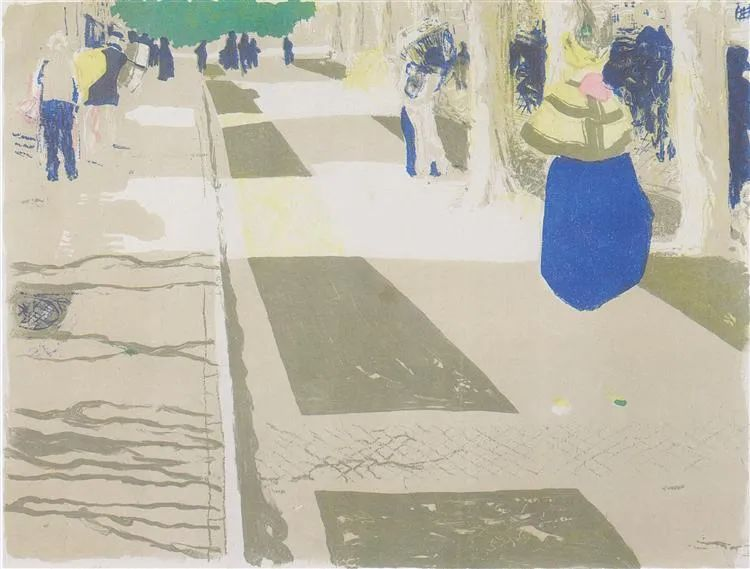

Edouard Vuillard，The Avenue

  

连岳先生，见信好！

  

向您请教开解，关于工作的抉择，或者关于人生的抉择，总之目前受困于我。万望能用您的智慧给予点拨。

  

在连续近三个月高压无休的工作之后，今天终于在自己家里睡了个心满意足的懒觉。早上送完儿子去幼儿园，回来手机静音，一觉睡到上午十一点多。醒来手机有三百多条未读微信，回了三条重要紧急的信息，其他不再理会。

  

看到书架上那本《我爱问连岳》，十五年前一位安徽大学的朋友赠送的，很亲切。追您的微博、微信公众号，多年来未曾中断。

  

于是利用这难得的仅剩半天的休息时间给您写封信，希望没有打扰到您。

  

我出生于皖北的一个农村家庭，母亲早逝，父亲年轻时不够顾家。记得很清楚，读小学一年级的时候找不到一双不露脚指头的鞋子。基本每年都欠学费。今早我儿子躺在床上心情很好的哼唱从抖音中听来的小调儿“哎呀我的天呀，破鞋露脚尖呀，老师让我交学费呀，我说等两天儿啊”，唱得我哈哈大笑。

  

后来我考上合肥一所大专院校，毕业后，贵人相助去了一家新兴网媒公司做编辑、记者，与所学专业没任何关系但却是我喜欢的工作。从一线记者做到频道主编。然后转型去了房地产开发公司做营销。转型的根本原因，是我要在合肥买房安家，且背后没有家庭的支持，还有一些负债，当时网媒的收入不足于支撑。

  

转眼在房地产行业打拼了十年，在合肥有房有家，我和老婆都有自己的汽车代步。儿子有他喜欢的幼儿园、画画课、轮滑课、鼓手课。这一切让我感到满足、幸福，就像此刻我坐在家里的小书房给您写信，看到地上的玩具、墙上的各种涂画，以及叠得工整的衣服，十分温暖。

  

然而今年转行、换工作的念头频繁闪现，但又不知如何抉择。

  

行业的属性，使得很多地产营销人四海为家。我操盘离家最远的项目，1500公里，东西跨越大半个中国。随着行业的竞争和成长，大多数房企的营销岗成了高压力、快节奏的工种，尤其对于背负业绩指标的一线营销管理人员，面临业绩指标和高负荷工作量的双重压力。我有过两段近三个月没有休息过一天的打新盘经历，早上八点半前到公司，晚上十点半后甚至十二点半后回宿舍。“996”工作制对我们来说都是福利。

  

2018年6月30日，我所供职的TOP系房企，全集团公司都在冲刺半年度指标。当天下午我在办公室突发颈椎病，半立于办公桌前，疼痛的一动不能动。同事立即把我送去了医院。做了CT，医生说7根颈椎有5根已严重变形。在这之前我从未察觉自己有颈椎病。后来慢慢调理，也偶有酸疼，但没有再爆发类似严重的情景了。

  

2020年的初秋之季，连续两个多月的无休工作之后，出现了肩膀、腰背酸痛的症状，有两个夜晚在宿舍翻来覆去睡不着，因为酸痛，怎么着都不舒服。

  

自己的造化不够，这些年来没能抓住机会，上到更高级的管理层，很难让自己在工作时间支配上多一些自由。而公司野蛮生长的发展需求，随时会一刀下来将你裁剪回家。在这种危机之下，近三四年我很少进过电影院、基本没看过足球赛、车后备箱的羽毛球装备也处于“冬眠”状态，书架上整面墙的书也基本都是四年之前买的、读的。

  

每次见到儿子，我都会惊讶于他的成长之快。个子又高了，懂得更多了。每次见到父亲，都感到他突然就老了，牙齿不好了，还容易忘事。

  

所以今年在工作很累又不开心的时候，我总是在想一个问题：如果我现在辞职退出这个行业，能做什么事情维持住现在的生活水平？

  

不知道。

  

一家人会不会因此饿肚子？

  

不会。

  

会不会因此返贫呢？

  

有这个可能！

  

或许这才是我最顾虑的事情。我不希望我的童年在我儿子身上重演。如果继续坚持，会是什么结局呢？牺牲几乎一切的个人时间，牺牲对家人的陪伴，牺牲一定程度的身体健康。即便如此，如不能有幸升到更高管理层，四十岁前依然大概率会被淘汰，或者到更边缘的城市和企业去继续如上的循环。

  

说这么多，是不爱目前从事的行业吗。也不是。他给了我物质上的回报、精神的荣誉，也改变了原本不太愿意竞争的性格。归根结底自己的抗压抗累能力有限，这种周而复始的高压节奏把我的时间和爱好挤压得没有丝毫生存空间，让我心生消极情绪，抱怨的东西就多了。

  

一个月前，准备辞职创业做生意。老婆把我们投资的一间商铺转手卖了。但最终还是没有下定决心，因为没有明确的生意路子，没有信心百倍的冲动。非常喜欢铜器、木器、茶这类物品。安静、厚重、不焦躁。特别想开一家与此有关的店。

  

老婆是个比较佛系的持家女主人。我很担心自己转行不成功会给家庭带来比较大的经济压力。所以在反复纠结中，希望向连岳老师求得点拨。

  

太久没有写过东西了，说了这么多，不知是否说清楚了我要表达的意思。

  

盼复点拨。

  

纠结中的MR-D

  

* * *

  

MR-D：

  

看了你对自己人生的叙述，我觉得你选择什么，都不会差。而且你现在处于一个比较有利的位置。

  

你的选择不会差，因为你的原则是对的。你总是围绕着让家人生活得好一点去规划自己的人生。这很朴实，却是最不会出错的大智慧，也是中国人的传统美德。这原则自然而然引领我们的生活。家人需要富足时，你去赚更多钱。家人渴望安居时，你去拼一套房子。家人缺少陪伴，你又给他们更多时间。就像你的经历那样，看似人生多变，其实你善良温暖的本质不变。

  

你这次选择，就是你敏感地知道家人不能失去你的健康。那就选择健康。而且，你有资格这么选，这是你之前努力获得的优势地位。在合肥这座不错的城市有房有车，还有一笔备用金，一家人不至于出问题。若没有这个基础，人的年纪越长，越容易被不喜欢的职业及人际关系吸住。甚至丧失选择权，再讨厌再有害也得做，不做处境更糟，马上流落街头了。所以我一直劝年轻人要有紧迫感，没什么时间松松垮垮，赶紧把房子供上，成家了则把家庭保护好，到了中年可进可退，人生从容。年轻时压力大一点，局部看，甚至影响一点健康。但从全局看，是更健康的，更快乐的。

  

人生前松后紧，那像宿醉，只有刚开始几杯是开心的。人生前紧才可后松，如倒吃甘蔗，渐入佳境。你现在的甘蔗，就在变甜。

  

当然，你辞职后，我建议你休息一段时间，不宜马上创业。创业要保持足够恐惧，如临深渊，如履薄冰。创业是高风险的事，多数人会跌下深渊，在冰水里挣扎。普通中产家庭，像你一样，创业失败一两次，就有破产之虞。随便开个小店，失利了，就烧掉大几十万。创业者之所以前赴后继，那是人性中的好奇心与赌性在起作用。人类总体应该感谢创业者，但从家庭的幸福安全来看，个体应该理智地避免去创业。尤其是没有做好充分调查研究的盲目创业，那是在深渊边上蒙着眼睛奔跑。

  

为家人打下了基本物质条件的中年人，再放下虚荣心，在职业的过渡期，挣点生活费的就业机会很多。你有房地产从业经验，当当房产中介；此外，送送快递外卖；开开滴滴。都是丰俭由你的工作。人生的选择当然不止如此，我只是想说明，其实没什么可怕的。

  

20年前，我也面临一次艰难选择，留在原单位，一辈子衣食无忧；离开，自己未来的可能性更大，风险自然也大很多。但想到自己有房子住，只要一个月挣一千块钱，至少饿不死。如果我一千块钱都挣不到，那确实是废物，谁也不应该养我，把自己饿死，算是为民除害。这样一想，就轻松地辞职了。当然，此后的人生并不轻松，为了生存与发展，我一直是努力的，但各种因素都可自由把握，价值，健康，时间，都不必仰人鼻息，还是很值得的。这点经验供你参考。

  

祝开心。

  

连岳  

  

推荐：[不被巨富家长祝福的爱情，怎么办？](http://mp.weixin.qq.com/s?__biz=MjM5NDU0Mjk2MQ==&mid=2651649723&idx=1&sn=f97e8dbe49007c5ce2363ab7c7bc3ab6&chksm=bd7e72a58a09fbb361bc6b5b94260d617e5b1cd3c20af9bc25b416c9b1a3fa9686df0a888d6f&scene=21#wechat_redirect)  

上文：[保持专注的真正含义与方法](http://mp.weixin.qq.com/s?__biz=MjM5NDU0Mjk2MQ==&mid=2651650200&idx=1&sn=cd08f400fda0be1bc65107f16a20875b&chksm=bd7e7c868a09f590121e635c97fa623c9202d437b9cdd77e84296b00e54a4a97c097c5ba06d3&scene=21#wechat_redirect)
