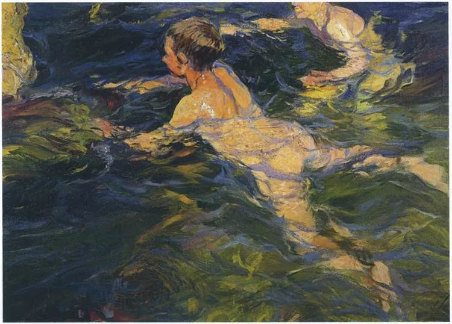

Swimmers, Joaquín Sorolla

  

体育在考试中越来越重要了。几天前教育部体育卫生与艺术教育司司长王登峰说，学校的体育中考要不断总结经验，逐年增加分值，要达到跟语数外同分值的水平。在此基础上，通过不断总结经验，立即启动体育在高考中计分的研究。

  

我非常支持这个改革方向。这是真改革。在中国的教育中，没与升学挂钩，就重要不起来。体育课从来都有，老师家长嘴里都说重要，但一到考试就得靠边站。有些孩子可能没上过几节正经的体育课。

  

几年前，我见妹妹的儿子细细长长，有往柔美方向发展的趋势。我跟他说，我们不走这条路线，有再多柔美的男性偶像，也不是正路，男人还是得强壮，肌肉发达才是真正的男性美。我建议他从俯卧撑开始练起。

  

小家伙很自觉，没事就练几组，现在一口气能做几十个。不久前见到他，发现他开始练引体向上，简单而硬核的力量训练。家里装了单杠，他经过就跳上去挂一下。现在能做半个。我说，我们英雄的选择略同。我这几年也迷引体向上。我常呆的地方，家里，办公室，都装了单杠。从半个到1个，花了不少时间。只要能完成1个，肌肉可做完完整的运动，那接下来，就是3个5个，10个以上。我就是这么练过来的。

  

体育容易形成链式反应，只要开始练一个项目，就会练许多项目，然后会欣赏竞赛，参与竞赛。这只是表象，最后练出来的，是自律，是意志。

  

人经过贫穷与战争的洗礼，可能意志顽强，精神坚韧。但那成本太高。为了训练孩子，人为地追求贫穷与战争，本末倒置。中国和平发展40年，怎么够，最好永远和平富裕下去。在这种环境中长大的孩子，为避免大范围出现的娇气与软弱，体育是最好的选择。体育竞技，是战争的变形，是力量与意志，合作与对抗的大训练。在短时间内，可体验快乐与悲伤，失意与骄傲。最重要的是，可一次又一次重启训练和比赛，成本极低。

  

这次教育改革，真正重视体育，做了该做的事。家长应该欢迎，不仅应该监督孩子练体育，最好自己也练起来。有人担心体育与语数外同值，会引发作弊，那是杞人忧天，过虑了。其作弊的可能性小于语数外，后者可以漏题、偷看、带小抄，体育最拼硬实力。比如引体向上15次100分，你只能拉14个，那多一个你难如登天。你也几乎不可能失误，你的实力是16次，那100分稳稳的。

  

体育的乐趣，无论是力量训练还是心肺训练，都得先苦后甜，先熬过乳酸堆积，才迎来快乐的多巴胺。虽说爱运动的孩子坏不了，但没有教育者一个强制启动过程，小朋友自己主动喜欢，概率很低。

  

推荐：[轻轻地，融进园林的怀抱里](http://mp.weixin.qq.com/s?__biz=MjM5NDU0Mjk2MQ==&mid=2651651127&idx=2&sn=009806bd3d957bb494c1f8a82b00174a&chksm=bd7e78298a09f13f8b145c2b92c65160e6fe948aaf7a2e9db45a2db5951a8efc273b23130d9d&scene=21#wechat_redirect)  

上文：[由弱变强，一直变强的方法](http://mp.weixin.qq.com/s?__biz=MjM5NDU0Mjk2MQ==&mid=2651651127&idx=1&sn=9e0e583725cbf0d9cc7cfb1d929676f3&chksm=bd7e78298a09f13f8955dd6fdce779769dc0707312f9a27217c7abe9ddc8f9cff84f8396e184&scene=21#wechat_redirect)
