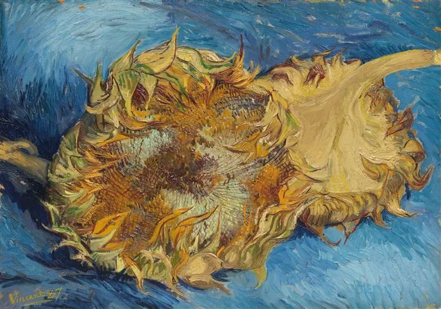
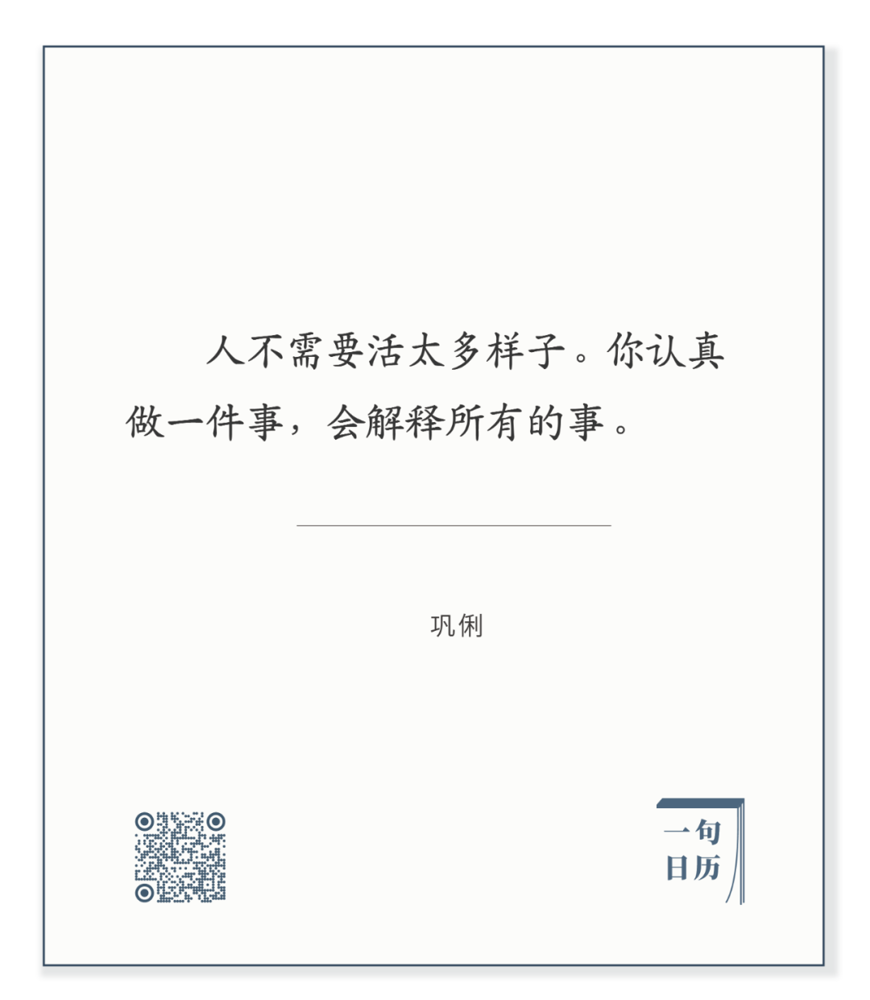

  

Vincent van Gogh，Still Life with Two Sunflowers

  

 长按二维码可关注

  

有人看到巩俐这句话，不禁微笑：我也有过类似的想法。

  

确实，有些话之所以好，那是说出了我们心中之想。有些人之所以我们喜欢，那是他活出了我们想要的样子。

  

在资质上，绝大多数人具有成功的一切条件。体现为成功者的好想法，你也想过。成功者的做法，你也做过。只是不如他们专注，不如他们持久。想想而已，浅尝辄止。

  

大家都是水，我们滴了几滴，又去当风。他们却下成一阵又一阵大雨，汇成巨流，奔流到海。当风也不是不行，大风可以吹动大海，只是我们吹了几缕，又想当土。每一次选择，似乎都是对的，但是小对一下，又被另一个对所吸引。人生由一连串的小对所构成，局部看，都充满希望，最后的大局却错了。耐心一点，专注一点，把小对养成大对，一天天，初看索然无味，过后，则趣味无穷。

  

今天是第145期“下周很重要”，写下你想要专注的小事，它将变成你的大事。做计划，既是对自己的行动说Yes，也是对分心说No，正如下面这句话所描述的：

  

 长按二维码可关注

  

推荐：[坏的一定会慢慢过去](http://mp.weixin.qq.com/s?__biz=MjM5NDU0Mjk2MQ==&mid=2651649335&idx=1&sn=4bf1ba89aad874aa603bdfc374582aae&chksm=bd7e71298a09f83ff896329fa32618a5ab441a3a3792e0085eb911b9607a5886091e42479bfb&scene=21#wechat_redirect)  

上文：[说说深圳的房价](http://mp.weixin.qq.com/s?__biz=MjM5NDU0Mjk2MQ==&mid=2651650147&idx=1&sn=ee2a6efffa385608c572a21b10db4ed9&chksm=bd7e7c7d8a09f56bea8c738aa748faa7b5b913bf24cc5e591eb5989816ef41672be372b040b6&scene=21#wechat_redirect)
