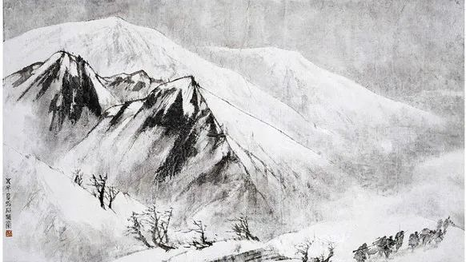

傅抱石，更喜岷山千里雪

  

我们总是说，人在事实面前会改变观点。  

  

这其实不太符合事实。事实是，只有一部分人在事实面前会改变观点。不少人在事实面前更坚持自己的观点，即使这观点是显见的错误。他们甚至加倍孤愤与悲壮，认定自己是掌握真理的少数人，其实不过一辆逆行的车觉得全世界的车都开错了方向。

  

改变观点是痛苦的。但要学会享受这种痛苦，人才能进步。就像桥水基金创始人瑞·达利欧(Ray Dalio)所说的，最大的悲剧是意识不到自己的错误想法。所以痛苦加反思等于进步。

  

瑞·达利欧不久前写了篇文章，劝告西方世界放弃对中国的偏见，“成见和偏见总让人们看不到机会。如果您是‘中国怀疑论’者，那与中国的发展现实不符，我建议您清除这一思路。”

  

他认为，当民众接受良好教育、努力工作并遵守规则时，一个国家往往就能拥有强劲的生产力、良好的财务状况，收入超过支出、资产增加快于负债，也就会实现崛起。客观对比中美两国，中国更有优势。——当然，他这种说法，对中国带有偏见的美国人不会同意，对中国带有偏见的中国人也不会同意。因为他的条件里没提意识形态。对意识形态挂帅的人来说，只要没有美式的意识形态，那就是错的。

  

瑞·达利欧的观点并不新鲜。企业家、投资家非常愿意承认中国的优势。巴菲特与芒格，是最典型的美国精英，在我的印象中，从来都是夸奖中国，欣赏中国。与美国的政治人物形成鲜明的对比。其实，这是美国真正值得学习的地方，他们有一群商业精英视野开阔，承认现实，可以迅速放弃头脑里的偏见。

  

为什么？同样是聪明人，在美国从政，就天天“中国病毒”，中国做得越好，他围堵得越来劲？

  

那是因为，商业精英如果判断错误，自己口袋里的钱变少，不改正偏见，一直错，那意味着破产。而政治精英判断错误，是别人付出成本。就像特朗普防疫错得离谱，是普通美国人死二十多万，他自己可有顶级的医疗。做错了没有惩罚，那为什么要痛苦地承认错误呢？

  

过几天若是拜登当选美国总统，骨子里也不会改变对中国的偏见。因为他也没有改变这个偏见的动力。说服美国的政客，徒劳无功。他们在意识形态上不会进步，为了迎合民众不停下滑的智商，他们还得退步，说些弱智的话，做些荒唐的事，不然没票。但是中国的大市场，高效率，这张终极王牌，将赢得越来越多的企业家与投资家，没有任何美国政客有能力围堵中国。

  

不久前，介绍过[李录先生的观点](http://mp.weixin.qq.com/s?__biz=MjM5NDU0Mjk2MQ==&mid=2651643667&idx=1&sn=5f38a255b168c7d0c433f1a52a898a6a&chksm=bd7e5b0d8a09d21ba539ccb7444aaf2b21f6b9745428c12b7920144b7a845e578bfe2d2097ec&scene=21#wechat_redirect)，这位芒格信任的华人投资家，他的看法与美国政客完全不同。他看好中国的未来，且不认为政治民主是实现现代化的必要条件。对李录历史有所了解，就知道，他通过自己的投资实践与思考，放弃了自己年轻时的偏见。与他同龄的许多人，抱着偏见不放，思维完全特朗普化，美国政客化，即使身处中国，也看不到中国的巨大机会。

  

人的差距，终究是思维的差距。在事实面前，不会改变观点，放弃偏见，那就是老了，停止了。

  

推荐：[解决投资中国的最本质问题](http://mp.weixin.qq.com/s?__biz=MjM5NDU0Mjk2MQ==&mid=2651643667&idx=1&sn=5f38a255b168c7d0c433f1a52a898a6a&chksm=bd7e5b0d8a09d21ba539ccb7444aaf2b21f6b9745428c12b7920144b7a845e578bfe2d2097ec&scene=21#wechat_redirect)  

上文：[为全职太太一辩](http://mp.weixin.qq.com/s?__biz=MjM5NDU0Mjk2MQ==&mid=2651655230&idx=1&sn=cbfbf72c56ebf39093bd09d80b4db088&chksm=bd7f88208a0801367f6a8e44a84ecc5f0acfa51956122fc08d05b5422914ba6600ea91696fe5&scene=21#wechat_redirect)
