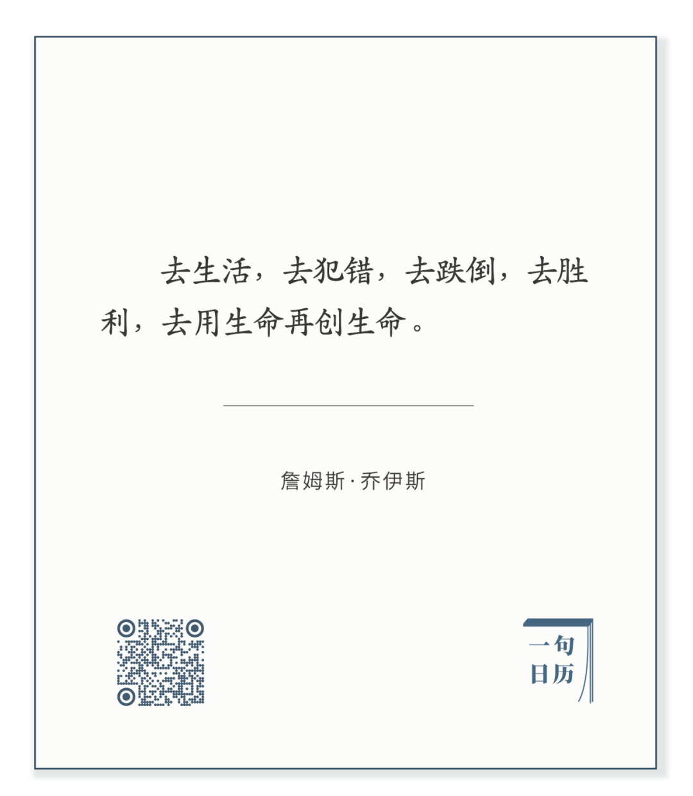

Konstantin Yuon，New Planet

  

长按二维码可关注

  

犯错，跌倒，是生活的一部分，必然的一部分。  

  

不过，犯错了要学到教训，跌倒了要爬起来，这样才有胜利。犯错是为了不再犯同样的错，人也不应该在同一个地方跌倒两次。犯错不是目的，跌倒更不是，胜利才是。

  

犯错与跌倒都不愉快，也多少会受到规律的惩罚，失败总是很难接受。这引发人的两种反应：一是以为不选择与不行动，就可以不犯错不跌倒。这恰恰是犯了最大的错，因为你失去了生活，你不选择，世界将替你随机选择。二是犯错了，跌倒了，死不承认，以为这样面子上好看。可你明明趴在地上，鼻青脸肿，来来往往的行人知道你跌倒了，你趴得越久，越不好看。可有多少人在错误里趴一辈子。

  

错了就改，跌倒后站起来。知道这是成长，那就不会怕，不会躲。你渴望去选择，去行动。对了当然开心，很多时候是对的。错了也不怕，知道错等于发现对。训练时的错题就是考试时的得分题。

  

今天是第146期“下周很重要”，去计划，去行动。

  

推荐：[保持专注的真正含义与方法](http://mp.weixin.qq.com/s?__biz=MjM5NDU0Mjk2MQ==&mid=2651650200&idx=1&sn=cd08f400fda0be1bc65107f16a20875b&chksm=bd7e7c868a09f590121e635c97fa623c9202d437b9cdd77e84296b00e54a4a97c097c5ba06d3&scene=21#wechat_redirect)

上文：[人生持久战](http://mp.weixin.qq.com/s?__biz=MjM5NDU0Mjk2MQ==&mid=2651653029&idx=1&sn=bb5489204c88a120c4f2c99796a28dfe&chksm=bd7f87bb8a080eade86b83cb7888124d9d2c1d40665cea39471292c4eba93390818848cf0eb3&scene=21#wechat_redirect)
