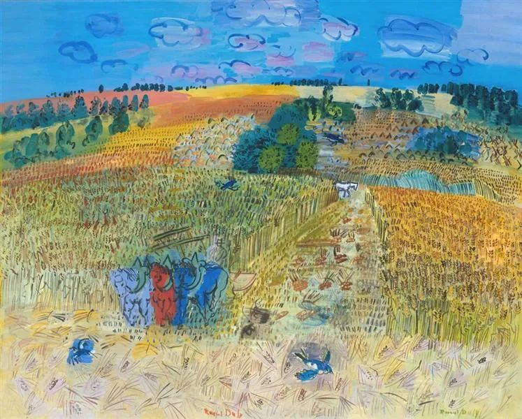

  

Raoul Dufy，The Wheatfield

  

连叔，您好！

  

觉得自己心里一直有个结，不去想的时候倒也相安无事，但是想起来的时候心里会很低落难过。

  

我出生在一个农村家庭，家里三个孩子，我是老大，小的时候就知道父母重男轻女，但是好像很多家庭都如此，也就没在意，后来慢慢发现我心思比较单纯，肯花心思在读书上，就一直有在升学，高考填志愿的时候，填错了(填了愿意调剂)，后来就调到了私立大学去，需要花比公立大学多一倍的学费，但是当时父母咬牙送我去了。我一直都特别感激父母为我做的，读书时心无旁骛，为了尽快工作赚钱，从来没有考虑过继续读研，其实我专业学得不错，有得过专业第一。

  

工作后，虽然没有每个月给我父母多少钱，但是年底肯定会把自己的积蓄取出来给他们，但是我妈妈还是时不时会说谁谁家的女儿多会挣钱这样类似的话。我没有当回事，毕竟自己做的不是生意，赚钱没有那么快，那么多。

  

毕业10年，都和爸爸妈妈很亲密，几乎每天必打电话那种。

  

转折发生在我和先生结婚那年，我们俩都是农村的，按习俗是要彩礼的，具体多少其实我不记得，大概10几万吧，一般来说都会给一些当嫁妆让女儿带到婆家，到办酒那天，我妈妈没有把一毛钱彩礼给我。

  

我结婚后不到一个月，我弟弟也办了酒席。我明白了，他们是用彩礼给我弟弟办了结婚酒。

  

从那时起，我觉得我的心就死了。这之后我先生也有一些意见，不过他心态放得比较宽，他说培养一个受过高等教育的女儿，嫁给我，给点彩礼应该的。但是我接受不了，我长达半年多都没有主动和他们打电话。后面几年虽然和父母关系慢慢好转，但是永远回不到我婚前和他们那种亲密程度了。

  

其实对白手起家的我们来说现在应该算是不错了，400多万的房子，两个人工作都不错，先生对我一直不错，既是行业内的精英，在家也是带娃能手，觉得自己很幸福了。但是每当有看到一些相关的文字，总让我想起自己的这段经历，就会特别低落难过，觉得自己没有可以依靠的父母，觉得自己被抛弃。他们根本没考虑过他们这么做，我在婆家面临的将是什么。

  

还有一点，我是公立学校的老师，班主任每学期都有一些班会的任务，如感恩父母什么的，我总觉得我没办法去说这个话题，我不知道该从何说起。

  

期待您的回复。这是昨晚写的，这会看的时候又觉得好像都是小事，犹豫了一下还是觉得想和您唠唠，听听您的想法。

  

Lin

  

* * *

  

Lin：

  

你心中的结，就是父母没按习俗回一部分彩礼当你的嫁妆。收到的彩礼10多万，他们的错价值数万元。即使100%回彩礼，错的最大值也就10多万。

  

如果你的婚姻不幸。那么，将原因归结于他们的这个错，我可以理解。其实按逻辑来说，也不成立，因为婚姻不幸的原因很多，主要是夫妻两人感情经营不好，嫁妆多少及有无，是次要的。甚至连原因都算不上，只是相关性。不过，不幸的人，有权利违反逻辑诉诉苦。

  

你并没有这个权利。因为你生活富足，夫妻和睦。换言之，你父母的错并没有引发任何严重后果。

  

没引发严重后果的错，就是不值得重视的错。一个人每天都会经历不少错，一些是由于人性的恶意，一些是由于教养的缺乏，一些是由于沟通的误解。它们造成的不愉快，我们很快会忘掉，这样最有利于自己，否则，我们的大脑就没有空间享受每天经历的更多的对，它们产生于人性的善意，教养的充分，以及彼此的理解。

  

生活幸福的人，比他人过得更好的人，有一项独特的义务。即要主动帮助提携他人，更多地同情原谅他人。若是变得嚣张、苛刻，那衬不上幸福，就是所谓的折福。你要学着开始履行这义务，养大养久自己的幸福。第一件事，就是原谅你父母在嫁妆上的错。

  

这世上，谁在我们身上犯的错最多？那多半是父母，孩子毕竟在他们身边呆到成年。人非圣贤，这错那错，难免。你的父母，整体上非常有责任感，也尽了抚养你的义务，没犯什么伤天害理的错。揪住一些小错不放，那人人都得恨父母，人人也不敢当父母，我不信孔夫子当父亲时没犯过错。当然，如你所说，有些文字无限放大这些小错，让你要深挖，要牢记，要复仇。那简单，你不看这些文字就是了。如果我的文字让你看了生活更糟，我建议你也别看，那证明我没履行好提升读者幸福度的义务。

  

我们都要履行好自己的义务，去原谅，去爱。这是我们力量更大的标志。

  

祝开心。

  

连岳

  

推荐：[孩子，忍耐一下，成长需要时间](http://mp.weixin.qq.com/s?__biz=MjM5NDU0Mjk2MQ==&mid=2651632136&idx=1&sn=c33b908e014c4bf5def8c29445709231&chksm=bd7e36168a09bf00ed976a1ce976097c88cb72ccbbe4f9a71e0d9bdedfa4c936344ee4673fc1&scene=21#wechat_redirect)  

上文：[上，上，上，上，上](http://mp.weixin.qq.com/s?__biz=MjM5NDU0Mjk2MQ==&mid=2651655700&idx=1&sn=3df5fc573434c586fe95395ce85bcae6&chksm=bd7f8a0a8a08031ca2c996bc5658334a33b3921e89ec5805604cffec3b9cec375616ec0db073&scene=21#wechat_redirect)
