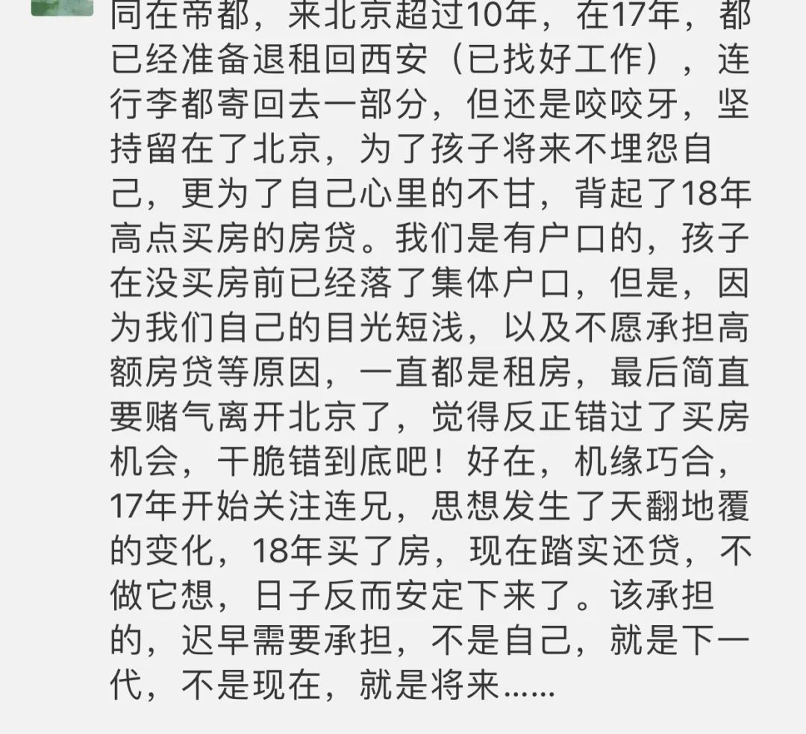

Willard Metcalf，Flying Shadows

  

  

首先恭喜这位朋友。其次谢谢他说出来人最容易犯的操作错误：与市场赌气。

  

许多人没有房子，并不是不想要房子，也不是买不起。而是错在与市场赌气。我认为市场要跌，市场偏偏上涨。于是我很生气，觉得此时买，没面子又多花钱，更是加码继续赌市场下跌。市场继续涨，他的气更大。最后心态崩溃，破罐破摔。不仅没有房子，还变得仇恨这个世界。世界自然不会因此有什么损失，它还是按规律发展，损失的是赌气者，及其家人。

  

专业的交易者，不会犯这种错误。他们将自己训练得没有感情。发现自己判断失误后，马上可以承认损失，进行反向操作。他们不会因为犯了错误而爱上错误，更不可能与市场赌气。顺便说一声，这也是多数人不宜进入股市的原因，一般人在情绪控制上，达不到专业水准，涨跌一不如意（而这必然发生），就开始赌气，最后只好亏本。气越大，亏得越多。

  

作为业余交易者，许多人在买房时经历过赌气阶段，我是可以理解的。没有像股市交易者那么多低成本的训练机会——买卖一手股票多数很便宜——房产一上手就是上百万，数百万的交易额，起伏一个点相当于一个月、几个月的工资，不可能没感情。有些人对地产商、交易方和中介，甚至发展出激情（基本是憎恨）。此时，能否过这个赌气关，就是人生的一大考验，是好与坏，富与贫，进取与退缩的转折点。这只能寄希望于责任感起作用了。一个有责任感的人，无法接受家人居无定所，他自然会尽力买房子，即使他缺乏市场常识与交易经验，也认为房子太贵。但是履行责任感的尊严压住了他的损失厌恶。很多人获得回报是因为有责任感 ，而不是对市场多了解。

  

人都有气，偶尔赌气也正常。可赌气误了事就不好，标准以是否有害责任感为限。当赌气到不想负责任，那就是错了，得赶紧停止。做到这点不容易，但做到了，小事大事，受益无穷。所以，非做到不可，这也是责任感的体现。

  

推荐：[人生持久战](http://mp.weixin.qq.com/s?__biz=MjM5NDU0Mjk2MQ==&mid=2651653029&idx=1&sn=bb5489204c88a120c4f2c99796a28dfe&chksm=bd7f87bb8a080eade86b83cb7888124d9d2c1d40665cea39471292c4eba93390818848cf0eb3&scene=21#wechat_redirect)  

上文：[真爱4字](http://mp.weixin.qq.com/s?__biz=MjM5NDU0Mjk2MQ==&mid=2651653487&idx=1&sn=5cfdcd3d5bec218e360ec68c092b159f&chksm=bd7f81718a080867a5f841110c19c9178dc4213aedb704b3bc1c96ef1acb6c452f6fcbf804a5&scene=21#wechat_redirect)
