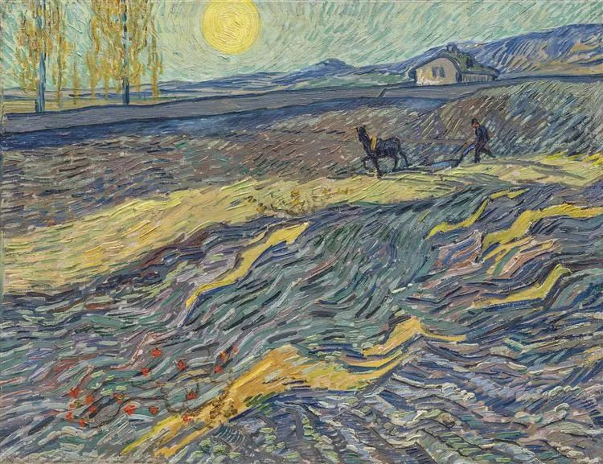

Vincent van Gogh，Laboureur dans un Champ

  

连岳老师：

  

连岳老师，在朋友的推荐下看您的订阅号已经有三年了，这三年来，读您的文章，看您为读者指点迷津，自己也从中学到了很多。让我看问题更加理性，也对生活有了更多的理解。如果说每个人的一生都有几个人生导师的话，那您一定是我最重要的人生导师之一。

  

我先简单介绍一下自己，女，26岁，本科毕业4年，毕业后和老公一起来到杭州发展，并在杭州按揭买房。跟老公一起过着朝九晚九为梦想奋斗的日子。虽然辛苦，但也快乐。

  

我在现在工作的这家公司已经两年半了，今年以来，我的各项工作都完成得比较出色，多次得到领导和老板的表扬肯定。最近我提出了升职申请，由我的上级领导帮我向老板转达。但是还没给我准确的答复。

  

昨晚部门聚餐，老板也在，在饭局上，老板的主要谈话中心多数是围绕我，问到我的家庭以及买房地点和月供之类的。然而我没想到的是，老板在饭局上多次试探我的生育计划，我咬紧牙关说近几年没有生育计划，家人们也都是很开朗的态度，不干涉小孩的人生规划，我们什么时候想生就生。

  

可我内心的真实想法是，我想明年就要，因为明年我就27了，是生育的最佳年龄，我不想太晚生小孩，一是体力会下降，二是我希望和孩子的年龄相差小一些，可以更好地和ta做朋友。我知道，如果我先怀孕了，不仅升职无望，而且生产完我在就业市场里更是被动。所以我拼尽全力去奔跑，多少个加班的夜晚，多少个忙碌的周末，多少个委屈化为动力的时刻，都在为了升职加薪这个目标努力。在这个努力的过程中，我也更加深刻的爱上了我的工作，它虽然给了我压力，但也让我享受到了快乐和成就感。

  

我想说，我这么努力工作，就是为了可以升职加薪更好地可以投入到下一个人生计划，生宝宝。可是昨晚的饭局，让我的人生规划茫然无助。如果我升职了，我的职业道德告诉我，我要过几年时间再要小孩，我的内心又告诉我，我想要在近一两年怀宝宝。又或者，领导觉得我到了最佳生育年龄和时机，出于保险起见，所以不会给我升职的机会。那我的一切努力都将白费。

  

连岳老师，我该怎么办？其实我知道我现在能做的就是照旧努力工作，最大化去证明自己的能力和价值。可是，心中的茫然挥之不去，仿佛陷入了一个死循环，我到底该如何打破僵局？

  

茫然的小蜜蜂

  

* * *

  

茫然的小蜜蜂：

  

你的茫然源于自己的生育计划被打乱。你的例子再次说明生育是女性成长过程中的一大变量，这是男性没有的。作为配偶的男性不仅没有，年轻男性还处于职业的摸索期，不少还不太懂得体贴人，照顾人，可能还要额外地为妻子（女友）增加一点茫然。有些人的解决办法是抱怨自己的女性身份，或者憎恨男性，在想象中打出几拳，暂时似乎出了点气，但长期来看，伤的只是自己，这样情绪更多，理智更少，更是无法解决生育、工作与生活的平衡。

  

巴菲特说过，情绪稳定比高智商更重要。看的人越多，年纪越大，我越同意这句话。那些能够驾驭人生的优胜者，往往并不是最聪明的，而是情绪最稳定的。

  

情绪稳定体现在当我们计划被打乱时，能够随机应变，制订出一个新的计划。计划十之八九，都要或小或大地被打乱。情绪稳定的人，随着计划的调整，慢慢进化，思维力与执行力不停加强，人生雪球越滚越大。情绪不稳定，那难免陷于焦虑、恐慌与对抗，在内心的剧烈动荡中，自我建设很难完成。今天好不容易完成，明天又推倒重来。热锅上的蚂蚁，原地打转，劳而无功。

  

看得出来，你智商不低，能力强，正在上升。老板详细了解你，说明已经在考虑你的升职请求。你“咬紧牙关”说这几年无生育计划，已是瞬间精算后做出的调整。你清楚，为了职业生涯更顺利，不得不改变明年生孩子的计划。只有在更高的职位上展现出能力，获得雇主信任后，你才可能生育。你那时也还处于生育的黄金时段。能不能和孩子做朋友？当然能，反正在孩子看来，你都是超级大人，你爱他，他就是你忠实的朋友。

  

其实只要女性有信用有能力，稍微正常一点，聪明一点的雇主，都乐意用。性别刚开始或许是考虑因素，但在品行与能力面前，那都不是事。你会因为一个好员工休几个月产假而放弃她？那是白痴，这样开公司办企业，非倒闭不可。

  

上次我的公司招人，我有先决条件，一定得招个男生。并非我歧视女生，是公司几乎都是女生，性别失衡。结果还是招了个女生。一起竞争的男生太弱了。看来，公司以后永远只招得到女生，我也得接受。对我这个雇主来说，这些姑娘将来结婚生育，从来不是为难的地方。我还希望她们不要太自得其乐，有点紧迫感，快点恋爱、结婚、生育。只不过，我一个男老板，去说这些事，显得太奇怪。像我这样的雇主，比比皆是，人才不分性别。所以，别担心，不迷茫，把自己的事情做好，会收获善良与回报的。

  

祝开心。

  

连岳

  

推荐：[幸福生活，我们创造](https://mp.weixin.qq.com/s?__biz=MzI3NzQxMzI0MQ==&mid=2247488680&idx=1&sn=2191ed585d4b59861cb41add20314331&scene=21#wechat_redirect)  

上文：[说说建议放开三胎](http://mp.weixin.qq.com/s?__biz=MjM5NDU0Mjk2MQ==&mid=2651653865&idx=1&sn=83a7484b164b89c50ecd0d4ef1ea58b5&chksm=bd7f82f78a080be10dc5913c949597e195213e8d93b5e6a4697d3da4300358d4adaab71a78c9&scene=21#wechat_redirect)
