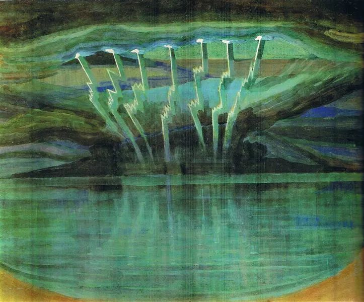

  

Mikalojus Konstantinas Ciurlionis，Lightning

  

现在大家都知道了，芯片很重要，制造芯片的光刻机更重要。这两样东西，特朗普现在用来卡中国的脖子。不仅华为吃尽苦头，国内芯片生产龙头中芯国际曾向荷兰阿斯麦（ASML）订购一台EUV光刻机，价值高达1.5亿美元，原本应在2019年初交付，由于美国政府阻扰，这项交易至今仍未完成。可能也很难完成了。

  

中国最后可能不得不自力更生，既要会做芯片，也要会做光刻机，把气喘舒服一点。有两种令人比较不愉快的声音。一是认为中国肯定会被卡死，中国人做不出光刻机这种伟大机器。二是责怪中国的企业家，早知今日，你们为何原来只想着买？现在有自己的光刻机，特朗普不就干瞪眼吗？

  

为自己的国庆长假挑书时，选了几本后，看到桌上刚寄到的《光刻巨人：ASML崛起之路》，随手也加到包里。顺便说一声，我对长假的最大期待，就是可以静静地读几本书。平时生活主要也是读书，但总是会被工作和其他事打断，不太像享受。美食美酒美景，都值得期待，但它们给的快乐比较短暂，不像阅读，快乐无穷无尽，打开的视野也无穷无尽。

  

原想随便翻翻《光刻巨人：ASML崛起之路》就回到自己的假期阅读计划。没想到一翻它就由配角变成主角，完全停不下来，它给了我一个快乐的长假。

  

读完这本书，第一个想法是，我理解那些原来不做光刻机的中国企业家。做光刻机，相当于赌博，技术与资金密集，但随时可能死掉，即使现在的光刻巨人阿斯麦（ASML）也是如此。光刻机研发不易，却两头依赖，下游依赖几家大芯片生产商的订单，上游依赖光学镜头生产商。任何一头出问题，就会出现生存危机。在阿斯麦之前，光刻霸主是日本的佳能与尼康。日本人统治之前，美国的GCA占据了统治地位。它们都是因为某一个方向出错，错过某一代产品，从而让出市场。

  

研发出一代成功的光刻机，似乎占领了市场，更大的挑战又开始了。在摩尔定律的驱动下，芯片生产商需要生产更小更精密的芯片，所以需要效率更高更精密的光刻机，这又需要更细的光线更精密的镜头，现在已经用离子束抛光镜头，一次只轰炸一层原子，而这只是开始，永远只在开始，人类现在的制造奇迹，不是古人追求金字塔与长城的更大，而在追求无限更小。所以最后，需要更多的数学家、化学家、物理学家和工程师，想出新方法，发明新工具，从0到1。一次又一次，从0到1。

  

这是伟大的技术长征，却不是一个好生意。

  

荷兰人为何去做这个生意？他们可是美国人看不起的守旧的欧洲人。

  

起因很简单，他们不服气美国人。1962年，飞利浦研发主管里奥·莫里斯发现美国开始制造芯片，他看到了未来的方向，于是对手下的工程师克洛斯特曼说：如果美国人可以做到，我们也能做到。

  

飞利浦养着一堆自由自在的科学家和工程师，他们随心所欲。5年后，克洛斯特曼及其团队研发出了重复曝光光刻机原型，可以刻出1微米的线条。1973年，飞利浦的科学家们完成了SIReI，当时世界最先进的光刻机原型。但飞利浦的官僚作风似乎忘了这个项目，科学家们也只是满足于拍张照片，申请专利，然后把机器扔进仓库。

  

1978年，飞利浦科学与工业部的负责人维姆·特罗斯特从废料堆中找出机器，动用秘密基金重启研发，并从IBM获得一台订单，必须于1982年交货。此后，就是苦难的开始，为解决一系列问题，研发成为资金黑洞，最后特罗斯特失去信任，飞利浦高层命令终止项目，停止赔钱。

  

1983年，荷兰新锐企业家德尔·普拉多与飞利浦成立合资公司阿斯麦（ASML），接手光刻机项目，他雇用了充满雄心的贾特·斯密特担任CEO。贾特·斯密特将这个士气低落、市场占用率为0，没有一台成品机器的团队扛在肩上。他说，我们要成为世界第一，如果只想当第三，那最好别做。他发现自己的公司毫无竞争力，作为乐观者，他反而看到希望：如果我做出一台最先进的光刻机，那市场就是我的。于是他开始疯狂地鼓劲、烧钱，迎接无数失败。1987年，这个奠定了阿斯麦（ASML）企业精神的英雄凄凉离场。在资金压力之下，德尔·普拉多也被迫放弃企业，飞利浦公司不情愿地接回烂摊子。普拉多悲愤地警告荷兰人：“我们应该把关键的战略产业拱手让给美国和日本吗？那我只能说，去快乐地挤牛奶、搅拌黄油和种郁金香吧。”

  

这个项目消耗掉两位英雄之后，在飞利浦这棵大树下，终于慢慢有了生气，运气也变好了。1988年，刚安装完机器的台积电发生大火，又订了17台光刻机，阿斯麦（ASML）的财务得以喘息，其后现金流变正。可到了1992年，业绩又跌到谷底，飞利浦只愿再给9个月时间和2100万美元借款。1993年初，阿斯麦（ASML）王牌机器PAS5500上市，公司才活下来。到了上市融资6300万美元后，财务压力缓解。

  

这本书的结尾是什么？1996年初，阿斯麦（ASML）终于在财务上独立了。当时他们的员工T恤上印着：我们将打败日本人。

  

谁会去做这么惨的事呢？耗时32年，不过财务独立。而且未来随时会死。

  

所以，看完这本书，我第二个想法是，中国最后有光刻机，要感谢特朗普围堵中国，让中国的政府、民众及企业家下决心，再难再苦的事都要做。只要下了这个决心，我们的路将走得比荷兰人更坚定，将来我们自己的光刻机工厂，员工的T恤上印着：我们将打败美国人。
