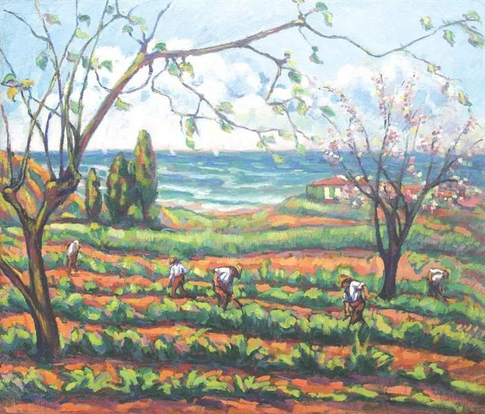

Nicolae Darascu，Field Work 

  

早一点推送文章，因为今天NBA总决赛的时间比较早。

  

中央电视台9号宣布复播NBA总决赛，距停播刚好一周年。火箭队总经理莫雷挺香港暴徒的愚蠢举动，给全行业带来的损失，开始止血。

  

这一年发生了很多事，香港的乱象得到控制，NBA也尝了教训，我觉得是时候重启合作了。尤其是特朗普这样的政客为了一己私利，不停污名化中国，着手围堵中国。中国接下来，不得不活在比较有敌意的环境里。这并不可怕，只要中国保持善意、开放，14亿人的大市场是围堵不了的。围堵中国产生的成本与损失，谁买单？特朗普与仇中美国政客不会买，也买不起。与中国亲近、交往、做生意，就有利益，得发展，那么，朋友肯定越来越多。怕就怕自己封闭起来，盲目仇恨一切“外人”，自己放弃主动权，那正中特朗普下怀。走极端是特朗普这种海盗型政客没有智慧的体现。中国的传统政治智慧是中庸，不偏不倚，以德服人，尊重规律。

  

我认为任正非先生说得对，中美最终是要在山顶汇合的。所有人类都要在山顶汇合。也许过程很长，得几百年，上千年。但中国保持开放，以天下为己任，和一切值得合作的人合作，就是提供正确的登顶路径，减轻登顶难度。

  

几天前，一位经常批评美国政治体制的中国学者受到嘲弄攻击。因为他的儿子在美国读了硕士和博士。这种逻辑不成立。人家儿子毕业后回中国工作了，并没有留在美国。这反而证明这位学者对美国的批评比较理智。如果认为美国什么都不如中国，不许孩子学习美国的长处，那才是失心疯。欧美工业革命以来积累科学技术优势，值得中国人虚心学习很长时间。以后真是第一了，无法保持虚心，也会掉下来。现在是特朗普阻拦中国学生留学美国，怕中国人进步，我们不能自己拦自己。反围堵，最好的策略就是欢迎别人来走一走，自己也多出去走一走。

  

大国的兴衰，不是一朝一夕之事。农业文明时代的中国，宋朝达到顶点后，衰败因子出现，但一直要到鸦片战争，才知道自己已不是天下第一。现在是信息时代，迭代更快，虽然美式民主迎合多数人愚昧，不停挑动群众斗群众，螺旋沉沦，注定要衰败，但百足之虫，死而不僵，再撑个几十年一百年，可能也行。以为中国今年防疫与经济都出色，就成了老大，那太幼稚太简单。路还长呢，而且还不能犯原则性的错误，如果失去包容性与开放性，无法一直学习，尤其是向最强大的对手学习，那么，天命是不会选择这种国家当老大的。

  

祝你今天开心，我看比赛去了。

  

推荐：[莫雷非常没有职业道德](http://mp.weixin.qq.com/s?__biz=MjM5NDU0Mjk2MQ==&mid=2651635296&idx=1&sn=59a23fdf8f5b51b6c73ffd14aa129e05&chksm=bd7e3a7e8a09b3683314be027071d6bcd194b43f2eafea87a699d2096b9b9c715b73aaa52690&scene=21#wechat_redirect)  

上文：[不被巨富家长祝福的爱情，怎么办？](http://mp.weixin.qq.com/s?__biz=MjM5NDU0Mjk2MQ==&mid=2651649723&idx=1&sn=f97e8dbe49007c5ce2363ab7c7bc3ab6&chksm=bd7e72a58a09fbb361bc6b5b94260d617e5b1cd3c20af9bc25b416c9b1a3fa9686df0a888d6f&scene=21#wechat_redirect)
