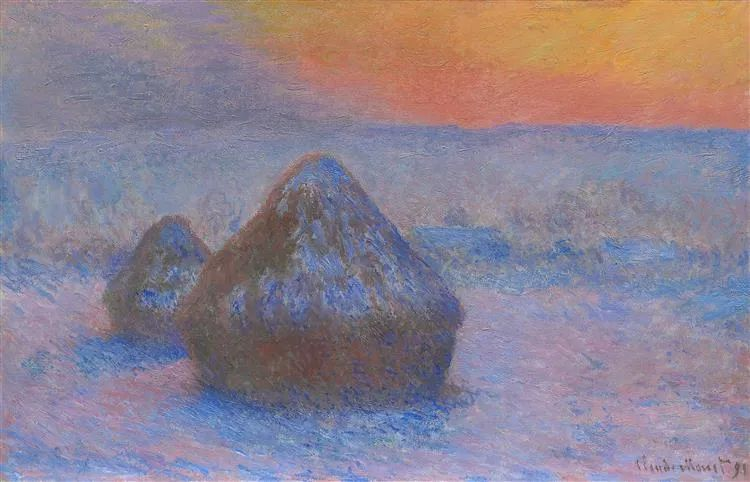

  

Claude Monet，Stacks of Wheat

  

很开心又见面了。

  

今年很魔幻，国庆假期的两件事对比，显得更魔幻。

  

一是美国的特朗普总统感染新冠病毒。这等于说美国的防疫彻底失败，随着气温降低，病毒更容易传播，普通美国人只能听天由命，承受疫情与经济低迷的双重打击。

  

二是中国社会在长假期间恢复正常，享受防疫成功后的经济复苏。文化和旅游部消息，长假期间，全国共接待国内游客6.37亿人次，按可比口径同比恢复79.0%；实现国内旅游收入4665.6亿元，按可比口径同比恢复69.9%。国家电影专资办发布数据显示，10月1日至7日我国电影票房约为36.96亿元，取得中国影史国庆档票房第二的成绩——受疫情影响最大的行业满血复活了。

  

在世界范围内，本次疫情并没有结束。但中国人并不会害怕。可以确定的是，人类社会还会有下一次疫情，有这次防疫经验，中国人以后也能更好地应对，毕竟方法不复杂，遵守科学规律，听从政府指令即可。防疫问题，不存在反科学，反政府的选项，否则下场就像美国一样，彻底败给疫情。美国人能否理解“人没有将病毒传染给他人的自由”？就像没有主动暴力攻击他人的自由。从民众到总统的言行来看，美国很多人不理解，也不想理解，这注定了他们战胜不了这次疫情，也战胜不了下一次疫情，只能浪费福奇——美国钟南山——这样顶尖的传染病专家，世界一流的医疗水平也沦为摆设（或只高效服务总统这样的权贵阶层）。

  

一个人的脑子如果没有被偏见束缚，面对疫情，当然会选择中国这种体制。不过，人的偏见很难改变，特朗普就没有改变的意思，很多美国人，或者美式民主崇拜者，也不会改变。他们甚至更有敌意，因为中国的成功让他们蒙羞，觉得动摇其体制的基石。在他们看来，世界只有美式民主一条路（而且最好改信基督教），其他都是邪路。邪路上的人怎么可以战胜疫情？怎么有资格活得更好？这也是特朗普这样的美国政客今年对中国尤其不友好的原因，甩锅、造谣，张口就来，“中国病毒”一直挂在口上，他要占据舆论高地。他感染新冠病毒，我不赞成中国人表同情，献爱心——有些人还认为不这么做，就是不文明——孔夫子说了，以德报怨，何以报德？同态对待，是最公正的，特朗普反科学反理性，误导美国民众，导致疫情泛滥，害死那么多人，他感染新冠病毒，说句“活该”，有什么过分？政治家或许不能这么说，毕竟不是敌国，斗而不破。老百姓这么说，才是为死难者讨公道的文明态度。中国的老百姓，现在还爱特朗普，怜惜他的身体，那不是愚昧，就是虚伪。

  

当一个真实的人，挺好。真实容易摆脱偏见，获得真知。

  

推荐：[解决投资中国的最本质问题](http://mp.weixin.qq.com/s?__biz=MjM5NDU0Mjk2MQ==&mid=2651643667&idx=1&sn=5f38a255b168c7d0c433f1a52a898a6a&chksm=bd7e5b0d8a09d21ba539ccb7444aaf2b21f6b9745428c12b7920144b7a845e578bfe2d2097ec&scene=21#wechat_redirect)  

上文：[最好的心理医生](http://mp.weixin.qq.com/s?__biz=MjM5NDU0Mjk2MQ==&mid=2651649570&idx=1&sn=c3f116d7a6aada5e8186818bd5524d56&chksm=bd7e723c8a09fb2ab92ba72daf49fb069e16e101ffc777cfbc1ffc8ea5fd6ee021333bae22e5&scene=21#wechat_redirect)
