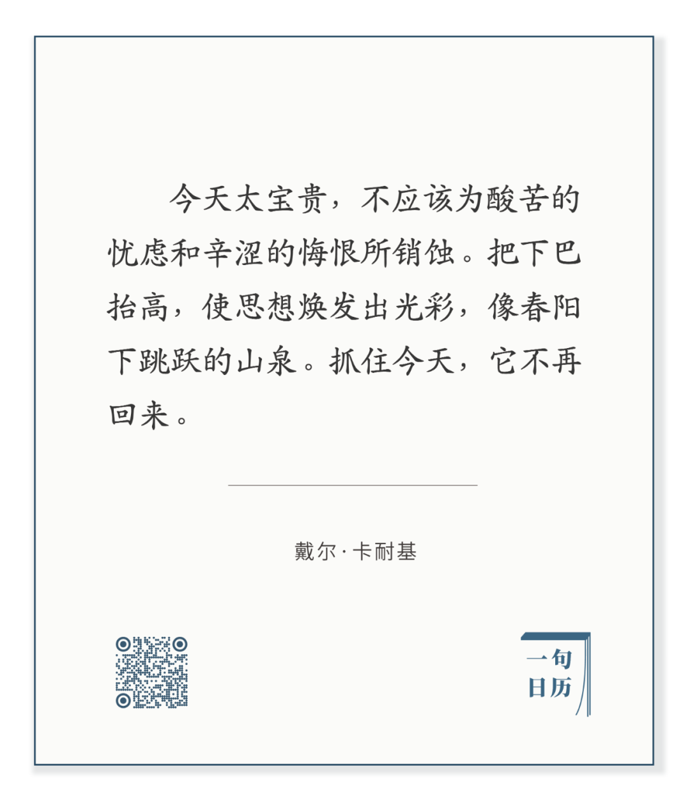

Frederic Remington，Against the Sunset

  

长按二维码可关注  

  

懊悔是人的主要情绪之一。因为过去的一天，没有一天尽善尽美，总有些该做的事情没有做好，甚至该做事情忘了做。

  

懊悔是有时间观的体现。时间是人特有的知识。我们知道时间是最宝贵的资产，无论多大力量也增加不了1秒。时间也是最冷酷的朋友，你一合眼入睡，昨天就决然离去。懊悔是浪费时间的情绪体现。从正面的角度来看，它是人的校正机制发出的警报声。不知懊悔的人，那不是人。

  

但懊悔太多，人也变成非人。因为懊悔会自我繁殖，像癌细胞一样，让人掉进自我否定，自我怀疑的无底深渊。一早醒来就开始懊悔的人，并非特别具有反省精神，而是让懊悔侵蚀今天，继续喂养懊悔。

  

今天是关键，今天是抗癌灵药。今天把该做的事情做完，做得比昨天更好。懊悔就开始停止增长，继而消散。千年暗室，一灯光明。懊悔之暗再重再久，行动的光明都可瓦解它。

  

你今天要做什么？你以为自己肯定不会忘掉，但如果你没有写下来，你极可能忘掉其中一两项，甚至全部忘光。这就是把计划写下来的好处，遗忘率和差错率可大幅下降。一个人养成习惯，在一周开始前写下一周计划，在一日终结之前写下明日的计划，总是用行动锁住时间，那么，懊悔在你身上就绝不可能过多。

  

今天是第151期“下周很重要”，又是制订下周计划的好日子。

  

推荐：[有些天生的弱点必须补强，尤其是涉及财富](http://mp.weixin.qq.com/s?__biz=MjM5NDU0Mjk2MQ==&mid=2651643154&idx=1&sn=f0803a81e6047d3d118b53ada90b8b63&chksm=bd7e590c8a09d01aff8ad07196e9b962cac44b8f82d56dd5b7d1a31ec199decdb9f6c3d19dc7&scene=21#wechat_redirect)  

上文：[放下“正确偏执”，尤其是在家中](http://mp.weixin.qq.com/s?__biz=MjM5NDU0Mjk2MQ==&mid=2651662500&idx=1&sn=bad3ebebcb848744cde1b9d6c27e860c&chksm=bd7facba8a0825ac2bd5adea521e73f8fc57160c71ec87d69d62efa2f7543c826020d84fb469&scene=21#wechat_redirect)
