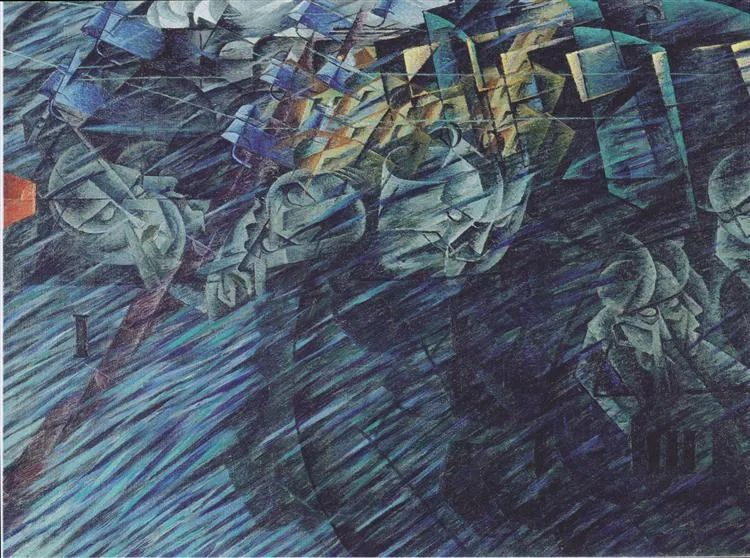

  

 Umberto Boccioni，Those Who Go

  

连叔您好：

  

我是一个在基层乡镇工作七年的小伙，之前一直是体制外，去年有幸考到了家门口的事业编基层乡镇，现在的我虽然离家近了，可过得并不开心。

  

十月的一次人事调整，我被任命为综合办公室负责人，负责服务主要领导和管钱。我这个人干习惯了具体业务工作，干几项工作，有章可循我都能做好。但让我经常在钱上搞变通，领导各种把应该副职领导干的活推给我，还要我去钱上搞变通，我做不来。

  

任职的时候，我试用期都还没过，别人都不愿意干的这个综合办公室负责人，把我推了上去，我打心里是不接受的。找领导谈过想法，没办法，领导说没别的合适的人啊。最后不了了之。

  

我这个人不求上进提职，只求在安分的把工作做好，不和钱打交道，别让我在钱上搞变通，违心的事我心里扭曲。

  

我知道作为小伙子，在基层大多早晚都是要委以一些脏活累活的，这会儿接受不了这些困难，将来早晚也会找来。孩子一岁了，是时候给孩子做个榜样了，可我现在突然没了精气神，干好干坏都挣这么多钱，不打算晋升提职，只是想在给群众办事时候态度好一些多帮帮他们。可我现在的工作脱离群众太远。

  

连叔，我该继续熬着吗？

  

水清

  

* * *

  

水清：

  

领导让你在钱上搞变通，我的理解，就是做一些违规违法的事，也就是做假账。否则，你不至于这么痛苦。

  

你现在两难。不做，与领导关系将破裂，以后在他手下工作，不那么顺心，穿穿小鞋，都是可以预见的。但你有不做的充分理由，按财务制度与财务纪律，一一指出违反的地方，正大光明，领导碰一两次钉子，要么放弃，要么换听话的人做。当然，他最好放弃，从此不打这些坏心思，对他来说，人生更安全。如果是这样，你某种程度上也算挽救了他。

  

遗憾的是，很多处于类似处境的年轻人，在领导的劝说及压力之下，将选择顺从。劝说之辞大概是这些：“这事没什么大不了，人人都这么做”“上面查了，有我顶着”“脑筋不灵活，不会变通，能有什么前途？”违抗领导的命令（即使是违规的），又需要大勇气，于是年轻人糊里糊涂半推半就做了。

  

这种脏事，只要第一次顺从了，就像贞操，失去了就不会再有。以后假账越做越大，越做越没有心理负担，事情败露，要处分，甚至要坐牢，领导能讲义气主动担责吗？那时他将有另一套脱罪的说辞，大概是这样“财务的事我不懂，是某某同志（也就你）在负责”“他误解了我的意思”。因为两人之间口说无凭，他一概不承认，也很省事。即使事情没有发展得如此之糟，在大数据时代，一切皆有纪录，你年轻时做假账埋的雷，跟你一辈子，可能在人生的任何一个节点引爆。

  

两害相权取其轻，不做好很多。而且你“不打算晋升提职”，知足淡定，没什么可失去的，更有不做的底气。

  

你坚持原则，度过这个难关以后，有晋升提职的机会，我建议你也不要放弃。权力不是用来谋私利，做坏事，是用来帮群众，那应该要，给你你不要，那也是不负责任。一个坚持原则的、有道德勇气的人，随着年龄的增长，应该逐渐处于优势地位，这样更能帮群众，也能帮自己身边的年轻人。

  

年轻人一步走错，可能步步错，一生就没了。这关键的一错步，如果是他身边优势者，凭借权力、金钱、名声、阅历或计谋，迫使或引诱而致，这些人就是另类的谋杀者，杀人慧命。这类人很多，至少占人群的一半，他们是人年轻时的危机，要鼓起勇气拒绝被他们轻易推入堕落之途。到我们慢慢长成优势者，也要承担起自己的责任，应助年轻人走美好之路，引着走对一步，推着再对一步，愿他们之后步步都对。

  

祝开心。

  

连岳

  

推荐：[掌握一生最可靠的名利之源](http://mp.weixin.qq.com/s?__biz=MjM5NDU0Mjk2MQ==&mid=2651639388&idx=1&sn=5e8a7889d11a6e15b7106215fcd594fa&chksm=bd7e4a428a09c354d80ad6318660e51e0980e2b9efada2a44601d19ad94a1c3f6c18490533da&scene=21#wechat_redirect)

上文：[今天是关键的一天](http://mp.weixin.qq.com/s?__biz=MjM5NDU0Mjk2MQ==&mid=2651662720&idx=1&sn=f98e86224dc0b7a445bf22a4d439cb06&chksm=bd7fad9e8a082488eb680556835f4ed72fd1fe75b1b1fdddf281e0f424f1dbcd2235a903850c&scene=21#wechat_redirect)
