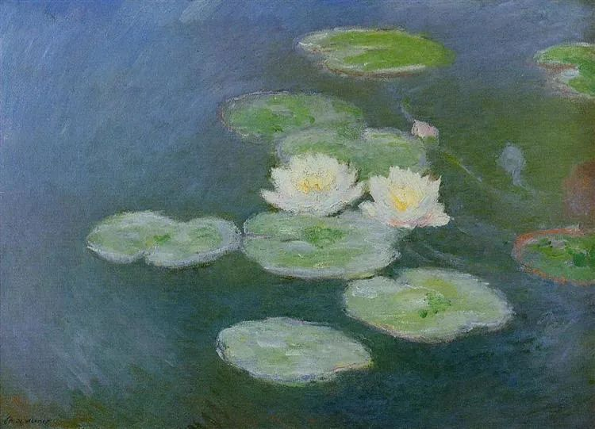

Claude Monet，Water Lilies

  

连叔您好，

  

我是您的新朋友，4个月前经人介绍认识，现在每天上班路上看您的推送已经成了我的习惯。按说不该对新朋友如此敞开心扉的，但您是我能倾诉的人里智慧最高的一位，特别是今天看到您推送的RCEP新闻（太巧了，我前一天刚兴致勃勃地跟老公说起，我们签下了体量最大的自贸协定，奥巴马怕不是要气哭呦～），我想您一定是可以理解我的。所以如果可能的话，还是想烦请您为我答惑。预致谢意！

  

我是一个从小到大没有吃过什么苦的孩子。在北京读书、高考，上了个好大学，毕业后非常幸运地被某部委录取，派到欧洲驻外四年。在国外期间认识了我老公，他聪明又要强，做饭还好吃。今年任期结束，我们顺利地回国领证、办席，现在正在戒酒期，准备半年后要小孩。国内的工作虽然又忙又累，但好在管理很人性化，起码可以让我毫无顾虑地休产假。

  

看起来一切都在往好的方向发展，对吧？但是有一个严重的问题：在人生的每一个阶段，我都觉得不如上一个阶段。上大学的时候想回到高中，毕业了又想回到大学，出国了想回来，回国了又怀念以前驻外的时候。这样看来，我又似乎一直在走下坡路。

  

我时常思考人生的追求应该是什么？评价一个人成功与否的标准又该是什么？大家普遍认可的“吃饱穿暖，有车有房”对我和身边的同学朋友来说，是父母那辈就已经解决了的问题，不该再成为我们这代人的追求。最有说服力的标准——“金钱”于我又不适用，毕竟总书记都说了，当官就不要想挣钱，挣钱就不要想当官。

  

或许我应该跳出体制去企业寻求发展吗？但那样成本太高了，我很怕跳槽以后又怀念现在的工作，就像我一直以来的那样。有时真的很向往那种逆境中咬牙坚持，拼搏向上的人生状态。想过做出一些改变，但又怀疑自己能不能坚持住，从而不敢改变。佛说众生皆苦，不知道当我的苦难到来时，从未接受过历练的我会不会被击垮。

  

啰啰嗦嗦了这么多，其实是想听听您对寻找人生目标的理解。我想在正式成为一名妈妈之前解决好这个问题，不要漫无目标地迎接我的宝宝。

  

感谢您的倾听！

  

一只兔子

  

* * *

  

一只兔子：

  

你的名字虽然叫兔子，但你是乌龟型的人，体现进入新环境比较慢，需要更长的适应时间，所以导致不停地向后看，觉得人生上一个阶段更好。你的好处是只要过了适应期，总能把事情做好。就像你之前的每个阶段，都完成得不错。兔子型的人，可以突然往前跳一大步，感觉进步很快，可是明天又往后跳一大步，振动幅度很大。

  

一两年后，你的孩子出生，随着他的天性逐渐展开，你也要判断一下他是兔子型的，还是乌龟型的，因材施教。不同类型的人，实现人生的方式是不同的。

  

不同时代的人，实现人生的方式也不同。比如你这一代人，有些就要面临富足悖论，而下一代，就得普通面对。中国人普遍富足，是我们几代先辈追求的结果，说拿血换来的，一点也不夸张。但长在富足中，不努力也衣食无忧，延迟满足能力弱化，这样的人多了，又守不住富足，家与国都开始衰退。就像今年的美国一样，富足久了，反而找不到北，真正遇到大挑战，社会就呈现出无能的混乱，无情的残酷。

  

所以你的忧虑与思考将越来越普遍：富足得到后，人生追求什么呢？

  

如果找不到答案，那就解决不了富足悖论。正如有些人发财后，黄赌毒俱全，贪嗔痴更炽，财富成了恶之源头。一个国家，这种人多了，那不过是黄金打就的地狱，富足如镜花水月，转瞬成空。

  

当然，不能因为这样就放弃富足，刻意维持贫穷。免于匮乏，小康社会，是几千年的追求，实现了是大成就。只是，无论个人还是社会，富足后面临继续进步的挑战。

  

富足，我觉得完成了自度。停留在这个阶段，很容易厌倦、无所适从。

  

所以接下来做的，是度人。

  

比如公务员这个群体，在中国的任何地方，其收入在当地，都属中上，再加上社会地位高，即使不富，满足感是够的。给这样的条件，当然就是让你度人的。

  

怎么度人？那几个字写在政府的大院里：为人民服务。服务得越尽责，服务的人越多，度人做得越好，人生的意义越多。年纪越大，我觉得这5个字越好，凡是找到意义的人，都在实践这5个字。释迦牟尼也是在为人民服务，而且服务得很好。我觉得我们的公务员应该有释迦牟尼的水平，说话和气，解民疾苦。老和富豪比，觉得工资低，又给办事的民众脸色看，不仅自己找不到意义，也会让政府失去意义。

  

我觉得你的意义，就藏在你接下来要做的事情当中，先当好妈妈，再当好公务员。既然你什么都不缺，就应该当得更好。孩子觉得你是好妈妈，民众觉得你是个好公务员，那么，意义就会逐渐呈现、宏大。正如RCEP协议签署的意义巨大，其后有无数尽责的公务员做了自己的细微的工作。

  

祝开心。

  

连岳

  

推荐：[锦诗人生](http://mp.weixin.qq.com/s?__biz=MjM5NDU0Mjk2MQ==&mid=2651645656&idx=2&sn=88d4cacecae0d583039c9d42ba0514a3&chksm=bd7e62c68a09ebd03b3d274c874da0c572a2634d037e90b903a033af4708bc68f3cabe87280b&scene=21#wechat_redirect)  

上文：[好生活的大前提：少争论，多做事，多产出](http://mp.weixin.qq.com/s?__biz=MjM5NDU0Mjk2MQ==&mid=2651661350&idx=1&sn=fbfb5ef38a150e319cdd5b8d3c94859b&chksm=bd7fa0388a08292e9d42c329b647105a0f8c5d50a8f9db5c09abc554cc509bfc5cbceeafe693&scene=21#wechat_redirect)
