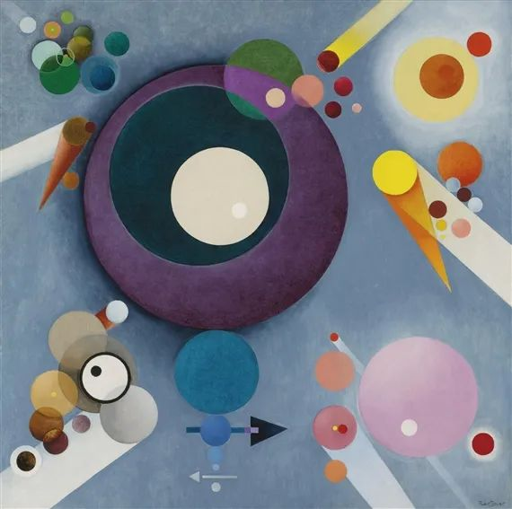

Rudolf Bauer，Spiritual Pleasures

  

昨天有位姑娘留言说丈夫每个月工资基本用于请客吃饭，拓展人脉。有许多男人的想法和这位丈夫相同，把请客吃饭的作用看得很大，其实这是错的。

  

中国从来都是宇宙最强的美食帝国，人生免不了请客吃饭，亲朋好友不吃吃饭，是不可思议的事。但其中的因果不能倒置，我们是因为相爱与欣赏，在一起吃个饭。而不是因为喝酒吃饭，变成好朋友。真的好朋友，就是10年没吃过饭，也是你的好朋友。

  

为了拓展人脉而吃饭，有百弊而无一利。尤其是本来收入就不高的年轻人。

  

一是身体负担重，长期这么吃，健康必出问题。

  

二是风险增大，饭局后面多数流于拼酒，喝高了，判断力与道德水准，都向最低的那个人看齐，而最低的那人，向牲口看齐。

  

三是荒废主业，喝高的人，第二天基本变成废物。在单位混一天，晚上的饭局又开始了。周而复始，你有什么时间与精力去做事，去精进？

  

四是怠慢家人，老婆孩子难得见到你，你对他们一无所知。这样感情怎么可能融洽？

  

五是经济危机。那点工资，吃高档一点，一顿就用光了。

  

你付出了上述种种成本，能认识什么大人物吗？就是偶尔碰见大人物礼貌性和你碰个杯，他就是你的人脉？笑话。这种百年一遇的事，你了不起多个谈资而已。吃来吃去，最后就是几个狐朋狗友搭伙过日子，把工资贡献给大排档，一毛钱都不剩给老婆孩子。

  

请客吃饭是美好的，与好友把酒言欢，是人生至乐之一。但只要一功利化，一切美好就消失了。而所谓的拓展人脉饭，是功利中的功利。人要有远离功利饭局的能力。自己请人吃饭，不要想着利用别人，好像别人吃了就欠你什么，得供你差遣。现在谁差点吃的喝的？陪你吃喝才是给你面子。同理，别人请的功利饭，也不要去吃。

  

人当然需要人脉，人是在与人的连接中产生价值的。别人越需要你，你越有价值。把事情倒回来想就容易理解了，你需要一个人时，你是因为他能力强人靠谱，还是因为他爱混饭局？所以，你的人脉是由你的能力与品格决定的，而天天混饭局，脑袋清醒的时间减少，品格不说，能力一定是下降的。

  

吃饭是人生最重要的事情之一，注定要留给最重要的人。不然就是本末倒置。把一天的工作做好，和老婆孩子吃饭，不是可有可无的事，而是责任。你的爱、观念与方法，在天天的餐桌漫谈中，不知不觉就传递给了家人。家人才是你最大的人脉，连家人的需求都不满足，谁愿意成为你的人脉？

  

推荐：[又坏又蠢的人，只有简陋的剧本可演](http://mp.weixin.qq.com/s?__biz=MjM5NDU0Mjk2MQ==&mid=2651631971&idx=1&sn=ab27e2faa019d13a5d0061ba6776ede0&chksm=bd7e357d8a09bc6bc347f4fd5ee0ebaaddf0927cc8eb309032c66ac61e2e887b2f2ca60658a0&scene=21#wechat_redirect)  

上文：[如何看好你的钱](http://mp.weixin.qq.com/s?__biz=MjM5NDU0Mjk2MQ==&mid=2651659792&idx=1&sn=1c19808d8a6362e26b12daa80ab8f9ee&chksm=bd7f9a0e8a08131802430db56d8df3b864f72f6e9ad27d9a7174efd96f1c0d463b891e7227de&scene=21#wechat_redirect)
