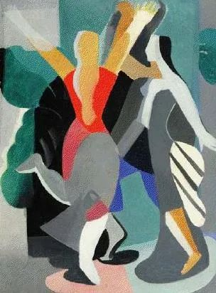
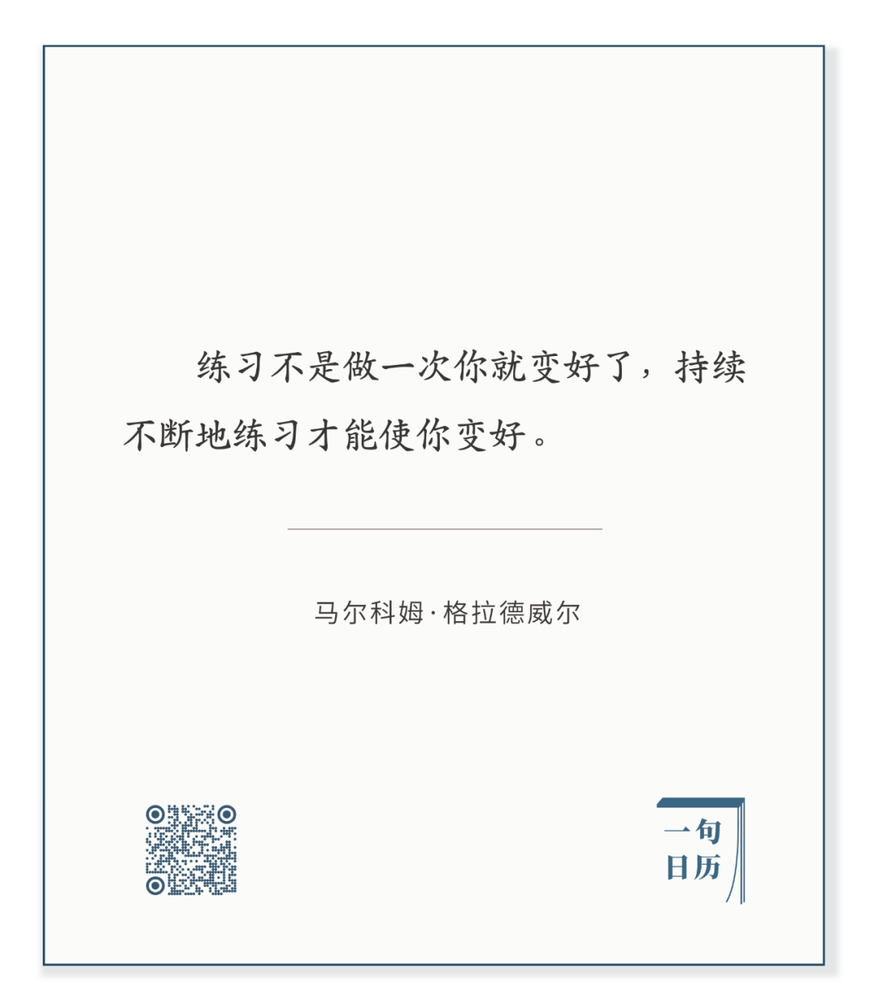

Aleksandra Ekster，Two dancers

  

长按二维码可关注

  

练习是什么？是进化。

  

进化注定是缓慢的。生物一代之间的进化，细微到可以忽视。可时间累积起来的进化，威力惊人，走兽成了飞鸟。

  

人是掌握自己进化频率的特权物种。只要练习一次，就相当于其他动物的一生、百生。你练完一次，感觉无所得——而这往往是必然产生的情绪，不必沮丧，因为你是有所得的，所得的超过我们尚不会生火的祖先一生的所得。

  

我们知道什么品质与技能是好的，必须拥有的，而暂时又还生疏。我们可预见到自己拥用它们之后美妙感觉，就像走的时候，想象得出飞的速度与视野。

  

想象指引了我们进化的方向。但想象是光速，越光速，它的副作用是让我们的日常生活显得更慢，更龟速。马上想象到了，1年后、5年后、甚至20年后才能得到，中间隔着百次、万次练习，这让人焦虑，失去耐心，练了一两次后放弃，不仅一无所获，还多了胆怯、懊悔与怨恨，没得到进化，还退化了。

  

所以，什么是正确的练习？就是永远具有耐心，一次又一次重复，不知老之将至。

  

今天是第150期“下周很重要”，你看，我们不知不觉练习149次了，制订计划，开始新一次练习，新一轮进化。

  

推荐：[你太快了！](http://mp.weixin.qq.com/s?__biz=MjM5NDU0Mjk2MQ==&mid=2651638717&idx=1&sn=d8768ef95153c504ad94bfb268b84ee3&chksm=bd7e4fa38a09c6b5d22876141236ae3f363437cd35b41cdfd9dadc2ff6a1d1da00ade9dc0100&scene=21#wechat_redirect)  

上文：[化解富足悖论：自度与度人](http://mp.weixin.qq.com/s?__biz=MjM5NDU0Mjk2MQ==&mid=2651661467&idx=1&sn=07a025237d1ee33ca39dd62cd59096e8&chksm=bd7fa0858a082993638617d3929366b36ea97318ab8e30937797b2fe3bd8c10d4851b747f787&scene=21#wechat_redirect)
