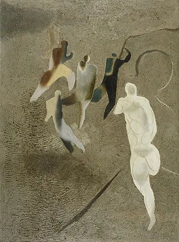
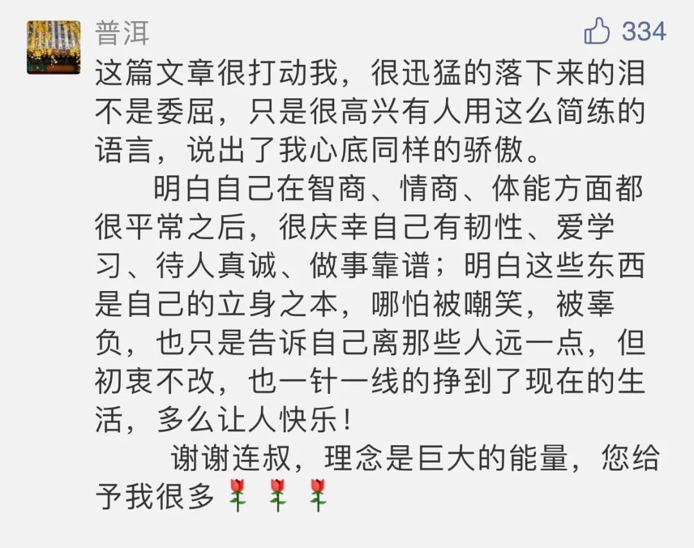

Willi Baumeister，Soccer Field

  

小人物一词往往含有贬义，我今天文章里的小人物没有贬义，标准严格一点的话，我觉得除了影响时代的那几个人之外，其他都是小人物，我就是小人物之一。

  

当小人物没什么不好。小人物更能够保有自己的生活的完整性，有更大空间追求自己的幸福。人物变大了，属于自己的就会变少。举个从政的例子，一个人到了县委书记县长这个级别，自我就得极少。你一项政策与举措，可能影响县城的几代人，若只从自己私利的小格局出发，官是当不好的。再举个经商的例子，现在很多互联网企业，掌握了大量用户的数据，也可分析出其弱点，你用来“成人之恶”，诱人深陷债务危机，喂人精神毒品垃圾信息，可能并不违法，但对不起别人的信任。一个人身家几百亿上千亿，一个人权力可以影响几万几百万人，处于这样的位置，如果没有“成人之美”的追求，老想着打人性的暗黑擦边球，那能量越大，破坏力越大。

  

“君子成人之美，不成人之恶。”大人物应该是君子。

  

不是说小人物就不要“成人之美”，只是小人物“成人之恶”的杀伤力小，了不起耽误自己。我们小人物资源少，机会少，输不起，某种程度上，更得“成人之美”，走君子之道。

  

之所以发了上述的感慨，是因为这位读者在[《我们拉车的人，都要好好保重》](http://mp.weixin.qq.com/s?__biz=MjM5NDU0Mjk2MQ==&mid=2651658392&idx=1&sn=760c4b0dc1de8b88c2346db1f98fa210&chksm=bd7f9c868a0815905d378c5df0fa2932d78d01b3b10ed602f16664670218777499f64a713e7b&scene=21#wechat_redirect)文后的留言：

  

  

这是个有大智慧的人。他的想法与投资大宗师芒格相通，甚至说得更好。

  

芒格说过，一个人很难成为体育明星（因为这需要过人的天赋），但是大部人愿意的话，都可以成为出色的水电工人，只要具有意志，坚持下去了解这个行业，精通手艺，假以时日，这是可以实现的目标。

  

世上大多数职业，相当于水电工，区分出优劣的，不是天赋，而是人生智慧。小聪明，小花招，小偷小摸小骗术，或可暂时获益，迅速得到满足，这是小人难以抗拒的“成人之恶”，但这伤害的是自己的长远利益，资源每用一次就断一次，人见你一次就躲着你，你成为孤家寡人，像病毒一样被嫌弃，人生不可能幸福。

  

小人物更应依靠大智慧，人性之美，才是取之不尽用之不竭的资源。理解了“成人之美”威力的人，就是君子。

  

推荐：[预知45岁的埋伏，倒推人生的安排](http://mp.weixin.qq.com/s?__biz=MjM5NDU0Mjk2MQ==&mid=2651637008&idx=1&sn=436f2846aa069653de786ee533ac076f&chksm=bd7e410e8a09c818126a16f8c015389da4b6973ad13bdbb35ea01f731dd27007d59f06b80251&scene=21#wechat_redirect)  

上文：[特朗普会不会坐牢？拜登会不会防疫？](http://mp.weixin.qq.com/s?__biz=MjM5NDU0Mjk2MQ==&mid=2651659370&idx=1&sn=8ac95705278b553572381d9a4e986434&chksm=bd7f98748a0811626fa9df76fb57d1565a11deb587b7613cd098a7e509200a05a47961179db4&scene=21#wechat_redirect)
