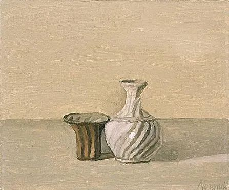

Giorgio Morandi，Natura Morta

  

有位姑娘问，替她带孩子的婆婆因为信仰，有时在院子里烧纸，搞得她烦恼，该如何应对？

  

从几个角度都可以证明婆婆不应该烧纸。

  

从信仰本身来说，一些名门正派的寺院，已经提倡信众不要烧纸，高僧大德们也在与时俱进，移风易俗。当然，婆婆烧纸未必就是佛教徒，可能是其他信仰，但存在不烧的可能性。

  

从产权的角度来说，如果房子是姑娘的，产权人说了算，她可以直接禁止婆婆烧纸。

  

从科学的角度来说，更可釜底抽薪，根本就不科学，不仅不要烧纸，信都别信。

  

但我不建议采取以上任何一种方法去说服婆婆。虽然正确，但不智慧。争论的结果是增加不愉快，情形比争论之前更糟糕，那么，这个争论就不应该发生。判断一件事该不该争，是一个人成熟的标志，世上该争的事，是很少的。你觉得对的事，主要不是为了去展示辩才，而是为了指导自己实践。

  

婆婆在院子里烧纸这事，最好的应对就是由她，不争论。烧纸有没有危害？不能说一点没有，院子里空气暂时不好，可是风一吹就好了。这种小事起争论的结果可能是婆婆心情不好，一怒之下不带孙子了。即使自己争赢了，也愉快不起来。双输，多输的结局。

  

争论可以无穷无尽，小到豆花应咸应甜，大到何时统一台湾。以为争论一定有结果，那是不了解事实，也误判人性。

  

少数人能被逻辑说服，想法被证伪后就能放弃。从事科学研究的人，这是必须具备的素质。但实际上一些搞科研的，尤其是他们离开了科研领域，回到“世俗生活”中，也不讲逻辑。

  

更多人能被事实说服。但不妙的是，有些事实只是偏好，无关对错。咸豆花与甜豆花是死对头，但都对。我今天穿T恤，你穿毛衣，也都没错。这种事争起来，一亿年都没有结论。可争得头破血流的许多事，不就是豆花级的事情吗？代价却是家庭破裂，朋友反目，社会动荡。

  

还有少数人，再大的事实也说服不了。困于自己的私心、偏见、情绪与意识形态，完全不承认事实。袁隆平们又太伟大，生产了太多粮食，这些黑白颠倒，指鹿为马的人又有饭吃，你完全没办法。

  

好生活的一大前提就是少争论，多做事，多产出。一个家，一个国的好领导都是如此行事。

  

想到1984年，深圳成立后进入第4个年头，三天一层楼的深圳速度举国皆知，建设者们喊出了“时间就是金钱，效率就是生命”，生产力大爆炸，事实够明显的吧？可当时争论惊涛骇浪一般，“深圳必败”“深圳是资本家孝子贤孙”之类的说法无法平息。

  

最后邓小平先生亲自去深圳看了看，全程没有表态，不肯定，不否定。陪同的官员专家们忐忑不安。邓小平视察结束，离开深圳3天后，他为深圳的题辞不仅给深圳人，也给中国人吃了定心丸：“深圳的发展和经验证明，我们建立经济特区的政策是正确的。”他还决定进一步开放沿海城市。从此，深圳才能全心全意建设，建到现在，面对这么伟大的一座城市，还有什么争论呢？

  

不争论，往前看。是邓小平先生爱说的话。社会主义的本质是解放生产力，发展生产力。深圳的发展符合这个大原则，一些枝节问题就不再争论了，有人争也没必要回应。

  

治大国若管小家，管小家若治大国。道理是一样的，要知道不争论，往前看，发展才是硬道理。

  

推荐：[邓小平何以成为邓小平](http://mp.weixin.qq.com/s?__biz=MjM5NDU0Mjk2MQ==&mid=2651638360&idx=2&sn=718afca27076978620d55c68644de5a7&chksm=bd7e4e468a09c7500e5eacda834fc1a4410a25a027a95ff74181a526d2e77d1ebe7e2708df1e&scene=21#wechat_redirect)  

上文：[如何分享时代红利？](http://mp.weixin.qq.com/s?__biz=MjM5NDU0Mjk2MQ==&mid=2651661164&idx=1&sn=5dbf9e4b1033766697fa058dc9853d8c&chksm=bd7fa7728a082e6457f9595a17c52ca8b7484bb51117e6a2f15e796ef0bb7754a6e284b7e9f4&scene=21#wechat_redirect)
