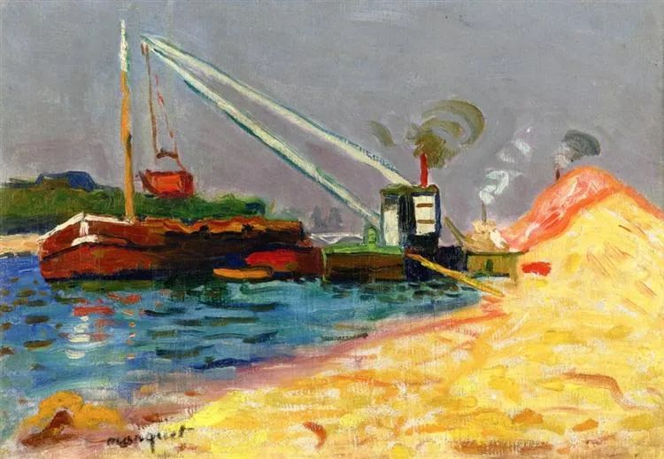

Albert Marquet，Unloading Sand

  

在高科技的现在，钱的流动异常便捷，转1分钱与转1亿元，速度几乎是一样的。换成实物的话，没有哪个劫匪或小偷搬得动1亿元。钱是手机上的一串数字，地主家的傻儿子败光1亿遗产，就容易得多了。

  

常有人感叹挣钱又不容易又慢，但没人感叹钱丢得又不容易又慢。钱丢起来总是很快的，在你反应过来之前已经没了。

  

不久前，有位读者写邮件告诉我他如何在几天之内被人骗走1千多万。骗术很老套，加入了一个群，有所谓的高收益投资项目，刚开始他试探性地投了点小钱，收益总是能及时到账，当他愉快且急迫地打进1千多万时，一切都消失了。最后他问我，这些钱还要得回来吗？  

  

说实话，我看到这种骗局已经没有感觉了。因为看得太多了。骗子固然可恨，受骗者执着上当也是一方面。我不止一次警告身边那些准备上当的人，那是骗局！老套的骗局。可他们不仅不听，还以为你要挡他财路，颇不愉快。真到被骗得精光，他们不恨骗子，也不反省，反而认为是警告者把事情说坏的。  

  

我支持抓骗子，但骗子是抓不光的，抓了旧的来了新的，骗子一直将活在人类之中。我们要不上当，守护好自己的财产，最好的办法还是自己的守护能力。

  

有年轻人遗憾自己不是富二代，财富之坡爬得辛苦。能当富二代是幸运的，不过也额外多了变败家子的风险。没尝过积累财富的艰难，手里又有些钱，人人奉承，见识与人品若有不足，则加倍放大，很快，一个富二代就变成了穷一代。打江山易，坐江山难。发财难，守财更难。能量大了，智慧跟不上，它必然逃逸。  

  

年轻时缓慢积累财富，是很苦，可这苦在告诉你财富的本质：它是你技能、耐心与见识的总和。不能熬这个苦，突然给你一大笔钱，也得败光，德不配位嘛。  

  

如果有人告诉这里有快速致富的方法，那里有财务自由的妙招，可以让你消除这个苦，你动心了，那么，你就白吃了这个苦。最后，苦吃得更多，钱却没了。  

  

一支股票能翻番，某项事业可暴富，有这些秘密，自己闷声大发财不好吗？为什么给点钱就告诉你？

  

真正的致富经都是平淡无奇的、毫无秘密可言的。不就是巴菲特说的大白话：买家好公司的股票，耐心持有。同理，什么是好爱情？爱一个好人，耐心陪伴。什么是好事业？做一件好事，耐心长进。

  

怎么才能发现好？这需要你的学问、人品与判断力。所以，归根结底，努力工作，多读好书，结交君子，持之以恒，自然品味提升，财富增长，跨过一个临界点后，越来越顺畅，火眼金睛，百毒不侵。

  

推荐：[穷查理，富人生](http://mp.weixin.qq.com/s?__biz=MjM5NDU0Mjk2MQ==&mid=2651643298&idx=2&sn=21cb1652a6999d789f0a8ee63ea2a0c3&chksm=bd7e59bc8a09d0aa91d168a813d0fb5701f65340732f00a9d89df9bce724100ee44af2c6ff1a&scene=21#wechat_redirect)  

上文：[大人物要有大智慧，小人物更离不开大智慧](http://mp.weixin.qq.com/s?__biz=MjM5NDU0Mjk2MQ==&mid=2651659488&idx=1&sn=f676fddffeff18ddeb179cbbcd464bd0&chksm=bd7f98fe8a0811e82783c2c89252655af506d6f11b13a76dcfc1c93802db1b417e59f9381fcb&scene=21#wechat_redirect)
