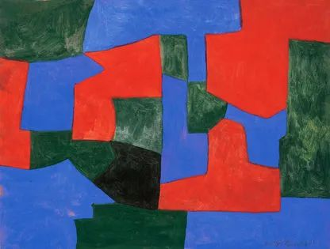
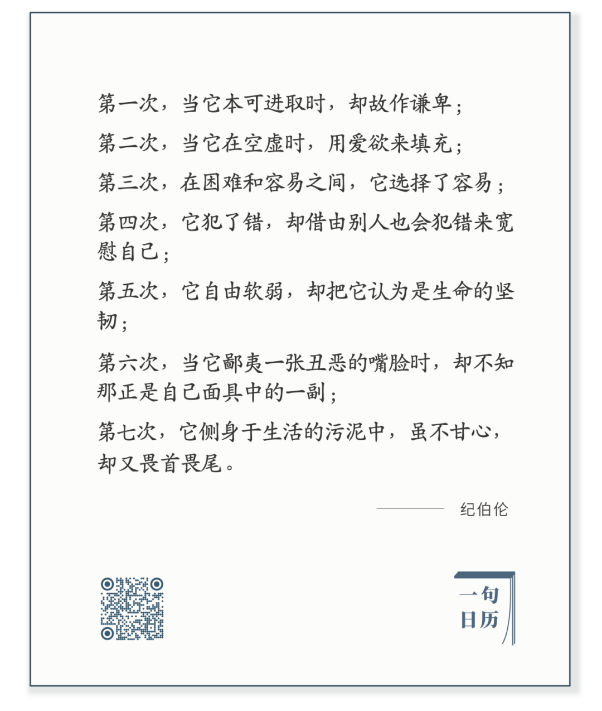

Serge Poliakoff，Composition abstraite

  

长按二维码可关注

  

心只会犯这7次错吗？不，会犯77次，777次。  

  

心将不停地犯错误。终生如此。

  

这或许令人沮丧。大可不必。换个角度想，既然心一生都在犯错，那错误可能就是资源。  

  

错误只会在两种情况下伤害我们：  

  

一是不知是错；二是已知是错，执迷不悟。这样错就会持续掏空我们的根基。  

  

知错就改，迷途知返。在错误中养出这份警觉，一偏航就有警报。甚至，错只是心语，还没有变成形迹之时，将成未成，你就已经发觉。那么，这时候的错误是什么？不就是反向提示我们去做正确的事吗？这份敏锐的察觉力，得益于一个人犯过错误，且能反思错误。  

  

我认为，一个人再忙，每天都要独自呆一会，此时，心可能会做随机运动，难以降服，由它去，它慢慢会安静，在这由动到静的过程中，得失将显现，能够看到自己的错误。  

  

而每隔一段时间，为未来画一个大概的计划，也可收摄心性。凡事预则立，不预则废。预，则错误出现时，自己知道。不预，错误就牵着自己鼻子走。  

  

今天是第149期“下周很重要”，写下计划，预示一下自己下周将要完成的事。

  

推荐：[为什么富不过三代？](http://mp.weixin.qq.com/s?__biz=MjM5NDU0Mjk2MQ==&mid=2651644604&idx=1&sn=f659528e839367b7f81a68904278cf0d&chksm=bd7e66a28a09efb4d3402d9ed4c598002ad267b9f97d444e420bf1c99659d8d0ba4058084a94&scene=21#wechat_redirect)  

上文：[量化财务自由](http://mp.weixin.qq.com/s?__biz=MjM5NDU0Mjk2MQ==&mid=2651660271&idx=1&sn=8d0d7c53eabf5d2f9e344af89f75b078&chksm=bd7f9bf18a0812e7d22aa7a50f6c795161362ceb8d8cadfd84426d20f47d2eaa6eaba21a11f1&scene=21#wechat_redirect)
