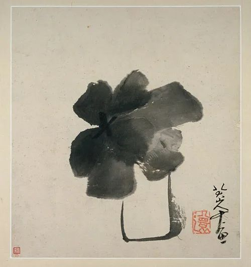

八大山人，瓶花  

  

连叔，敬爱的老师：

  

我终于还是给您写信了。我没有办法像您和“风”那位美丽的姐姐一样，[哪怕埋头拉车，也能看到曙光](http://mp.weixin.qq.com/s?__biz=MjM5NDU0Mjk2MQ==&mid=2651658392&idx=1&sn=760c4b0dc1de8b88c2346db1f98fa210&chksm=bd7f9c868a0815905d378c5df0fa2932d78d01b3b10ed602f16664670218777499f64a713e7b&scene=21#wechat_redirect)。也许我是想倾诉，也许更多的是需要您为我指引。

  

我与我老婆结婚一年零十天了，恋爱到结婚不到一年，也算是闪婚吧。她很漂亮，对小动物也很有爱心。认识之初，我与她是客户关系，她自己正在做工作室（美发美甲类）。我觉得她漂亮，有能力，身边追求的人也很多。我不敢和她深入了解。我觉得我是配不上她的：她很那么优秀，而我只是一个初中毕业还没什么成就的人。后来可能因为机缘巧合吧，我们还是在一起了。可能我也在想我是不是运气太好了，是不是有一种别样的魅力。

  

确定了关系后。我忍不住开始炫耀了，迫不及待的告知亲人好友我找了一个特别好的女朋友。我跟父母说她如何如何优秀，家庭条件也优渥，在父母面前自豪的说儿子是不是还是很优秀的……

  

在一起之后，忽然有一天她告诉我她差贷款要还不上了，差的不多只有几千，然后我也没多问就帮她还了。再之后又陆陆续续的帮她还了几千。也是这个11月，商量结婚的时候，她告诉我她有一张信用卡一直在给他姐姐姐夫用，刷了大概八万左右现在她姐姐她们也没能力偿还了，已经逾期了。而且之前还有一些贷款没有还清，让我帮忙想想办法。于是我在她的指导下，开通了微粒贷和借呗借了几万出来。打算去拿证的前夕，她开口告诉我，其实她们家的房子也是租的，信用卡有两张一张八万，一张五万。她让我想清楚了我们再去拿证。我说十来万对我们以后来说不算什么，房子我也有只是有点小，你不介意就好。

  

就这样，我们领了结婚证。婚后发现，她的贷款像是一个无底洞。我不知道她具体欠多少，不知道都是什么原因导致的。她特别好面子，每每谈及此事要么我停止追问，要么提离婚，更严重的是她会轻微自我伤害。

  

有两件事心里始终过不去。其一，她爸爸喜欢打麻将在我们都困难的时候她依然给钱给她爸爸，我提了个意见，建议少给一点给个几百块钱够生活就行了。她大发雷霆，她觉得她爸爸养她这么大，不知道给了她多少钱。现在连给点钱给他用我都要说。其二，她找我最好的朋友借了钱说是过信用卡，事后没有按约定的时间归还我朋友觉得她不守信于是就删了好友。我后来才知道这件事情，也明白为什么我结婚他也没过来的原因。

  

写的有点多了，我多次在脑海里想着离婚，每次都没说出口。我怕她做出过激的事情，我也不知道怎么跟父母交代。我有时觉得她也很好，我希望能和她一起变更好。但是脑海总会浮现我们真的能走远吗。

  

两个人的问题肯定是两个人都有错，可能我错的地方我不知道。连叔，我需要您的指引与批评。

  

说的有点多了，我是一个不果决的人。多次也想离婚。

  

阿白

  

* * *

  

阿白：

  

我来给你画个像：你学习能力不弱，这从文字表述的流畅度看得出来；你工作认真，自食其力；你善良，愿意原谅他人的过错。按理你该过上好日子，可惜你有一个短板。  

  

因为这个短板，我可以预计一下你的婚姻走向，有两种可能：

  

一是债务缠身，经济破产，从而家庭破裂。

  

二是你特别能挣钱，在老婆与岳父两个财务大窟窿漏水的情况下仍有盈余。但随着时间流逝，你老婆不再漂亮，她唯一吸引你的魅力消失了。你对她的厌恶急剧增加，从而家庭破裂。  

  

无论如何，都是婚姻不幸。也牵连以后出生的孩子不幸。  

  

你的短板就是见色忘义，只要姑娘漂亮，其他所有原则性的问题都忽视了。她毫无财务责任，举债度日，甚至整个家族都是有今天没明天。无论怎么色迷迷，交往到她让你借网贷还信用卡，也就该醒了。年轻人容易被好皮囊迷惑，这也是动物本能，所以你的短板是动物性的短板，刚开始并不能太怪你。

  

但人毕竟是高级动物。高级的地方体现在能够控制动物本能。爱情是人类特有的，两人花很长时间谈话、互动、磨合、了解品性，在理智的作用之下，一些奇怪的事情发生了：原来漂亮的人你不喜欢了，原来勉强接受的人却越来越有魅力。

  

爱情是在义与色之中达到平衡的理智选择，色很重要，但义要胜于色。义的重要成分是责任感。有责任感的人，对自己、对自己所爱的人，都会负责。否则，不可能相伴几十年。

  

你的爱情不及格。你始终见色忘义。客观地说，你老婆在这点上犯的错少一点。虽然她现在是小骗子（体现在骗你的好朋友）。但在婚前还是履行了告知义务的：我是一个财务混乱且破产的人。是你拒不清醒，在“我用漂亮老婆证明自己优秀”的虚荣心驱使下，仍然坚持结婚。婚后一年醒来，觉得难受了。

  

是醒得迟了点，不过总比不醒好。醒了就离。你们两个都还没有资格结婚。一个失败的婚姻可以让两人清醒一下，有助于成长，尤其是你，我觉得短板能够补强。  

  

祝开心。

  

连岳

  

推荐：[人要甘愿去赚钱](http://mp.weixin.qq.com/s?__biz=MjM5NDU0Mjk2MQ==&mid=2651631609&idx=1&sn=908fb15cfa68799db056045352ec533f&chksm=bd7e2be78a09a2f173e224da75dcb4a70b8661978945dec83d40450391e2610288b94d4ab054&scene=21#wechat_redirect)  

上文：[心会犯多少次错？7次够吗？](http://mp.weixin.qq.com/s?__biz=MjM5NDU0Mjk2MQ==&mid=2651660440&idx=1&sn=b63e2758e17a1e3b2aabee9a894045c2&chksm=bd7fa4868a082d90623967174f8be06215eb0610cc969950613dedc8b46a5e738f6facd965b7&scene=21#wechat_redirect)
