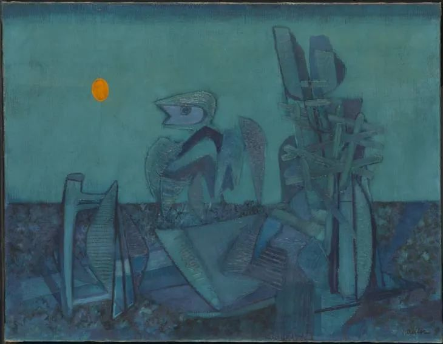

Jankel Adler，No Man's Land

  

美国大选胜负已定，拜登赢了。只有美国总统特朗普不认，大喊舞弊，表示他才是真正的胜利者。

  

特朗普有理由这么认为，他获得了7100万票，美国有史以来总统选举得票数的第二名，有这么多人支持，怎么会错呢？没有今年的疫情，没有在疫情中的愚蠢举动，可以想见，特朗普连任总统是不可撼动的。即使在今年胡作非为，他在选举中落后仍然不多。说明美国人是非不分到了何等地步。

  

其实特朗普在4年当中，都是胡作非为，小学生该有的礼貌、信用，他都难以企及。只是他前3年欺负美国以外的人民，获益者是美国人。这个世界，在国家层面上，现在就是一个丛林社会，拳头大的人说了算，美国总统耍流氓，别的国家只能忍气吞声。只是疫情很特殊，特朗普胡作非为的受害者变成美国人，痛在自己身上，才知道自己的总统不靠谱。

  

接下来，特朗普会不会被清算，送进大牢？如果他在韩国，那是一定的。韩国民主是复仇式民主，下台即坐牢。这要么说明民众只会选择罪犯当总统，要么说明在任的总统可以为所欲为。复仇的人是爽了，政客们却合力把自己这个群体塑造得非常可悲。美国的政客比较聪明，为了大家的政治饭都能混下去，能够克制复仇欲的极端发作，总统的面子还得给。只是，特朗普不坐牢，他的亲信会不会坐？他的女儿女婿逃不逃得了？那就难说了。毕竟，不把风情万种的伊万卡关起来，4年后她携7100万铁杆支持者卷土重来，总统可能还是特朗普家的。

  

拜登的防疫，显然将比特朗普好一些，至少他尊重科学，呼吁戴口罩与保持社交距离。但最终也是拿疫情没有办法。疫情很特殊，病毒不讲民主，多数人尊重科学守规矩并不够，只要少数人乱来，病毒就能到处传播。别说美国有7100万人反对拜登，有7万人、7千人不听指挥，防疫就破功。

  

防疫成功的模式，只有中国是最好的。科学家提供决策依据（这最大程度保证了知识的正确性），政治家提供执行效率，避免贻误战机，保证科学规律起作用。这是精英治国的典范，科学加纪律战胜了病毒，重启了经济，先保住了命，再保住了钱。美国不仅学不来，而且要污名化中国的防疫模式，偏偏反着来。在需要纪律时，要有自由传染他人的权利。在需要科学时，科学规律必须为选举和政党利益让步。可以预见，拜登做得对的地方，共和党一定要反对和捣乱，以证明民主党防疫并没有更高明。一个国家防疫，有另一个党，另一半人执意反对，那么，换谁当总统，都没用。只是4年来一次虚幻的希望，以为有用罢了。这世上任何人都拿美国没办法，但是疫情有办法，美国的体制不改，在一次次疫情的打击下，老本吃尽，没落是必然的。

  

推荐：[谁将赢得美国总统大选？](http://mp.weixin.qq.com/s?__biz=MjM5NDU0Mjk2MQ==&mid=2651650014&idx=1&sn=31e9a9d02e7404e5f747505141e918c1&chksm=bd7e73c08a09fad6e9bb44eaf4df53e901f31446ffb4937b6e2e2c177c4bfb7fe47b6bfee541&scene=21#wechat_redirect)  

上文：[风，继续吹](http://mp.weixin.qq.com/s?__biz=MjM5NDU0Mjk2MQ==&mid=2651659112&idx=1&sn=7bb3670fea7d9ead889a2fc84f5512c4&chksm=bd7f9f768a081660bab04a5873853e49da72d07e332cb729864e217976628c2887164923bfae&scene=21#wechat_redirect)
