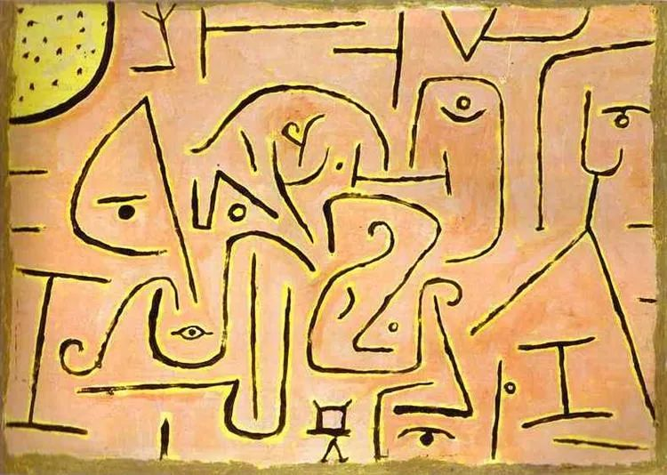

Paul Klee，Contemplation

  

近来连续回复了几位处境优渥的读者来信，有父辈解决车房问题的部委公务员，有数套房子的华为员工，也有能为孩子学习数学提供数百万学费的富爸爸。他们都有各自的烦恼。

  

最近凡尔赛文学是个梗，所以不少评论者认为他们在“凡尔赛”。所谓的凡尔赛文学，就是原来所谓的装X、炫富（贵）的另一种说法，并不是新鲜事。这种装和炫，可能也是一种普遍的人性弱点，有了一点地位、财富、才华，怕别人不知道，忍不住要展示一下。许多人能够战胜这个人性弱点，获得成长。一个人也应该战胜这个人性弱点，否则，一切所得，不过塞翁得马，焉知非祸。

  

真假“凡尔赛”，其实一眼可以看得出来。真的凡尔赛，自然不必理会。但很多人展现出来的优势，并无炫耀的本意，是假的凡尔赛，此时，就应认真沟通。中国财富积累了几十年，阶层已经十分丰富，人与人之间的差距可以极大，这是正常的。这结合昨天（23日）中国宣布所有贫困县脱贫。可以回答不久前一位读者的问题：什么是好制度？好制度就是普遍解决绝对贫困，不愁温饱，在这基础上又不抑制竞争，让努力者的成就没有上限——说实话，他们也是大税源。

  

但是人与人之间、阶层与阶层之间若无法顺畅沟通，也会出问题。穷的仇恨富的，富的鄙视穷的，成为主流，那社会就变成火药桶，一点就炸。在这点上，中国人在很穷时就在探讨解药，孔子说了，“贫而乐，富而好礼。”贫而乐，不是因为贫穷值得开心，而是贫穷时做了自己该做的，遵行天理，乐于自己行了正道，贫穷不那么容易给人造成烦恼。富而好礼，礼是指不做不该做的事。富了不善良，去欺负人，去包小三，去诱惑穷人及时行乐，借债消费，甚至太爱“凡尔赛”，都属于不好礼。

  

在中国这个和平时期的大市场里，贫困县都消失了，消灭绝对贫穷的人间奇迹已经实现，穷都是相对的、暂时的，只要你愿意学习，财富梦想就有实现的机会。

  

这种学习的重要途径就是向领先自己很多人的学习，与你同阶层的人，观念、格局与方法大致相同，一起抱团取暖可以，但突破就难了。而只有放下攻击性、嘲笑欲、戒备心，才能学到别人的长处。从这个角度看，我很感谢那些衣食无忧，甚至财富惊人的朋友坦承他们的人生忧虑，这不是什么“凡尔赛”，这是大价值，这告诉大家，人生有元烦恼，我们始终得在新的平台上寻找更大突破与更多意义，永无止境，这点穷人富人一样。

  

人也有元动力，起决定性因素的总是责任、勇气、坚定与耐心，有这些，就能贫而乐，从贫到富，再富而知礼，在任何一个阶段，都不容易对抗，都活得自在。

  

推荐：[我最喜欢谁的意见？](http://mp.weixin.qq.com/s?__biz=MjM5NDU0Mjk2MQ==&mid=2651638068&idx=1&sn=ea0d37e928a0300ef85d0ca1cc70ca18&chksm=bd7e4d2a8a09c43c09ebce22e5694eb2acb7b065ca7ef6b076f7ad79af5380d0e5617de39690&scene=21#wechat_redirect)  

上文：[华为给的好牌，我们想随便打掉](http://mp.weixin.qq.com/s?__biz=MjM5NDU0Mjk2MQ==&mid=2651661977&idx=1&sn=7c144ff58bea066bafb0155b7d2a6b94&chksm=bd7fa2878a082b91427db60974e07a6fe09af9c1b3f2e0e6d575ca4b15e516182691653364ae&scene=21#wechat_redirect)
