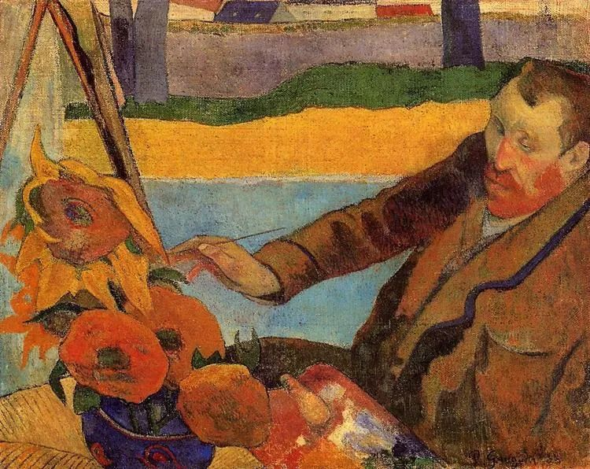
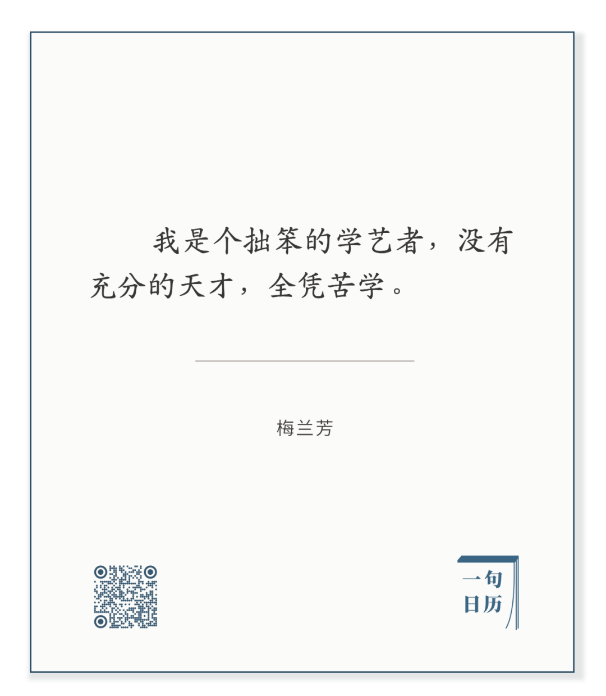

Paul Gauguin，Van Gogh Painting Sunflowers

  

长按二维码可关注

  

梅兰芳这样的大师，说自己拙笨，可能出乎很多人预料。在想象中，他必然是天才。

  

到了大师级别，肯定得有天才，一点天分没有也成不了事。但这天才，一开始很小，星星之火，一丝风，一滴水，都可熄灭它。只有持续地呵护它，喂养它，壮大它，它才有燎原之力。

  

人之初，就是梅兰芳先生所说的，带着“没有充分的天才”，运用它，总觉得拙笨，只有苦学，才能达到“充分的天才”，在观众看来，你天生如此。

  

而自己不能像观众那么看，自己要知道自己的拙笨。凡高一次次画向日葵知道。梅兰芳知道，你也知道。

  

那些需要一直努力的事，更值得。有价值的事，没有某个分手的时间点，我们不会在高中毕业时，大学毕业时扔掉，而是像生命一样，我们想一直拥有它，到死为止。

  

一日不作，一日不食。这并非只追求生活的辛苦，周末不作，休息一下，也可以食。它是告诉我们不要忘了最重要的常识，食来自于作。一日作，日日作，人才能完成自己，天才才从不充分走到充分。表面看起来机械的、严格的、拙笨的计划，今天不作，果然不食，更容易记住常识。就像梅兰芳先生到了大师级别，还是天天练习，与拙笨为伴。

  

今天是第148期“下周很重要”，作起来。

  

推荐：[富思维易，富行动难](http://mp.weixin.qq.com/s?__biz=MjM5NDU0Mjk2MQ==&mid=2651631510&idx=1&sn=c44bbe842fb9821ae0a09e861f5f5780&chksm=bd7e2b888a09a29e575d44b843ec6d660381c7168504c8f98e16afcdb02e1634cdd86fce1cf9&scene=21#wechat_redirect)

上文：[我们拉车的人，都要好好保重](http://mp.weixin.qq.com/s?__biz=MjM5NDU0Mjk2MQ==&mid=2651658392&idx=1&sn=760c4b0dc1de8b88c2346db1f98fa210&chksm=bd7f9c868a0815905d378c5df0fa2932d78d01b3b10ed602f16664670218777499f64a713e7b&scene=21#wechat_redirect)
