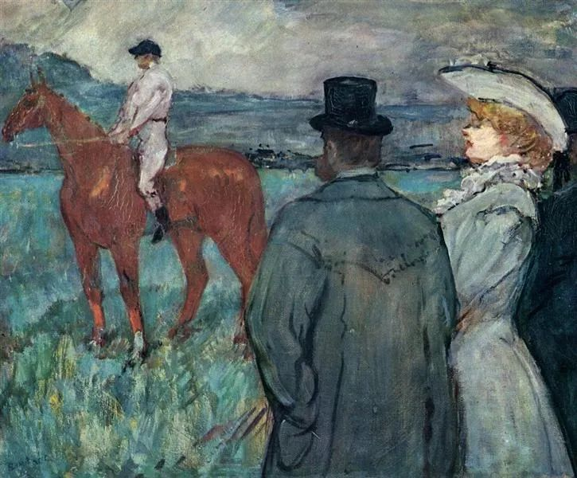

Henri de Toulouse-Lautrec，At the Races

  

常有人抱怨自己的职业“上升通道窄”，或产生厌倦感，或想改行。

  

这两种反应，往往都导致工作质量下降，与同事关系变差，从而更不容易上升。这不是说从事一项工作就必须从一而终，中途不许更改。我找到自己喜欢的工作，也换了几次跑道，教师、公务员、记者，都试过，觉得自己都还及格，但最后也都放弃了。我算试得多的，你未必要搞得如此麻烦，但人发现真适合自己的职业，变动一两次，我觉得再正常不过了。

  

无论怎么换，理由万千条，“上升通道窄”这条理由反而是不成立的。因为上升通道窄是所有职业的共同特征。哪个职业上升通道宽？呈倒金字塔状，越往上领导越多，没这样的职业。抱怨“上升通道窄”就像抱怨人终有一死，毫无意义。用毫无意义的抱怨指导自己的行动，则行动也失去了意义。

  

任何一个职业都有其难忍受的某个短板，稳定的职业可能收入低，收入高的职业可能不稳定。有成就感的工作可能很辛苦，轻松的工作可能没有成就感。在职业规划中，你得明确自己最想要什么，得到了，你就应该满足，就应该接受其不利因素。想通这点，抱怨就少，心会安定。

  

永远不要忘了自己选择职业的初心。比如你选择当公务员，那是看中它稳定，社会地位比较高，生活水平至少达到平均。你不能当了几年公务员，开始抱怨自己没官当，更哀叹自己发不了财。大多数公务员没官当，不很正常吗？官位就那么几个。公务员收入不应低，低了无法吸引人才，但肯定不能发财，公务员发财，尤其是大发财，那民众与国家就要倒大霉。

  

前几天看篇新闻，说是互联网大厂程序员的悲哀，一失业生活就成问题。看完内容，我差点吐血。这位老兄现状是可怜，干了10多年程序员，被辞退后不久，饭钱都没有。可是最后一位雇主，3年来每月付他3万元以上，他夜夜笙歌，月光。他职业生涯的总收入，高过绝大多数公务员的职业总收入。最后被辞退时，也一次性拿到了18万元赔偿金。他几个月挥霍一空。自己不会管理财务，结论却是工作不够稳定，互联网行业残酷，程序员悲哀？但凡正常一点，都有房有车有存款，生活从容了。

  

有多少职业抱怨是上面这些类型？我觉得占比很高，吃尽某个职业的红利，却不愿意接受相应的风险或不利。这种心态的人，给他任何一个职业，他最后都会以抱怨收场。从今以后，再也不要抱怨自己的职业“上升通道窄”了，把你的工作做好，做一辈子职场螺丝钉也正常。工作之外，你有书，有爱好，有爱情，有家庭，有朋友，那里有无限的温暖与精神上升，工作不能给你的，它们能给。

  

推荐：[人过不好一生，主要是不懂道理](http://mp.weixin.qq.com/s?__biz=MjM5NDU0Mjk2MQ==&mid=2651636336&idx=1&sn=846d012e780ee9f421e498bae372dd8f&chksm=bd7e466e8a09cf7837e0d4941cbfd6f8b1059474cc0bedfd0f80bef3ce2fb509eceaf276f593&scene=21#wechat_redirect)  

上文：[从年轻时极可能出现的大危机，走向优势者应承担的大责任](http://mp.weixin.qq.com/s?__biz=MjM5NDU0Mjk2MQ==&mid=2651662788&idx=1&sn=afa69326f4d9bf60ae11d021d652fa38&chksm=bd7fadda8a0824cc7934b07e04ef78ea61b8e263ba68e805e7c2b21e3952c742b5aed589b181&scene=21#wechat_redirect)
