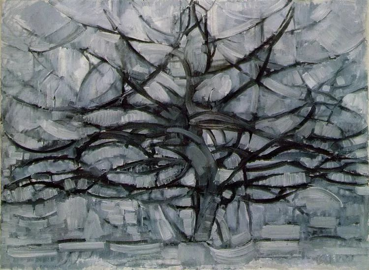

Piet Mondrian，The Gray Tree

  

侥幸，我应该又猜对了[美国总统大选的结果](http://mp.weixin.qq.com/s?__biz=MjM5NDU0Mjk2MQ==&mid=2651650014&idx=1&sn=31e9a9d02e7404e5f747505141e918c1&chksm=bd7e73c08a09fad6e9bb44eaf4df53e901f31446ffb4937b6e2e2c177c4bfb7fe47b6bfee541&scene=21#wechat_redirect)。接下来，就是看特朗普认不认了。  

  

许多中国人希望拜登赢的原因，并非多么了解他，只不过是太讨厌特朗普。他的对华政策和特朗普却无本质的区别，没有那么赤祼祼而已。其实特朗普当选更好一些，他只会粗暴地挥舞大棒，中国人反而没有幻想。拜登还会用用胡萝卜，让人产生选择困难。

  

无论是共和党还是民主党，对美国制度，不止自信，还自大，只有美国代表人类希望。像中国这样，与美国不同，美国又觉得挑战了自己的老大地位，那就是他们制度性的对手，谁上台都要斗一斗。  

  

现在中美之间，没有热战，谁都有核武器，再说了，在朝鲜也打过一次，美国人吃过苦头。也不会彻底冷战，老死不相往来，生意还是要做的。有的就是制度之战。

  

这种终极战争，美国人赢了苏联一次。武力那么强大的苏联，只要对自己的制度失去信心，可以一枪不放地认输。今年疫情最早侵袭中国，美国可能也觉得机会来了，以为中国的制度，无法防疫，经济崩溃，最后人民失去信心，更加向往美国。可是剧本没这么演。先进的民主国家美国，落后的民主国家印度，疫情全部失控。所谓民主自由才能防疫，群体免疫是更高级的人道主义，统统破产。只有中国，先尊重科学控制了疫情，后尊重市场复苏了经济，赢了今年的制度之战。中国人可能从来没有对自己的国家与制度，有这么高的自信。  

  

有人说，美国的制度会纠错，4年一次的总统大选就是例子，总统不称职，就用选票把他换掉。可是，反智反人类的特朗普，这次得票率并不低，有纠错功能的话，他最多得5%的票吧——不正常的人也就这个比例。说中国的制度不能纠错的，那改革开放是怎么来的？18年前，中国在SARS疫情中错得离谱，今年防疫，就完全按照科学作决策，效果世界第一，这种纠错能力不强吗？  

  

制度之战不会在今年终结。就是美国死了20多万人，接下去再死几十万人，也仍然有人认为美国的制度好。制度之战，中国还更难打一点。政府承担无限责任，必须持续做正确的事，才能持续赢得民心，没办法像美国政客一样甩锅给竞选对手或其他国家。中国现在为何80后以后的年轻人更爱国？那就是他们生长过程中幸福富裕的体验更多，觉得政府靠谱，国家挺好。再发展几代人，中国真的样样出色，制度之战才算赢，至少不怕任何冲击了。在这个漫长的过程中，2020年这一战获得的经验，依靠科学，依靠市场，依靠信心与决断力，都会起关键作用。  

  

推荐：[谁将赢得美国总统大选？](http://mp.weixin.qq.com/s?__biz=MjM5NDU0Mjk2MQ==&mid=2651650014&idx=1&sn=31e9a9d02e7404e5f747505141e918c1&chksm=bd7e73c08a09fad6e9bb44eaf4df53e901f31446ffb4937b6e2e2c177c4bfb7fe47b6bfee541&scene=21#wechat_redirect)  

上文：[老子心理大师](http://mp.weixin.qq.com/s?__biz=MjM5NDU0Mjk2MQ==&mid=2651657053&idx=1&sn=963701676fb8cb1282800ade6935b634&chksm=bd7f97438a081e55ea3b71de24add77621153331f71a265726360d48e0bf21d7a6998f4accbe&scene=21#wechat_redirect)
