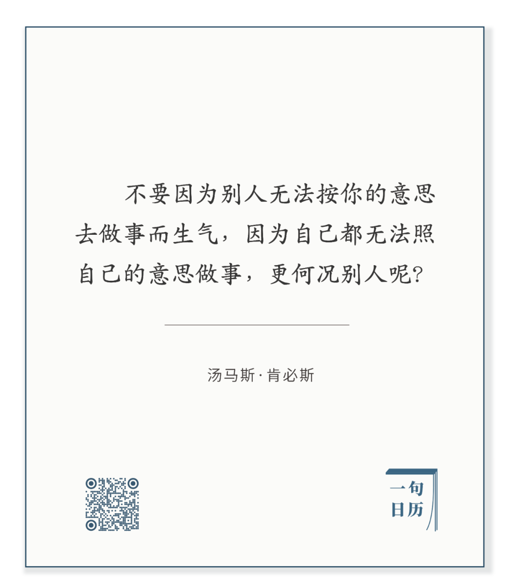

Briton Riviere，On the Bank of an African River

  

长按二维码可关注

  

意外总是会发生的，黑天鹅总会飞来，知道这点，气就没有那么多。人生气，多是因为世界没按自己的意思运转。

  

世界多数时候是按自己的意思运转的，顺风顺水，白天鹅飞在身边，人人显得很厉害，但其实看不出谁才是真的厉害。真厉害的人，因为一向的理性、谨慎，反而显得不那么厉害。只有意外发生时，那个不生气的人才脱颖而出。巴菲特说，潮水退去，才知道谁没有穿裤子。穿裤子的人肯定不生气。而知道不可能永远涨潮的人，必然必穿裤子。这裤子当然是指心理上的裤子。物理上的裤子谁都会穿，心理上的就未必了。

  

丹尼尔·M.海布伦在[《幸福》](http://mp.weixin.qq.com/s?__biz=MjM5NDU0Mjk2MQ==&mid=2651663801&idx=1&sn=7f898fb4b822c9dfe7c1b4f076b5131d&chksm=bd7fa9a78a0820b1715338b660238c9d16ec40dd6ab88c9af1a57f58de67bc6fcd02798dd82a&scene=21#wechat_redirect)中写过一件事。在调查研究中显示，拉丁美洲国家的国民幸福感高得惊人，而这些国家的物质水平并不高，专家们发现，这与这些国家的文化有关系，他们善于发现生活中值得享受的事情，不被意外搞坏心情。旅行时汽车出故障，哥伦比亚甚至有句固定的话对付它：“Todo es parte del paseo”，意思是，这不过是旅途的一部分。这说明哥伦比亚人的汽车质量不高，这不能学，汽车的故障率越低越好，但这心态值得学，学到了幸福感会提升，不然的话，开着越来越好的车，一点点意外就能让自己生气，怎么对得起世界的进步呢？

  

今天是第153期“下周很重要”，制订计划，这可降低人生的故障率，但是，计划是旅行，他人、他物，甚至自己，有时都会出点意外，难免打乱计划，这时候，不要生气，毕竟走了一些路，而且，还可以重新再来。Todo es parte del paseo，这不过是人生的一部分。

  

推荐：[钱重要，幸福更重要，平衡点在哪里？](http://mp.weixin.qq.com/s?__biz=MjM5NDU0Mjk2MQ==&mid=2651663801&idx=1&sn=7f898fb4b822c9dfe7c1b4f076b5131d&chksm=bd7fa9a78a0820b1715338b660238c9d16ec40dd6ab88c9af1a57f58de67bc6fcd02798dd82a&scene=21#wechat_redirect)  

上文：[说说教育部“杜绝将学生作业变家长作业”](http://mp.weixin.qq.com/s?__biz=MjM5NDU0Mjk2MQ==&mid=2651666338&idx=1&sn=32c1bbcfcf19f6cfc78d45073e89ff57&chksm=bd7fb3bc8a083aaa4dddf4d2373fff227ce971a098489227daed86cfa55a30a6733a0c1cfa61&scene=21#wechat_redirect)
