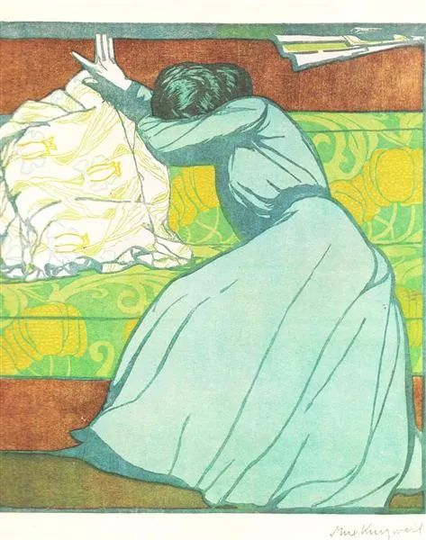

Max Kurzweil，The Cushion

  

讲到节俭话题时，有位读读者朋友问：如何把握节俭的度？

  

这是个会提问的人，知道问题的核心所在。

  

节俭这个概念，不是定量，而是定性。人生之所以难，要随时调整，就在于许多人生问题是定性的。节俭与吝啬，消费与浪费，一纸之隔，非常容易错位。

  

某人一个月花了一万元。他是否节俭？无法作答。这得依据他的收入而定。他收入是七千元，那就是浪费，他收入是十万元，肯定算节俭。

  

我们的上一代人，不少还有饥荒与战乱的记忆，生活没有安全感。节俭对他们来说，不是难题。这到了物质富足的时代，就容易演变成吝啬。眼里到处是可捡的小便宜，无法放手，变成不会享福的人。这时候，我劝他们学会浪费，最后那点饭菜，不要勉强自己吃完导致过饱；劣质变质的食物更要舍得放弃；好衣服不要压箱底，老穿旧衣服；学会上上餐馆，四处旅游，把手头的钱花掉一些。无论是手头还是精神，活得放松一点，避免吝啬。往小里说，对得起自己的人生，往大里说，对得起这个时代。

  

而我们的下一代，许多没有匮乏的印象。消费对他们来说，不是难题。他们容易掉入超前消费的陷阱，丢掉节俭的技能。我会劝他们学会节俭。节俭可说是最重要的财技，年轻时收入低，节俭收效很慢，缺乏长期的自律、自信与朴实，是坚持不了的。没有个五年十年，看不出节俭的效果。可是超前消费，一念之差，一夜之间，就可以掉入大坑。年轻人，手要紧一点，避免浪费。这样，人生才会有更多机会。

  

一个理想的社会，应该是年轻人节俭，老年人不吝啬。如果刚好颠倒，那这个社会就不正常，也埋下了危险的种子。

  

节俭不是不消费，节俭是为了未来更好的消费。节俭增加了一个人的经济实力，最后也增加了他的消费力。节俭获得的能量，若不回馈给自己爱的家人，不能有益于社会，那就成了守财奴，带着一串数字死掉，过完可悲的一生。

  

不掌握节俭的度，可能就会成为守财奴，演变成乞丐型节俭者，身家亿万，形同乞丐。这个度的标准是什么？就是达到同收入阶层的平均水平。巴菲特以节俭著称，他很年轻时就给老婆孩子买了别墅，做了百万富翁该做的事。芒格一直反对浪费，为陪伴家人，有钱后也添置了游艇。游艇对普通人来说，是承受不起的浪费，对芒格这个级别来说，就是普通消费。

  

随着我们财力的增长，节俭的人，消费也慢慢随之匹配，这样就可避免为节俭而节俭，有入没出，变成小气鬼。这个度把握住了，我们可以一直是个节俭的人，也一直是个会生活、懂生活的人，在应该花钱的时候，我们也永远是个慷慨的人。

  

推荐：[害人慧命，与谋杀何异？](http://mp.weixin.qq.com/s?__biz=MjM5NDU0Mjk2MQ==&mid=2651668370&idx=1&sn=18f1846ec27f74dfdf19e588f688acbf&chksm=bd7fbb8c8a08329ae283b623700fc918a3baf42a637ce9b8ffc5a0638e985d5906b4714fe076&scene=21#wechat_redirect)  

上文：[当你失意时，当你没信心时，应该想什么？](http://mp.weixin.qq.com/s?__biz=MjM5NDU0Mjk2MQ==&mid=2651668694&idx=1&sn=11f632ac2afea5cda5c9df780dbaab9a&chksm=bd7fc4c88a084ddeea022f098b8eb01f2a461b7fd786d091b05082e664c0efefa906e927833b&scene=21#wechat_redirect)
