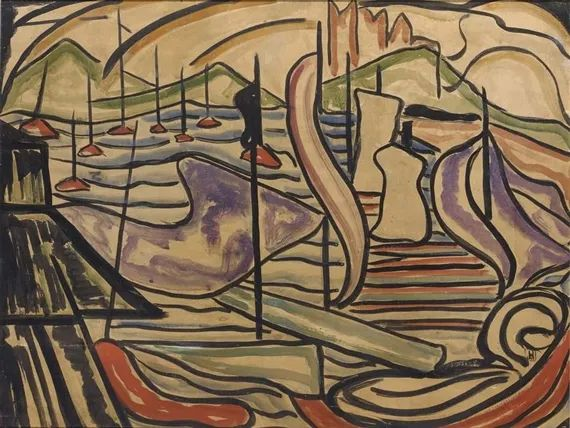

Jacoba van Heemskerck，Harbor Scene

  

连叔，您好：

  

我是一名医务工作者，在外人看来，应该是生活幸福美满的，有两个可爱的宝宝，双方父母都相处的很融洽，可是我总感觉内心很迷茫。

  

我大学学的口腔专业，毕业之后父母安排进了一家二甲医院，没有口腔科，家人的说法是先占个位置，就这样我在这家医院待了10年，没有编制也没有准确定位的我一直很苦恼，一方面纠结没有编制还没有专业技能，能否在将来的某一天被辞退；一方面又为自己学习了这么多年的专业没有好好的应用而惋惜。看着身边的同学在自己的科室干的风生水起即羡慕又不甘。

  

现在的我总感觉看不到未来的出路，我不知道我是应该继续在医院就这样混日子，还是说我要搏一搏重新捡起自己的专业。要是待在医院，可能就是无数个10年这样，最后随着医改不知道会如何。如果是选择重抄就业，就是说33岁的我可能要像实习生一样的开始，想想就头大，比他们大了10岁还要干着一样的活，可能还会有大学的同学在，我们专业很小，基本我们都认识的！感觉自己很难走出这一步。

  

我的家人也不怎么赞成我去诊所工作，不方便照顾孩子，而且工作也不稳定，他们希望我可以考事业编或者公务员，不过我的专业受限的厉害，能报考的只有什么都不限制的，这种大家都想考考上很难还要看运气，我还有2年就35了，也不敢保证一定能考上，如果要是专心考试就又要两年，现在特别纠结，不知道未来的路在哪，应该怎么选择，感觉自己30好几了还一事无成很有挫败感！前途很迷茫，希望能得到一些指引。

  

一个不算牙医的牙医

  

* * *

  

一个不算牙医的牙医：

  

牙医是个好职业。我保养治疗自己的牙齿，每年要花不少钱，估计终生得如此。像我一样的人不少，而且会越来越多。经济水平提升加医学知识普及，养护牙齿成了刚需，人人有口好牙，迟早也是中国人的标配，人又有这么多颗牙齿，牙医怎能不好？只要技术不太差，服务不太烂，牙医这口饭，比什么编制都稳定。

  

像你这样，学了口腔，却荒废专业一门心思蹭编制，蹭10年蹭不上，还想继续蹭。这是拿着金饭碗讨饭，还没讨着。观念格局决定一个人的高度与命运，你算是个典型的反例。

  

求稳定并没有错，人之常情。编制这种体制饭和稳定划上等号，某种程度上是对的，只要不犯原则错误，体制很难开除一个人，把聪明才智都用来摸鱼，有些人几乎没做什么事混到了退休。进了体制就像进了保险箱。我吃过几年体制饭，有切身体会。我体制饭吃得很好，聪明懂事，认真肯干，通宵达旦写材料也不怕，现在回想起来都被当初的自己感动。

  

当时比现在好混得多，但我从来没有混的想法。很简单的逻辑，不混，勤奋一点，长的本事是自己的。领导也不会因为你嘴甜就赏识你，即使领导格局这么低，嘴甜加有本事也更好吧？

  

为追求混而进体制，似乎钻了体制空子，最后一定把自己混小了，混没了。我见过许多聪明绝顶的人混得呆头呆脑。能进体制，哪个不聪明？但混几年，紧不起来，知识没更新，话术一大堆。在体制内，面对百姓，自大得很，一想要出体制的大门，自卑得要死。最后没提拔，当不成官，牢骚怪话就全来了，专门吃饭砸锅。这样的人生有意思吗？猪都不如。

  

今年大家讨厌“恨国党”，中国没被疫情弄垮，他们就不开心。其实“恨国党”的一大来源就是体制内的阿混，衣食无忧，有得是时间恨国。体制外的人天天忙生存、求发展，反而容易记着国的好。

  

体制饭让你过得比一般百姓好，有这兜底，本来应该更努力，天天长本事，这才对得起体制。古人还讲“食君之禄，担君之忧”，有基本的契约精神，现在让百姓养着，却着眼于混，最后混得首鼠两端，左右为难，进退维谷，这是必然。

  

有太多人告诉你，进了体制就可以混，有关系有背景就可以。这是误你害你。最能混的地方最应该努力，这样选择，你有关系有背景，可以锦上添花。你没关系没背景，也会慢慢会有关系和背景，勤奋敬业就是最大的关系和背景。即使最后没官当，勤奋敬业不也是应该的吗？

  

你不能再混下去了，也别想着去体制内更好混。踏踏实实去市场上当牙医，33岁开始努力是迟了些，但比34岁早了1年，比43岁早了10年。人生还长，来得及。

  

祝开心。

  

连岳

  

推荐：[从“求宠爱”到“不从众”，长大的关键一跃](http://mp.weixin.qq.com/s?__biz=MjM5NDU0Mjk2MQ==&mid=2651636892&idx=1&sn=5d31225835ea95a254e61e4ed28c24f9&chksm=bd7e40828a09c994d080e1e3357b1a29826e2ced495489724e588477882da6fa175e4e834610&scene=21#wechat_redirect)  

上文：[你不是行尸走肉，你只是不知自己的好](http://mp.weixin.qq.com/s?__biz=MjM5NDU0Mjk2MQ==&mid=2651670233&idx=1&sn=03d5f324e58d36c38735304260d18776&chksm=bd7fc2c78a084bd19c9d19e06e815dbfd599bf9bf46ddde8e8d449dc2fb605f090d5d4683612&scene=21#wechat_redirect)
