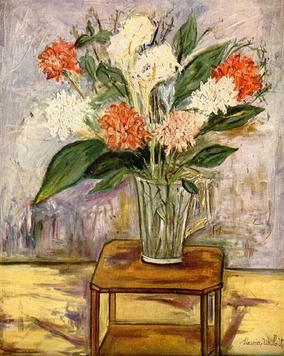

Maurice Utrillo，Flowers

  

连叔：

  

您好。

  

我，91年出生，大学毕业后，参加事业单位考试，在一所农村中学任教。我先生从事工程类的工作，常年随工程在外。因为工作性质差别，也因为生存压力，都不可能放弃自己的工作，恋爱5年结婚4年一直异地，唯一欣慰的是，趁着他们单位团购，省吃节用努力在省城西安首付了一套房子。我从小因为家庭变故，缺失父爱母爱，特别渴望一家人在一起。尤其当我有了孩子，更希望他能有爸爸妈妈陪伴，能有更好的受教育环境。

  

去西安工作，可能是实现我这个愿望唯一的途径。我先生是一个踏实，有责任感，但比较谨慎的人。他虽然知道我内心的渴望，也渴望团圆，但他觉得年轻的时候，努力挣钱很重要，在西安，他有机会换工作，如果我能去西安工作，收入也稳定可观，他有可能换工作。我要在西安依然从事教师工作，只能参加事业单位考试。

  

我马上快30岁，年龄限制，可能就剩一次报名机会。在编人员想要再考试，只能单位同意报名，单位一般不会同意。只能先辞职，再考试。如果没有考上，可能这辈子就没有机会了。我自己平常上班，和婆婆一起看孩子，精力感觉不如从前，以前我笔试比较强，面试能差些，所以来了竞争少一点的农村，这些年，讲课能好一些，面试能好一些，但笔试又改了形式，不是我那么擅长的。所以，我感觉自己都没有以前那么有斗志，但内心又很渴望。尤其当离考试的时间越来越近，我每天都没有学习的时候，当我们努力还完了首付外债，又慢慢攒钱一点一点装修房子而住得很少的时候，当退休年限增长，我可能还要异地30年的时候，尤为痛苦，觉得像在行尸走肉。

  

有时候想，最坏的结果也就是不当老师，失去体制内的工作，做一份其他的工作，努力挣钱就好。但像温水煮青蛙，习惯了，往前一步，觉得很纠结。主动失去，也需要勇气。连叔，我该怎么办？

  

一个挣扎的人

  

* * *

  

一个挣扎的人：

  

你怎么是行尸走肉呢？在我看来，你目前的人生很成功。不到30岁，什么都有了：工作、家庭、孩子、房子。运气也不错，老公负责踏实，婆婆帮带孩子。重要的任务完成了，以后的人生只会比现在轻松。

  

你的天性保守稳重，它的不利之处是很难迅速做出决定，凡事左思右想，似乎进退两难。对于天生激进冒险的人来说，你的难处，他可能一秒钟就解决了。当你需要做决定时，你就会羡慕和自己完全不同的人，羡慕到极点，就开始攻击自己，把自己说得一无是处。这种事也会发生在激进冒险者身上，当他们缺乏耐心，无法深耕之时，他们痛恨自己的浮躁与多变，羡慕你的沉着淡定。

  

天性没有哪个更好。只是给我们不同的方式、不同的剧本去理解人生。随着时间的推移与自己的领悟，我们缺的慢慢有，弱的慢慢强。我年轻时属于激进冒险，不管不顾，大破大立，做决定从来不是难事，给我带来许多机会，也让我吃尽苦头。到了后来不算年轻，我终于稳得住。你也需要时间，再过三五年，十来年，你既有保守稳重的天生长处，也会有杀伐果断的后天优点。这就是人生有意思的地方，顺应天性的有，补足天性的无，达成圆满。

  

你现在的处境不错。作为老师，教育自己的孩子有优势，孩子有这样的妈妈陪伴，得到更多的爱；漫长的寒假与暑假，也让夫妻团圆得够久（其他分居的夫妻只有周末时间）。而且我认为你的工作特别有意义，农村孩子最缺的就是教育，同样是老师，在农村的效用更大，改变了更多孩子的命运。我的意思并不是说你得在农村呆一辈子，你有权利追求更好的生活。只是说，你在农村的每一天，都很有价值。

  

五年后，你可能就能轻松做得了决定。你可能教学能力提升，是个抢手的老师。你可能积蓄多了，为自己换来几年时间转换职业。你可能看淡体制内与体制外，此职业与彼职业的界限，选择范围大大增加。从技艺到金钱，好好积累五年，能量大一个级别，现在的难题，就不是难题了。

  

祝开心。

  

连岳

  

推荐：[换换我们的底色](http://mp.weixin.qq.com/s?__biz=MjM5NDU0Mjk2MQ==&mid=2651637926&idx=2&sn=d59e25a9d5521d31b594f5e7c6698092&chksm=bd7e4cb88a09c5aef67e6352a83e04ddd7e716fd42e2b60bd123b2baa4b0000f1998824e5042&scene=21#wechat_redirect)  

上文：[因为好小，所以好大](http://mp.weixin.qq.com/s?__biz=MjM5NDU0Mjk2MQ==&mid=2651670165&idx=1&sn=0fbcdd9e458705ca3d8272084d22d6cf&chksm=bd7fc28b8a084b9dee011f04e48214b364bbc0fb1b9fb3bfc7fc18a9940fd107d42cae5b2940&scene=21#wechat_redirect)
