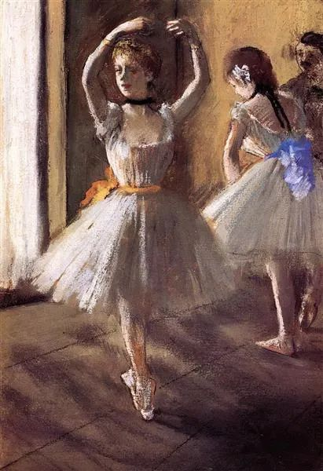
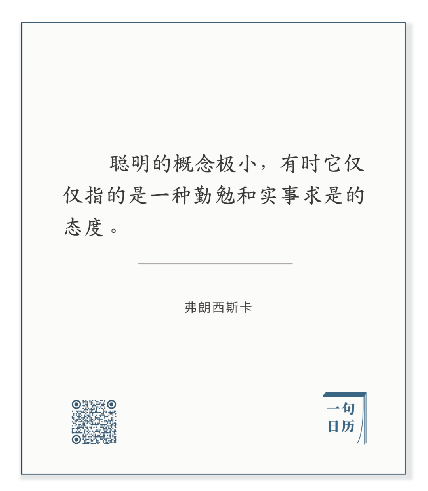
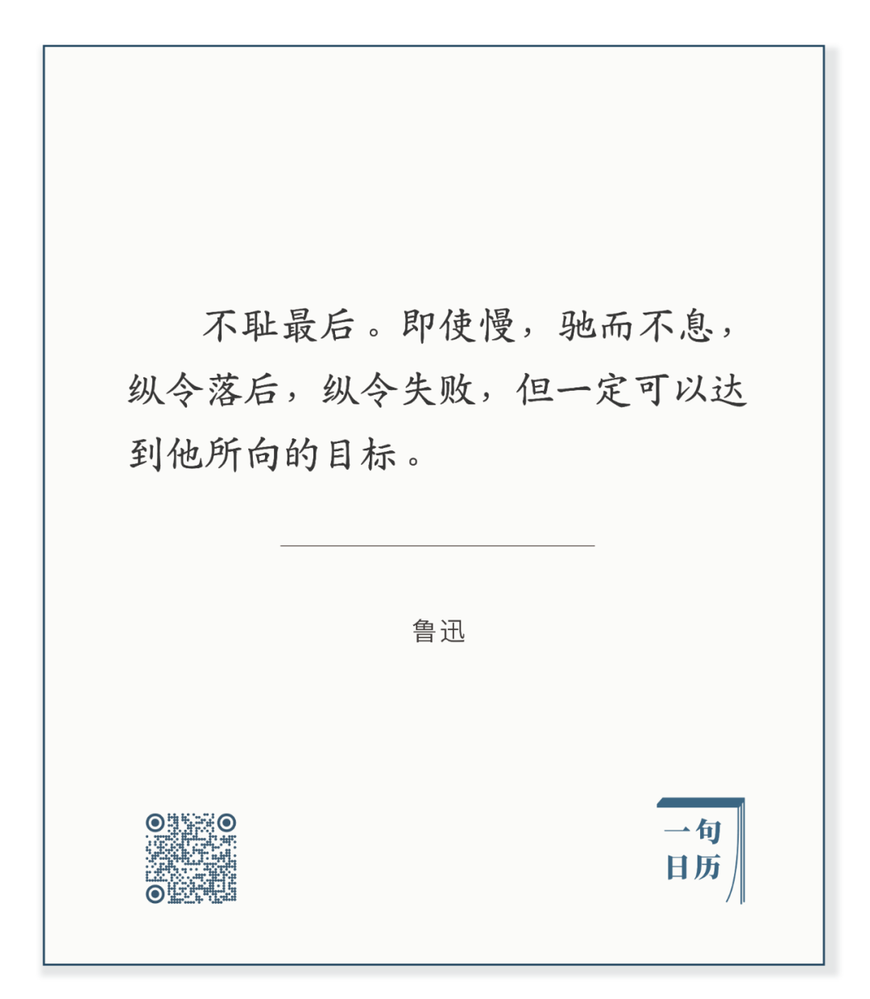

Edgar Degas，Two Dancers in the Studio

  

长按二维码可关注

  

同样面对一件事，一件难题，聪明人一眼可以看见本质与症结，不聪明的人眼里只有皮毛和幻像。

  

有意思的是，在多数情况下，聪明人说出这本质与症结，不聪明的人却报以怀疑与嘲笑。

  

多年以后，少则一两年，多则十来年，当事物的发展果然如聪明人预期的那样，人们其实已经忘了他之前对旧事的判断，又关心眼下新事的皮毛与幻像，大惊小怪起来，并怀疑与嘲笑聪明人不识好歹，不解风情。

  

聪明人当然有很多好处，家庭幸福，事业有成，人生顺畅，其中的一项或几项，可得到，能维持。但不好的地方在于，你很难得到一时的热闹与恭维，往往处于被忘记，被忽视的境地。这是变聪明的成本，你需要安静、耐心与积累，忍受加速之前的极其缓慢。慢并不要紧，大事都是慢慢成就的，历史必须一天天累加。正如鲁迅先生所说的：

  

长按二维码可关注  

  

事情上，我认为人的成长要从“即使慢”的遗憾中，慢慢过渡到“还好慢”的庆幸中，只有在慢慢跋涉中，才知道慢的必要与价值，才大悟所谓的聪明，更主要靠实实在在的积累，练得多了，手就巧，看得多了，眼才毒，诚实多了，不知为不知，则有知识，这一切加起来，人似乎就有第六感，一眼可以看到本质与症结。

  

今天是第152期“下周很重要”，在自己制订的计划中慢慢地、扎实地花掉下周的时间。

  

推荐：[你太快了！](http://mp.weixin.qq.com/s?__biz=MjM5NDU0Mjk2MQ==&mid=2651638717&idx=1&sn=d8768ef95153c504ad94bfb268b84ee3&chksm=bd7e4fa38a09c6b5d22876141236ae3f363437cd35b41cdfd9dadc2ff6a1d1da00ade9dc0100&scene=21#wechat_redirect)  

上文：[成长的两大风险](http://mp.weixin.qq.com/s?__biz=MjM5NDU0Mjk2MQ==&mid=2651664674&idx=1&sn=fff2078bcf84a3793ae5707193d44ee8&chksm=bd7fb53c8a083c2a8070afb209c78cad5111188e2b7a9f8a04559aa878198b658a96fa8fc958&scene=21#wechat_redirect)
