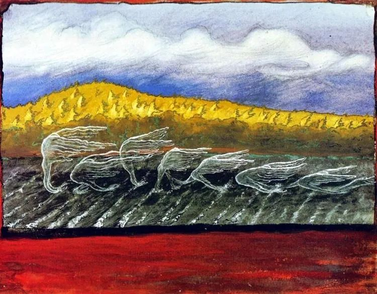

Hugo Simberg，The Wind Blows

  

有没有天生的坏人？有。就像天生有智商的高低，有人天生就缺乏同情心、同理心，特别残忍，再加上特别自我，如果后天又没有管教与约束，什么坏事都做得出来。这类人多了，人类社会的存在是不可能的。

  

还好，绝大多数人都是天生的好人，科学家在儿童心理学的实验中证明，同情心与正义感与生俱来。人们不是因为害怕惩罚而善良，而是因为天生善良而善良。极大多数好人并没有理由害怕极少数坏人。

  

但是，网络时代的传播力量改变了这一力量对比。天生坏人刻意制造的谣言，因为刻意，所以特别具有戏剧性、传播性与欺骗性，可以瞬间抵达亿万人的关注，产生以少胜多，一人胜一国的效果。

  

近来最典型的例子，就是杭州的郎某某、何某某捏造的“少妇出轨快递小哥”。据警方通报：经查，网上流传的视频系嫌疑人郎某（男，27岁）趁谷女士在小区快递站点取快递时通过手机摄录。出于博眼球目的，郎某与朋友何某（男，24岁）通过分饰“快递小哥”与“女业主”身份，捏造了暧昧微信聊天内容，并将摄录的谷女士视频和聊天内容截图发至微信群，造成不良社会影响。谷女士称因此被公司劝退，精神抑郁，陷入“社会性死亡”。

  

当她要求赔偿与道歉时，郎某与何某缺乏诚意。我认可这个判断，在道歉视频中，郎某与何某倒是挺珍惜自己的脸面，戴着墨镜与口罩。而郎某父亲称：“我们也很烦，具体也不是针对她，不认识的，对不对，就是小朋友开开玩笑，开出来的事情，认也不认识，怎么会针对她呢。”话里一点人味也没了，这种家庭养出的郎某，做出什么残忍的事，都不稀奇。

  

谷女士以“诽谤罪”向余杭法院提起刑事自诉，12月14日，法院受理此案。我是希望郎某与何某受到法定最严厉的惩罚。天生的坏人，什么道德劝说都没用的，对他们，好心没好报，他们只怕惩罚，痛了，才会有所收敛，作恶的能量才可变小，不然的话，杀人放火，自我评估也是“小朋友开开玩笑”。

  

为博关注，类似郎某与何某这样的事并不少见。几天前最新一例是：一43岁徐州赵姓男子，录制视频，手持“教啥啥不行，叫家长第一名”的锦旗，指控某学校的某老师。后经当地教育部门查证，其所指的学校与老师均为虚构。其实，不少国家级大媒体，互联网大厂们的新闻App，标题党横行，为骗点击无所不用其极，何尝不是推波助澜这种风气呢？

  

科技向善，互联网大佬们喊了几年，但我看来，还不够善良，还对善良没有足够的敬畏。在强大的算法支撑下，一切为了流量，一切为了割韭菜，为了眼前的利益，别人的时间不值钱，别人的债务无所谓，美好的价值观可以摧毁，那么，你最喜欢的，就是郎某何某这类人，造谣带一波流量，辟谣又带一波流量。力量越强大的人，越要把善良当成价值观来捍卫，否则的话，迟早出事。

  

最后，建议谷女士原来的公司，应该主动表达善意，邀请谷女士回去工作。

  

  

推荐：[善良，淡定，这是真聪明的起点](http://mp.weixin.qq.com/s?__biz=MjM5NDU0Mjk2MQ==&mid=2651643416&idx=1&sn=50be2b8ef590a03d13c00a3d84040000&chksm=bd7e5a068a09d310504439567f155bf0fb1e4b055083ea5685c5d998197fc190f93f9f458afa&scene=21#wechat_redirect)  

上文：[很普通，没资源，他为什么不缺工作？](http://mp.weixin.qq.com/s?__biz=MjM5NDU0Mjk2MQ==&mid=2651667958&idx=1&sn=a989a4d2a2a705a91a416a6ee447e466&chksm=bd7fb9e88a0830fe15abab63d997429e45e201cc99fdd4b2ed2f3afb606b065bfbfe5a187f78&scene=21#wechat_redirect)
