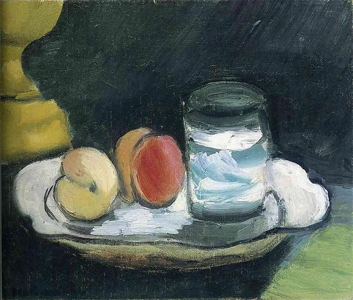

Henri Matisse，Still Life

  

长按二维码可关注  

  

从小到大，这是我们的成长史。物质上，人是由一小组可复制的信息不停分裂而成。

  

初始小信息不能出错。错了人活不了，活着也会出问题。事实上，人的疾病就是信息在复制过程中模糊了，变形了，误读了，不再是当初那个正确的小。

  

精神上的成长也是这样。没有最初那一点好的小，就没有最后好的大。  

  

人的成长，主要是精神上的成长。肉体大家都有，虽有大小美丑之分，但维持生命的功能大致相同。人与人的区别，在于精神，由你的学识、意志、品格、远见构成。人可爱可敬，最终是因为他有好精神，人可恨可憎，一定是因为他的精神坏。

  

小小的好精神，知道不难。难的是把它养大。孔夫子说过，一件对的事，认认真真做三年，还没产生功利的想法，就算了不起。（三年学，不至于穀，不易得也。）所以，不是现代人缺失耐心，人性从来缺失耐心。做事三天不成就懒，三月不成就怨。不疾不徐做三年，战胜了人性的人，没几个，但愿我们是其中的一个。

  

我们必然是其中的一个。  

  

今天是第155期“下周很重要”，再次告诉自己，要做的事虽小，小如手中的杯子，但可解我之渴，杯子不必大，一直有水就行。好事不必大，一直做就行。

  

推荐：[13美德](http://mp.weixin.qq.com/s?__biz=MjM5NDU0Mjk2MQ==&mid=2651636251&idx=2&sn=c54375aa7f7dce96252c4e9bc8c5ded2&chksm=bd7e46058a09cf13189f12c026e75481b38d96ae1a6c85c8b9e49b735154557be81b1fbe9a2a&scene=21#wechat_redirect)  

上文：[我为什么要吃苦？](http://mp.weixin.qq.com/s?__biz=MjM5NDU0Mjk2MQ==&mid=2651669899&idx=1&sn=f56535bf20424bf939d52e92cda2f771&chksm=bd7fc1958a0848834d73a9ac138bc625fb82d2c21e84c1d9d7ca217b4c8fa04b660b137bebba&scene=21#wechat_redirect)
