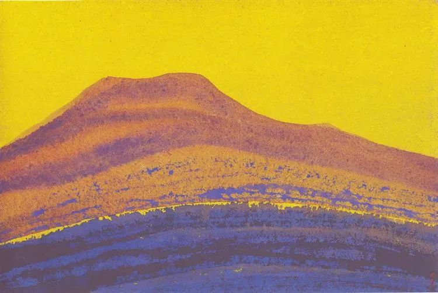

Nicholas Roerich，Himalayas  

  

连老师：

  

你好！

  

以一个有点迷茫的中年男的身份给您写信，不管能不能得到回复，也算给自己梳理一遍自己的思路以及对自己的认识。

  

简单的介绍一下自己的情况：

  

年龄38岁，农村出生（人称凤凰男），211大学研究生学历，工科男，国家注册工程师，开发商设计师工作（但小专业），家庭幸福，凭我们自己的努力，深圳两套房，惠州一套房，有车，除了房贷没有别的负债，一儿一女，和妻子关系融洽，家庭到手年收入约60万。

  

成长经历：

  

由于农村出生，家境贫寒，母亲也是一种苦情的方式激励我，成长过程中家庭也是时有被别人欺负的事情发生，导致我对这个世界、对人性的东西比较悲观。

  

从小学一年级开始，我就努力读书，可以总结为：咬牙切齿的读书，憋着一股飞出去的劲读书，心里暗想，等我读出去了，我不跟你们玩了，你求我我都不理你们。这种心理状态肯定是错误的，可能就是这种心理，导致我可能确实对别人很容易充满敌意，导致无法跟别人真正的成为朋友。

  

虽然我学历很高，但其实我感觉我的阅读能力、自学能力很差，学校的是应试教育，读书时靠的是体力，死攻攻下来的，基本没有读过什么课外书，觉得时间太宝贵，都得用在学校功课上，甚至我一直都是在异常紧张的状态下学习生活的，时常会感觉到紧张，心跳的飞快。

  

毕业后来到了深圳，老老实实上班、工作，结婚生子。

  

遇到的问题：

  

（1）没有交际能力，事业无法突破

  

本人不善言辞，不会“来事”，性格内向，农村出生，甚为自卑，与同事朋友很难交心，特别是上司，导致目前事业遇到瓶颈，无法获得职位上的突破。周围在我眼里算“野鸡大学”毕业的，都成为中层领导了，心里有点不平衡了。

  

由于不善言辞，不会“来事”，不懂得“人情世故”，工作中无法跟同事搞好关系，甚至同公司不同部门的人认识的都很少，这样无法将自己的“个人品牌”打开，事业上就无法获得各部门支持，所以事业上难有突破。

  

我觉得我的性格太害羞，害怕跟人交往，目光都害怕跟别人交织，比如路上遇到认识的人，特别是不熟悉的大领导。来公司几年了，很多其它部门的同事和领导我都不认识，路上遇到，由于不知道人家是哪位，我就害怕打招呼，很多时候人家的目光过来了，我却回避，这样在别人眼里可能会觉得我太高傲了。还有一些时候，我不善于发现别人，别人看到我了，冲我微笑，我却没看到别人，别人以为我太拽，其实我是真的没看见。

  

（2）孩子教育

  

两个孩子性格像我，性格比较内向，带他们上培训班，都有点不敢去上（但孩子妈妈觉得小孩有点害羞很正常，我却比较忧虑，怕他们像我一样，但性格随我，也不能怪孩子，孩子也是受害者）。老大二年级，老二幼儿园中班，目前都没有上任何培训班。妈妈不太喜欢家庭事务，觉得孩子不要管太多，他们自己能搞定，孩子我陪伴较多。我的想法，小孩培训班不用上太多，但一点都不上也说不过去，起码体育学一样，文化课学一样，培养孩子的一个兴趣和耐力。但妈妈跟我想法不一样，她觉得孩子愿意去就去，孩子不愿意去就不去。目前两个孩子就是放养，自己瞎玩。老大不愿意阅读，成绩中下，目前我们也盯着她每天读一点，但总体上我们大人费的心思还是太少，有点使不上劲一样，因为孩子确实不喜欢阅读，要费好大劲跟孩子周旋，还不能打骂发火，很多时候觉得力不从心。

  

（3）没有朋友圈

  

没有交际能力，没有自己的朋友圈，没有兴趣爱好，这个也让我很痛苦，都说人到中年，混的是圈子，可是我一点圈子都没有，事业生活上都没有。

  

总结一下，我迷茫的地方就是没有交际能力，事业无法突破，混不进圈子，没有朋友，对一个中年人来说是不是很惨？

  

其实我也知道要提高估计已经很难了，从小到大，只知道埋头读书，读死书，从来没有也不会跟别人搞好交际，“情商”太低，说话容易伤人，这是我一直以来的死结。

  

不知连老师是否能理解可能性格、心理状态跟你完全不一样的人，是否可指点一二，万分感谢。

  

迷茫中年男

  

* * *

  

迷茫中年男：

  

你的邮件写得很工科男，问题很多，但一一开列，条理清晰。

  

我的答案很简单，你没有问题。

  

一个中年男人，阶层跃升，家庭幸福，夫妻融洽，优质房子数套，收入高且稳定，那就说明他没有问题。有问题的男人无法在38岁取得这样的情感成就和财富成就。

  

你这样的男人，你自以为的缺点，别人都可以解读为优点：没圈子？那是顾家；内向？那是稳重；不会“来事”？那是没有是非；个人辨识度不高？那是甘为人梯，有团队精神。

  

人的许多特质，内向与外向，开朗与害羞，健谈与寡语，合群与独狼，没有好坏高低之分，它们是好是坏，是对是错，人们往往以结果倒推，一个成功者，什么都好，不然他怎么成功？一个失败者，什么都错，不然他为什么失败？这么认识一个人，并非全然符合因果律，但也八九不离十，一个人能够成功，自然是他将自己所有特质的能量聚合得很好，大大战胜了自己缺点所产生的阻力。

  

成功者不可能完美，一生都得与缺点缠斗，借此不停提升自己。但成功者一定呈现出足够的自信，使他们能够坚持自己，激励自己，欣赏自己，这是成功的重要收获与意义。

  

你成长过程中过于自卑，总怕别人对自己有看法，小瞧自己，欺负自己。你现在是有了一切的成功者，是时候走出自卑了。不应再害怕和别人不一样，这些构成你的不一样，就是你的“个人品牌”，学会欣赏自己。

  

祝开心。

  

连岳

推荐：[什么是初心？有时出发很久才能发现](http://mp.weixin.qq.com/s?__biz=MjM5NDU0Mjk2MQ==&mid=2651638321&idx=2&sn=a804a9f5ed7e7e34171c344811ff78c4&chksm=bd7e4e2f8a09c7393542162d03979740762594e7e4f73fd0b35c5ad4fbfe8d930e4c9561912f&scene=21#wechat_redirect)  

上文：[说说张桂梅成时代楷模，教育的定力最重要](http://mp.weixin.qq.com/s?__biz=MjM5NDU0Mjk2MQ==&mid=2651667092&idx=1&sn=f79d58d58576d072b87c3e9737c6ebd8&chksm=bd7fbe8a8a08379c6092f14a31d49351cfa45a1b757c48a13818f24daa228b704265d4c72400&scene=21#wechat_redirect)
