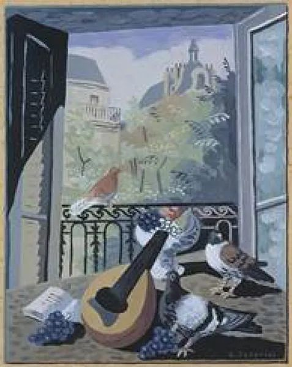

Gino Severini，Window with Doves  

  

连岳老师您好，

  

期望您能读到我的来信，盼您能不吝赐教。

  

一直以来心思单纯，原动力较足的我，最近经常感觉压抑，心口像是堵着什么。原因是作为一名87年的大龄单身女青年，在某一瞬间突然意识到无法忍受孤单安静的房间，仿佛打开了一个按钮，导致最近几个月心情压抑，而且这种压抑的状态已经影响到了日常工作。在公司职能部门做支持工作的我，之前一直心态平和，工作较认真效率较高，对待同事态度平和较好沟通，但最近发现自己经常无法维持原来的温和的态度，说话的语气莫名的就会较冲，办事效率也不如从前。每次态度冲之后往往又会自责，自责自己为什么会变成自己讨厌的样子。

  

和我同龄的大部分人已成家生子而我依然独身，虽有一句话说人生应该按照自己的节奏，但从众心理不可避免的让自己和周围的人都觉得，我是在应该完成某一任务的年龄没有完成任务。和周围同事相处时，不在同样的人生状态里的人不可避免的欠缺了同样的闲聊话题，因为和大部分人的状态不一样，常会觉得自己格格不入。或许这种与周围人不一样带来的压力应该就是无法再维持平静的主要原因。不过，我觉得可以忍受独身，可以忍受孤单，但是，因为大龄单身带来的工作上的负面效应，让我觉得有点恐怖，害怕人生会全面崩溃。

  

我出身农村，普普通通的本科，从小家贫自卑，造就独立坚韧的性格，也造就独来独往不爱社交的习惯，北漂十年，去年在六环边买了个一居室，目前每年还完房贷能小存几万。原来我以为有了自己的房子，慢慢再积攒了积蓄，应该可以内心安定踏实不再慌张，可以有大把时间用来看书学习做自己喜欢的事，可以过得挺好。但其实并没有，之前租房的时候还能每年看20多本书的我，有了独立的相对宽阔的空间后，反而不能定下心来看书了，觉得压抑空旷，心无定所。

  

关于结婚方面，刚毕业的几年认为自己还没弄清楚自己，没考虑过找对象结婚，再大一点又觉得自己什么也没有，不足以负担一个家庭，蹉跎岁月至今，虽然依然不能完全自我明白，所有也不多，但自认为心智成熟到可以成家了，时间却又过了。到了这个年纪，我觉得不用强求物质，能有幸与一个人格独立、踏实稳重、人品过硬、身体健康的人组成家庭，是一个相当不错运气了。但是，按北京男少女多以及自己年龄大了的情况，可能已经很难了。而且，独立自主惯了，就算有这么一个人出现了，也不知道自己有没有能力去经营一段长期的与人相处的友好关系。

  

所以，连岳老师，是因为我正处于可能结婚和生育的末班时间内才会如此焦躁不安吗，若是过了这个时间段，到了四字头之后的年纪还独身是不是就不会再有如此情形，恢复到情绪平稳温和的状态了？如果一直独身，如何能让自己保持安静平和的内心，不因为不符合主流而影响心境从而影响工作和生活呢？

  

以上，感谢您的阅读，祝您工作生活愉快。

  

L

  

* * *

  

L：

  

你现在是处于一种比较放松的状态，是终于获得“我有资格”的状态：我有资格发点脾气，我有资格不那么勤奋，少看几本书。这是一个漂泊在北京的姑娘拥有自己房子后获得的安全感。长安居，大不易。首都从来都是最不容易立足的城市之一，站稳了脚跟，这是普通人的大成就。有了房子以后，尤其看来你的房贷并不算累，生存的压力基本释放掉了，现在吃、穿与出行，花不了多少钱。

  

我们的有些好，比如温和，有些勤奋，比如阅读量大，有时候是自卑的体现，害怕被主流淘汰的不安全感，逼迫我们表现得用力一点。某种程度上说，这也是自卑给的礼物。自卑这种情绪听起来挺负面，可是使用得好，它也转换成强大的动力。人人都有点自卑的地方，换言之，这算是人人自带动力源。在人超越自卑时，人就获得了成长。我想，你很快会回归温和与阅读，毕竟，你是靠体现在这些行为之中的克制与自律在北京立足的，只是下一个阶段段位更高，是更主动的选择。我的温和不是被迫的，是我觉得更好的人应该如此，这么做让我开心。我爱阅读不是为了完成什么任务，因为它就是最有趣的事，抑制不住。

  

婚姻与爱，当然可能有巨大收益。但世间万物，收益与风险总是呈正比的，有大收益的事就可能有大风险。我们会看到许多不幸的婚姻，破碎与悔恨的爱情。而婚姻与爱情的沉没成本又很大，除了心痛，还有不可倒流的时间。在女性没有选择权、工作权，没有经济实力时，只能蒙着眼接受婚姻的大风险，幸福与否，靠运气。那时的婚姻，第一位的追求是生存，是社会认同。现在你愿意接受低质量的婚姻，放弃自己的所有标准，也可马上就有婚姻。婚姻易得，好婚姻不易得。

  

如果只有低质量的婚姻，在其中你被伤害、被侮辱，那么，无论男女，我都觉得一个人过是更好的选择。逼迫一个人进入低质量的婚姻，那是不善良的，是奴隶式的。像你一样的女性，想要婚姻的，都在追求高质量的婚姻，宁缺勿滥。但很多人犯的错误就是空想空谈，只想着完美伴侣，爱情的理论一套一套，但从来不行动，思想上的巨人，行动上的植物人，不想承受任何一点风险，没有一点训练，怎么会有收益？怎么会有大收益？

  

有知识，有工作，有房子，这样的新女性，比起前辈，幸福得多，抗风险能力强得多，胆子比前辈更大才像话，大胆去认识人，去接受人，去追求人，去承受爱与婚姻的风险。别说你才33岁，就是43岁，66岁，谈谈恋爱有什么不行的？爱没有太老这么一说。谈不成，你不照样有知识、有工作、有房子吗？有什么可怕的？行动起来。

  

祝开心。

  

连岳

  

推荐：[钱重要，幸福更重要，平衡点在哪里？](http://mp.weixin.qq.com/s?__biz=MjM5NDU0Mjk2MQ==&mid=2651663801&idx=1&sn=7f898fb4b822c9dfe7c1b4f076b5131d&chksm=bd7fa9a78a0820b1715338b660238c9d16ec40dd6ab88c9af1a57f58de67bc6fcd02798dd82a&scene=21#wechat_redirect)  

上文：[即使慢……还好慢……才变聪明](http://mp.weixin.qq.com/s?__biz=MjM5NDU0Mjk2MQ==&mid=2651664770&idx=1&sn=d61817ecd732573110f9a9f21e31778f&chksm=bd7fb59c8a083c8ac49cfaa6bcd6ab052ec5df3868446aa35f8517592074fa868f4a17d1038f&scene=21#wechat_redirect)
