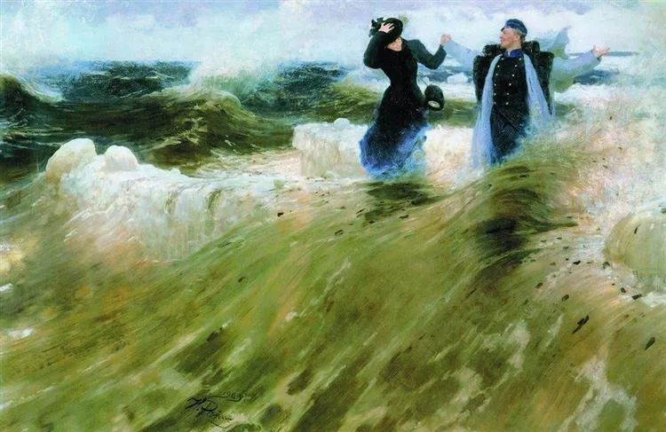

Ilya Repin，What a Freedom

  

连叔，

  

谢谢您这几年的陪伴。初中和高中的我喜欢隔天丧，经常抑郁，后来遇到了你，让我慢慢乐观起来。

  

今年我未参加高考出来工作，期间做过餐饮业、跑过快递和美团，不过后者很快放弃了。后来发现面对种种工作适应不了。现在对工作有点逃避心理，一个人无法融入新的工作环境。

  

目前的一切不是我想要的，我也看不到我想要的，同时也不知道自己想要的。接下来我想逃离，身上还有几千块可以走多远是多远。甚至我想若有一天我意外死亡了说不定挺好的，现在这阶段对于我来说二十岁和八十岁好像只是数字而已，我看不到一点我想要的，眼前看到的只是一片迷雾，但又不得不去面对，可我一下子真的累了，心态上起不来了，不会再说：我们再干一把这样的话 。

  

身边亲人说我眼高手低，时常强调我要去找餐饮业的工作，可我并不喜欢去融入餐饮业的工作。

  

今年我试工过好多餐饮业的工作，最后无法融入，也做过美团外卖，上班第一天送了三单超了两单，第二天上班实在顶不住放弃了。

  

我说我想做发型师助理，家里人不看好，我说我想做健身教练，家里人不看好，家里人告诉好像只有餐饮业是可以的。

  

并且要求我马上20岁时要好好存钱，然后好好规划自己人生，买房子，存钱等。可我也想，但我目前的心态没调整好，而家里人又紧逼，我压力更大，但又绝对不想去行动，成为行动上的废物。我想我做一份工作起码不能讨厌，不然也不可能做好，餐饮业我个人原因发生了心理抗拒。

  

我并不是贬低餐饮业，因为我开始第一份工作就是奶茶店店员，在自己人的店里上班。上班十个小时，月休息三天，疫情期间太忙而时常需要休息日也赶过去加班，上晚班，加班到凌晨一两点很正常。我并不是觉得辛苦，而是我不所以管理者的情绪化，所以放弃了那份工作，但出来找新工作发现融入不了，对餐饮业心态是有抵抗。

  

现在这近段是看不到自己的出路，因为我绝对不想去餐饮业，内心和精神会崩溃了。但我又没有时间的慢慢考虑和打算，时常想法消极和悲观，只能逃避现实，我害怕麻烦别人，所以我会逃离。

  

小河

  

* * *

  

小河：

  

不喜欢餐饮业很正常。我也不理解你的家人为何只认餐饮业，或许与他们是干这一行的有关？可以理解他们的职业自豪感，但也不能自豪到自大，世上的好职业很多，应该允许你的选择面大一些。

  

我们的理想职业列表上，有不少重合的。我也认为发型师和健身教练很好。

  

发型师这职业（你可能也是想从助理晋升为发型师），只要练出一双好手，置备一套工具，不愁客户，只要有头，就有市场，很多客户是认发型师的，一跟一辈子——即使他的头发越来越少。不过，我想我没这个天赋，当不了好发型师，把人发型剪坏，可能是世界上引发最强抗议的事吧？

  

健身教练，给我3年时间，我倒是可以胜任。每次去健身房，我就很羡慕健身教练，我来玩这几块铁，每年要交不少钱，教练们每天来玩还有工资，下班前洗个澡香香的回家，回家路上好身材又引来许多佩服的目光。当然，这想象可能有些美化，不过，这肯定是个健康的职业，钱多少另说，至少收获了健美的身体和自律的品格。自律我倒是现成有，之所以要3年时间，是我觉得需要那么长时间才练得出健身教练应有的肌肉线条。你现在可以开始练起来，肌肉在家徒手也可以练，按健身教练的标准要求自己，一块块肌肉打造出来。

  

碰到一个感兴趣的职业时，我会琢磨它，如果我来做，有什么可以改进的。以前在学车时，我发现驾校教练普遍存在沟通简陋粗暴的问题，就想，这职业不错，我能做得非常好。教练的核心技术不在于那些基本动作（是个老司机都会），反而是对新学者的同理心，以及将技术要点平白、准确输出的能力，要掌握让人在放松、自信的氛围内学习技能的沟通方法，这才是此行的第一竞争力。

  

而各类快递员的需求，我觉得是中国在移动互联网时代领先后得到的巨大红利，为社会创造了海量的无门槛就业机会。同时，工作也健康，主要是走路。当然，要避免危险驾驶，违反交规之类的危险。我觉得最适合从事这职业的一类人可能还没发现它的价值，那就是退休人员，每天送几单，刷了步数，又可顺便赚点钱。

  

不过，我可能还是要一生以写作为主，只是这些理想中的职业和我的写作都有高度的共性，在自律基础上的自主，精进后的手艺也留在自己身上。富贵在天，能否大富大贵，那不是个人能够完全控制的，没什么职业能做这担保——敢担保的都是骗子。但是，三分自律，三分耐心，再加四分改良，一生衣食无忧，自在喜悦，完全做得到。所谓的改良，就是你喜欢的职业，把喜欢的要素变大变强，从而更喜欢；讨厌的职业，把你讨厌的要素变小变无，从而不讨厌，甚至开始喜欢。这样，我们就处于不败之地，无论是碰上喜欢与讨厌的境况，我们总是有所得，能够积累知识与智慧，这像你善于存钱一样，10年后，你就能享受到复利的威力。

  

20岁，宝藏一般的世界正向你打开，宝藏显现的方式不同，有用你喜欢的方式，有用你讨厌的方式，有的像花，有的像刺，有的是泪，有的是笑，拥抱它，享受它。

  

祝开心。

  

连岳

  

推荐：[换换我们的底色](http://mp.weixin.qq.com/s?__biz=MjM5NDU0Mjk2MQ==&mid=2651637926&idx=2&sn=d59e25a9d5521d31b594f5e7c6698092&chksm=bd7e4cb88a09c5aef67e6352a83e04ddd7e716fd42e2b60bd123b2baa4b0000f1998824e5042&scene=21#wechat_redirect)  

上文：[说说离婚冷静期](http://mp.weixin.qq.com/s?__biz=MjM5NDU0Mjk2MQ==&mid=2651665124&idx=1&sn=a30933338191055e59733670ffcb20db&chksm=bd7fb6fa8a083fec0a292829796c5d85b58118cf903aee2426e47409c2c01c278e122680778f&scene=21#wechat_redirect)
