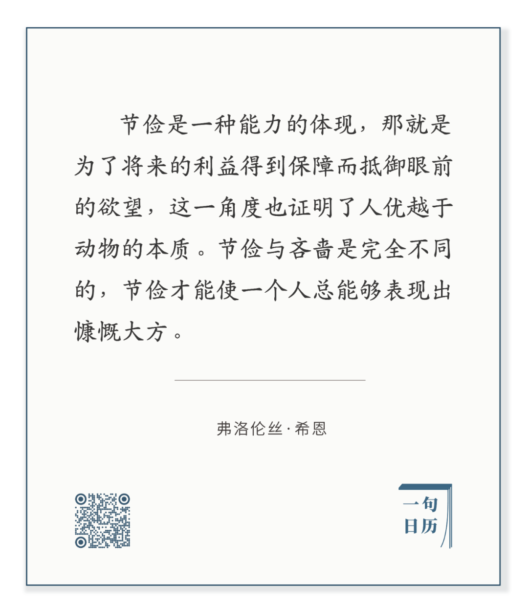

George Luks，Bleeker and Carmine Streets

  

长按二维码可关注

  

节俭是人最好的本能。能够富裕繁荣的人与国家，都在于其有节俭能力。消耗比产出少，日积月累，自然而然就富了。

  

我们现在能看到的反例可能是美国。美国人好像并不节俭，寅吃卯粮，许多人拿不出现金，生活稍微受一点冲击，车子房子马上就被收走。但你看美国先民们的发家史，那些伟大企业家的创业史，并不会觉得陌生，他们是勤奋的、节俭的，对浪费深恶痛绝。

  

美国之所以变成这样，一是美国有印钞霸权抢劫全世界，只要在纸上印数字就可以买来别人的服务与产品，那存什么钱呢？二是鼓励及时行乐、超前消费的文化成为主流。奶头乐理论甚至成为统治精英操纵民众的策略，为了让多数人忘掉不公及被遗弃，刻意喂养他们无尽的娱乐、色情、暴力、争论，当然也包括透支未来的借贷，让他们像叼着奶头的婴儿一样永远快乐。这样丧失延迟满足能力的人，没有耐心，没有节俭，拒绝任何辛苦，永远追求廉价的快乐，过着猪一样的人生，用佛家的话来说，慧命已死。

  

害人慧命，与谋杀何异？

  

近来，许多中国人对各类恶意诱使超前消费的网贷恨之入骨，那就是本能地意识到，这些产品消耗的是中国人发家的传统美德，勤奋与节俭，也会逐渐让定力尚弱的年轻人滑入及时行乐的奶头乐陷阱。奶头乐真成为主流，中国人还没真正富，就得返穷。中国还没复兴，又得重归二流。国民若没有普遍具有节俭能力，进化成能够延迟满足的更高等的物种，那么，这种国家是不可能真正富裕强大的。

  

节俭是自律精神在财务上的体现。量入为出，不该花的钱不花，这些存起来的钱，是种子，时间产生复利，一生二，二生三，三生万，万生无穷，最后你储备的粮食够多，你才能够给家人、给那些你爱的人、给需要帮助的人以饱、以满足、以幸福。节俭才有丰富的人生。

  

今天是第154期“下周很重要”，制订计划，就是培养自律。在一件事上的自律可渗透到人生的各方面，也有利于养成节俭的好习惯。

  

推荐：[感谢特朗普，为中国送来光刻机](http://mp.weixin.qq.com/s?__biz=MjM5NDU0Mjk2MQ==&mid=2651649905&idx=1&sn=7ca06eb7ae9bf3ed1feaa7df2582f19b&chksm=bd7e736f8a09fa790d9df0345642fe964980347f3a8fa257f86bfd046e36085c5fe99ac45d81&scene=21#wechat_redirect)  

上文：[接下来一两年，最能保证生命与经济安全的，仍是中国](http://mp.weixin.qq.com/s?__biz=MjM5NDU0Mjk2MQ==&mid=2651668158&idx=1&sn=0d321bb81205f36f9e591d3254a5930c&chksm=bd7fbaa08a0833b6f484e8f377d92464886aacc1ea6d8590b67bcc7addfc5b22cff623141974&scene=21#wechat_redirect)
