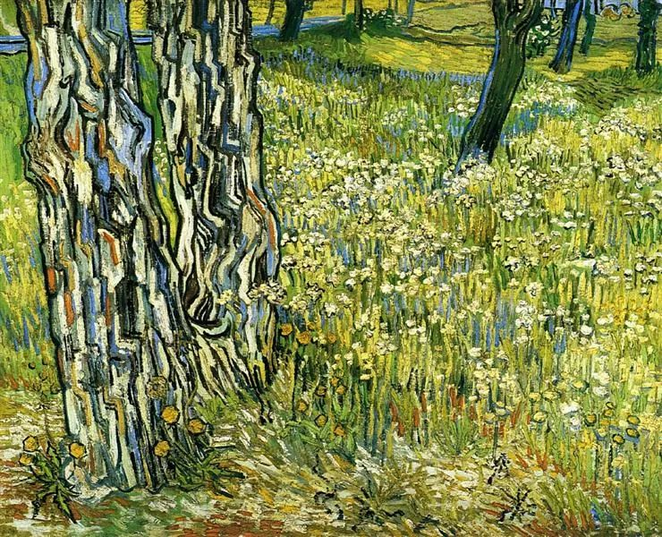

Vincent van Gogh，Tree Trunks in the Grass

  

连叔:

  

你好!

  

同学介绍"认识"你3年了，你的诸多理念深入我心，理财，家庭，读书。

  

近期遇到一个纠结的难题，迫切地想请你指教。

  

我42岁，湖北黄石农村人，爱人在家专职带3小孩读书，2女儿上初三、五年级，儿子上三年级。

  

2004年结婚，欠债1w。和爱人一直在温州一家小公司打工做技术到副总至2015年底共11年。2010年在镇上买了套商品房方便读书。农村有房屋。老板是我人生中的贵人，回家时手头有60w存款。

  

回家第1年2016年买个旧挖掘机雇人开，年中卖了，总帐亏损7k。年底安装2户水电赚1w。相当于一年没赚钱。2017年至2018年两年在镇上租门面经营一家瓷砖厨卫店(自认为瓷砖网购不利选此项目)，平时太闲打牌浪费了大部分时间。有空也没有去揽安装水电的活。2018年底买了辆18w的车。两年销售额60w，净赚12w，但年底外面欠帐10w(现在还欠6万)，讨债不爽，关店。

  

2019年跟小舅子到武汉学做快餐，打算学会自己开个店，做了1个月熬夜感觉身体吃不消。4月到7月，在黄石找了个监理的工作，月薪3k。转正时工资只加500，想到油费1000，没多少余款，辞职。下半年帮镇政府、熟人跑出租车，一趟一上午150，净赚100，工作量小，但活不多。平时又是打牌。4个月赚1w。

  

2020年真是尝尽人生滋味，一个人打工，4月至7月到深圳亲威的公司做技术资料。8月至11月自己到温州找了个生产管理。12月朋友介绍又到广东韶关做技术。

  

一个人在外地，工作没问题，一年稳定赚个6，7w，还有增加余地，存款还能滋生2w，但心情极极极不愉快，经常想回家做点事情算了。在家里嘛又全是失败的案例，赚不到钱，存款滋生2w还要减少。存款只有30w了，眼看着后面小孩上高中、大学逼近，慌。

  

是该回去再开个店兼带安装水电，还是委屈自己一个人在外面安心打工稳定地供家庭开支呢？只能相信连叔赐教！

  

心方

  

* * *

  

心方：

  

你的邮件虽然只是简单罗列了自己工作，看完我却要向你致敬。你是我喜欢的那类人。

  

喜欢的理由如下：

  

一、不抱怨。生活不易，人可以找到各种理由抱怨。你在不易出现时，只是想着怎么把它解决掉。这是幸福生活的真正心理基础，不然的话，命运将人放到多好、多高的位置，他总是要抱怨的，而人只要一习惯抱怨，就会失去他的好，又从高处跌落。

  

二、不犹豫，你是行动派。工作不好找，转换工作令人恐惧，前怕狼后怕虎，这些普遍存在的难题，对你来说，不存在，你光明正大地爱一切正当的工作，没有傲慢，没有分别心，所以，你从不缺工作。工作问题，最本质的决定因素不是家世、文凭、人脉这些似乎很重要的因素，而是一颗热爱工作的心。

  

三、有责任感，令人信任。你把家庭照顾得好好的，在这个开始缺孩子的时代抚育三个孩子，又用孩子的未来指导自己的人生计划。这样的男人，怎能让人不敬不爱呢？

  

个人在技术进步面前，渺小又强大。你看起来渺小，其实强大。你有爱，你有温度，你可信任，这些技术取代不了。有些人看起来很强大，站在财富与关注的巅峰，但如果失去爱，长了坏心眼，开始损害他人，那自证其渺小，很快会被取代。

  

基于以上判断，我认为你回家安装水电是最好选择。

  

从装修到日常维护，水电都是刚需，有稳固的市场。水电又很特殊，除了技术过关，人还要值得信任，因为用户一般看不出活不合格，却会留下麻烦的隐患。符合这两个条件的人，用户将自发替他做口碑宣传，谁都会急迫地为亲友推荐好的水电师傅。同时，不需要降价去争取市场，好师傅就值好价钱。这是一个越做护城河越宽的职业。

  

从你的梳理来看，水电安装挣钱的效率最高，也不存在拖欠。那就把这块做大。你唯一的不足是，没把它当事业做，不主动。太爱打牌影响了你。若能把牌戒掉，或者克制地在工余玩一会，专注把水电安装这块做大，收入应能达到你的预期。

  

还有更重要的一点价值无法评估。一家人开开心心地团聚，孩子在成长过程中，爸妈时时在身边，知道幸福的家庭是什么样子，好男人好爸爸的模板也印在心里，他们将来的路顺畅得多。

  

祝开心。

  

连岳

  

推荐：[人应该装上富兰克林操作系统](http://mp.weixin.qq.com/s?__biz=MjM5NDU0Mjk2MQ==&mid=2651636251&idx=2&sn=c54375aa7f7dce96252c4e9bc8c5ded2&chksm=bd7e46058a09cf13189f12c026e75481b38d96ae1a6c85c8b9e49b735154557be81b1fbe9a2a&scene=21#wechat_redirect)  

上文：[说说张桂梅成时代楷模，教育的定力最重要](http://mp.weixin.qq.com/s?__biz=MjM5NDU0Mjk2MQ==&mid=2651667092&idx=1&sn=f79d58d58576d072b87c3e9737c6ebd8&chksm=bd7fbe8a8a08379c6092f14a31d49351cfa45a1b757c48a13818f24daa228b704265d4c72400&scene=21#wechat_redirect)
