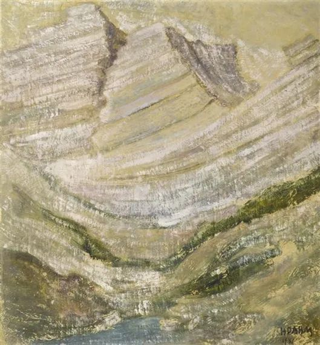

Helen Dahm，Mountain landscape

  

公务员一直是中国人最喜欢的职业，国考某种程度上相当于现代版的科举制度，录取率并不高，今年平均61人竞争1个岗位。

  

显然，有其一目了然的好处。工作稳定，只要不犯严重的错误，一辈子不会被解雇；社会地位比较高；收入体面，一定能达到当地的中上水平。能同时满足这几个要件的工作，并不多。

  

但是，当公务员的坏处在什么地方？这就没那么容易发现了。这些坏处主要是指心理建设，有几个心理关不过，那当公务员，就会好事变成坏事。我见过不少公务员，到了人生后半段，本事全无，毛病太多，牢骚满腹，神憎鬼厌，既对不起雇主，也对不起家庭，变成这样行走的负能量，人生就浪费掉了，太可惜，原本都是聪明人，应该有更美好的一生。

  

首先要过特权关。其实普通公务员有什么权力？只是民众觉得你有权力，你也觉得自己有权力，这种觉得叠加成再大的幻觉，也不会真变成权力，你还是能量普通的一个人。欲望与现实落差太大，总得不到满足，人必然变形。向外，可能开始刁难来办事的百姓，脸难看，话难听，自己也很累，不过可衬出地位更高，变相地满足了一点权力欲。向内，则无休止地抱怨体制，觉得体制亏待自己，没给个官当当，砸起锅来比反贼还狠。

  

真让你如愿，不再是普通公务员，权力这个改变世界的最大工具放在你手上，你也不会想着造福一方。眼中只有小利，成不了大事。不过是把权力勾兑成吃喝嫖赌，声色犬马。如果你的孩子成为这样的公务员，你心里踏实吗？一出事，就坐牢，侥幸不出事，这种生活方式也不健康、不道德、没意义。所以，家风不正，让孩子去当公务员，那就是毁了他，他的仕途顺不顺，人生都低端。自己的孩子是公务员，父母应该替他挡事，不要给他找事，否则就是增加他堕落的可能性。

  

其次，要知足，要感恩。我的不少公务员朋友，越活越自在，一生很幸福。他们没背景，也不做无底线的事，有些还特别直肠子，但他们都有一个共性，就是善良，珍惜自己的所得，没有贪欲。他们到最后，比起那些歪门邪道的，会搞事的，少得了什么？没有，只有更多。最多少一个官位与级别，当公务员，一辈子奋斗一个处级，顶天了。而处级算什么？真不算什么，就是你自以为算什么，权力也是外在的、是平台给你的，终将收回。为了它，拿一生的焦虑与虚假去换，而且未必换得到，值得吗？太不值。

  

当公务员，没人逼你不善良，不真诚，是你自己的欲望逼你。只要你知足、感恩，也只有你知足、感恩，公务员这条路才走得平安，才能真正获得生活与精神的稳定。

  

推荐：[幸福而丰富的一生，就是六个字](http://mp.weixin.qq.com/s?__biz=MjM5NDU0Mjk2MQ==&mid=2651645764&idx=1&sn=a0de5f4558466e57d7bec4f5aa75a80b&chksm=bd7e635a8a09ea4c7b5a962ee4140ca0d978202d9276f859cfa5a9dffea8bb792d9f2e128cc3&scene=21#wechat_redirect)  

上文：[职场最重要心理建设](http://mp.weixin.qq.com/s?__biz=MjM5NDU0Mjk2MQ==&mid=2651663149&idx=1&sn=69aba7dc782b8ca0ff2b01e364c14816&chksm=bd7faf338a082625992c3dcbe49df5b9e832b71f5a1fe20219c002aabda77713124f36b8e617&scene=21#wechat_redirect)
