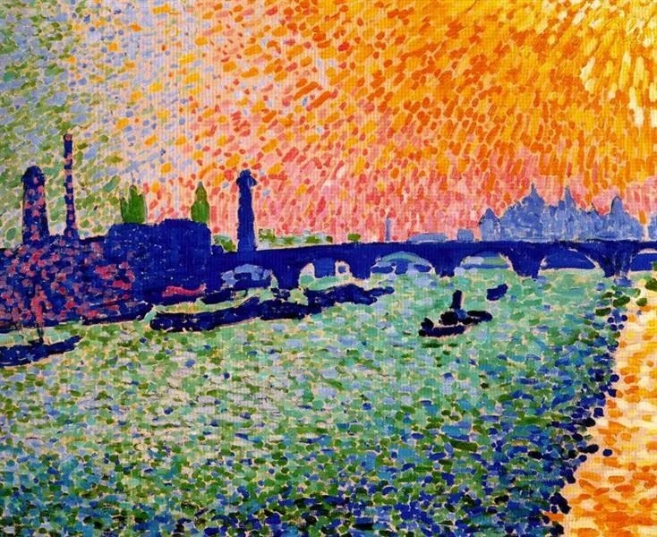

Andre Derain，The Bridge

  

连叔您好，

  

虽然预计很大概率您无暇关注这个来信，但苦闷憋屈又无处诉说的我……就当是梳理自己吧，期待您的点拨。

  

我的家在深圳，有一个才刚满一岁的娃。我的工作在香港，没有疫情的时候，几乎每天往返深港，虽然每天奔波路途劳累，但经过在香港苦苦打拼奔波多年，冲着这份收入，奔着养娃养家的责任，跑得苦点累点，我都能克服。       

  

然而疫情改变了一切，香港漏洞百出且拖拉乏力的防疫措施，使得疫情一直反复发作，关口封了快一年了，根本见不到家人。孩子在深圳，不到一岁我就含泪离开了她，盼着疫情受控了就能恢复以前的生活模式。可是，香港的疫情局势一次又一次磨灭了我的希望。这大半年我在港也是度日如年，每天茶饭不思，想念孩子以泪洗面。孩子从一个软糯的婴儿一晃眼已经满地跑，咿呀学语了。

  

我该如何取舍？我快40了，放弃这份积累多年的工作回深圳重新找工作并非易事，而家里现在也经济困难，很需要我这份收入。我甚至在想，也许过三个月情况又不同了，我就此放弃会不会也是对孩子和自己的不负责？可是如果我继续留在香港工作则会继续错过孩子的成长，对香港的防疫和通关不抱希望，继续等待的结果是很不确定的。

  

香港疫情反复肆虐，家人也不同意我把孩子带到香港，从对孩子好的角度出发，确实深圳的安全程度高很多，阳光与草地，孩子可以放心地小跑，开怀的笑。

  

我该怎么办……焦虑，痛苦，放弃又不甘，又是一个人在港的周五晚上，平时最期待的周五，现在变得最折磨，对孩子充满愧疚，内心也充满遗憾。万能的连叔，您能给我一点方向提示么？

  

一个心急如焚的港漂妈妈

  

* * *

  

一个心急如焚的港漂妈妈：

  

两个方向提示，一是疫情方向，一是香港未来方向。

  

先说疫情。

  

比尔·盖茨近日有个判断，“如果政府处理得当，在12到18个月后，美国才有可能真正恢复正常。但是，在2022年之前，美国要想完全恢复正常状态是不可能的。”这个判断可能同样适用于香港。

  

实践是检验真理的唯一标准。这一年的事实证明，只有中国内地才能完成控制疫情与增长经济的双重挑战。经验也很简单，政府与民众高度尊重科学，高效地密切配合。政府与民众的素质都要到位，缺一不可。像美国那样政府昏庸无能，民众麻木不仁，就只能被病毒残忍屠杀。有些国家的政府也想按科学规律行事，但民众不配合，也只好听天由命。即使疫苗成功推出，若是反科学反疫苗的人群足够多，欧美的疫情未必控制得住。

  

在接下来的一两年，确定性最强，最能保证生命与经济双重安全的地方，就是中国内地。一两年之后呢？按照中国政府与民众饥渴的学习力与创造力，获得了领先优势，就很难再把领先还给别人。

  

2020年，在历史上是分水岭式的一年。中国内地民众，是一场特殊的伟大战争的参与者，可以吹一辈子。

  

再说香港。

  

去年香港大闹大乱时，我的结论就是[香港注定走向衰败](http://mp.weixin.qq.com/s?__biz=MjM5NDU0Mjk2MQ==&mid=2651636048&idx=1&sn=fe8779a5b2f38c138259ce47c814387e&chksm=bd7e454e8a09cc58575cc49f036f847b11f044195e497abeebf2d1d3058c1dbeed72a30d6923&scene=21#wechat_redirect)。香港人珍惜、尊重内地人对它的爱，原本可以更加辉煌，前途无量。可惜的是，从精英到民众，普遍在践踏这种爱，恶形恶色，离心离德，自毁前程。一旦失去内地民众的爱，或许就是永远失去。

  

有人认为，中国内地始终需要香港这条国际资金通道，香港再怎么忤逆，地位仍然在。这是没用发展的眼光看问题。一个强大的国家，一个对人类负有责任感的国家，一个重获自信的文明古国，最终必然对自己的货币充满自信，这才符合逻辑，人民币全球自由流通，金融开放，这是显见要发生的事。到那时，香港只不过是万千条通道中普通的一条，内地大城市，经过市场经济充分洗礼，人才储备已经完成，还没有普通话不通的障碍，胜出不难。

  

不到40岁，还年轻，如果看到了历史的大势，那就应该顺势而为，即使转换时辛苦一点，长久来看，反而是最轻松的。

  

祝开心。

  

连岳

  

推荐：[说说香港，都该醒醒了](http://mp.weixin.qq.com/s?__biz=MjM5NDU0Mjk2MQ==&mid=2651636048&idx=1&sn=fe8779a5b2f38c138259ce47c814387e&chksm=bd7e454e8a09cc58575cc49f036f847b11f044195e497abeebf2d1d3058c1dbeed72a30d6923&scene=21#wechat_redirect)  

上文：[同情这个姑娘](http://mp.weixin.qq.com/s?__biz=MjM5NDU0Mjk2MQ==&mid=2651668117&idx=1&sn=9194182ab4caa5fcc8b416a3e699b14d&chksm=bd7fba8b8a08339dcf3f2676f316ae7fe1f0a2ccf92d069372edcd52835108b9a83d34b5affb&scene=21#wechat_redirect)
