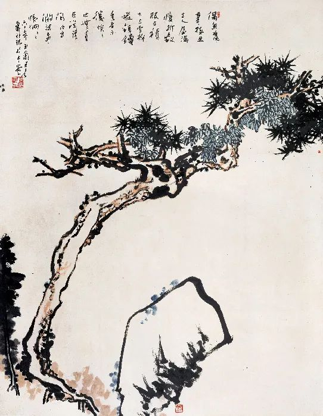

潘天寿，松石图轴

  

2020年，人类大灾难之年。有史以来少有。

  

大灾难，往往也是大发现、大重组、大机会、大成长。这是残酷的进化。适应不了这种进化的挑战，输了，就是大溃败、大死亡、大淘汰、大退化。

  

大庆幸是，中国赢了。小庆幸是，我们恰好在中国。

  

中国不是赢在幸运。天地不仁，以万物为刍狗。天地不会偏爱某个国家，病毒还对中国发动突然袭击，按理，中国是赢不了的，中国应该输得最惨。

  

中国是赢在自己的努力。赢在其中的每一个人都有赢的素质。天地不仁，人有仁。这是一个仁者聚居的国家。

  

此国之人有担当。当灾难发生时，他们在想，我应该做些什么？即使是忍耐、痛苦、牺牲，他们也甘于接受，所以，才能做到十多亿人瞬间隔离，向病毒宣战。无孔不入的病毒战胜不了无隙可乘的意志。

  

此国之人抗击打。储蓄的传统，家庭的温暖纽带，对贫弱者的体恤，从个体到社会编织成坚韧的防护天网。我们在被袭中守望相助，疾病相扶持，让疼痛者不痛，让掉队者归队，让人们再次相聚，一起唱歌，一起跳舞。

  

此国之人有爱。仁的核心就是爱。老吾老以及人之老，幼吾幼以及人之幼。故意让病毒清洗老弱，我们从来没有这种纳粹式的想法，更不可能像有些人一样真的去操作。失去了爱，那才是最致命的病毒。有了爱，天下可运于掌，再大的灾难都能化解，不仅化解，我们还进化得更强大、更有爱。

  

大道至简，我们依靠责任、力量与爱，这些简单的仁之原则，熬过了艰难的2020年，体会了光荣的2020年，以后再也没什么可让我们害怕，因为我们最好地证明了我们像我们伟大的祖先一样，我们是仁者。

  

仁者无敌。
